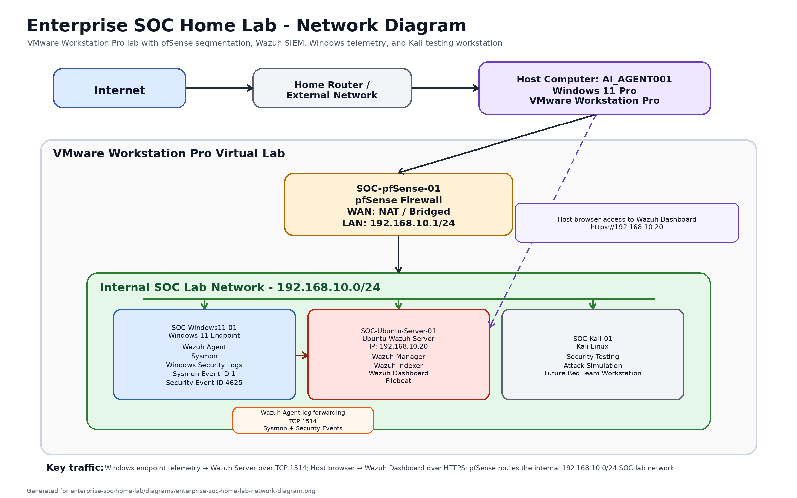
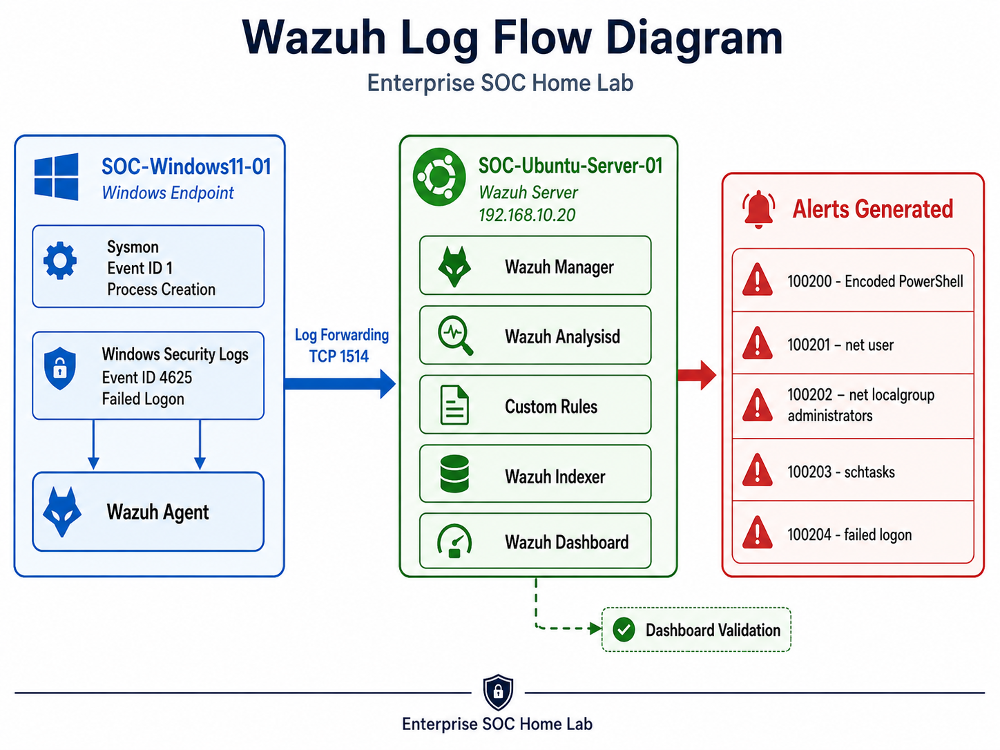
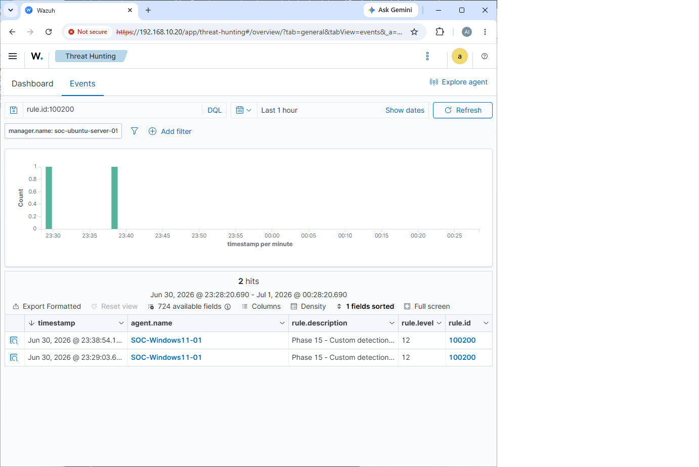
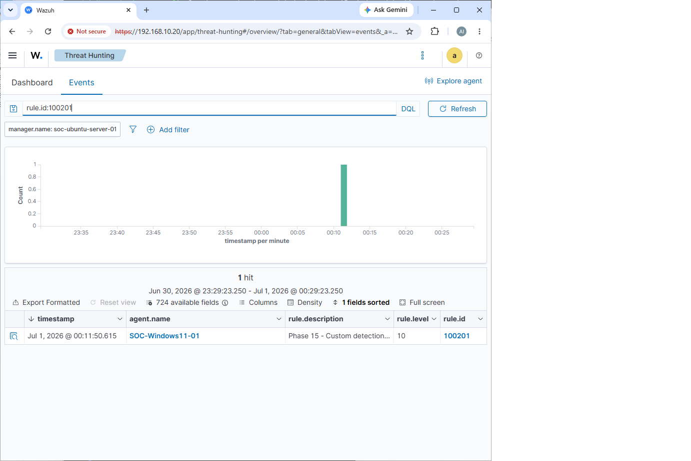
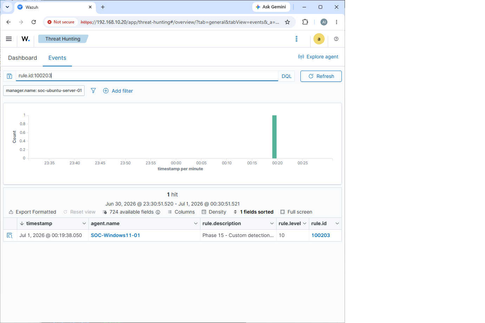
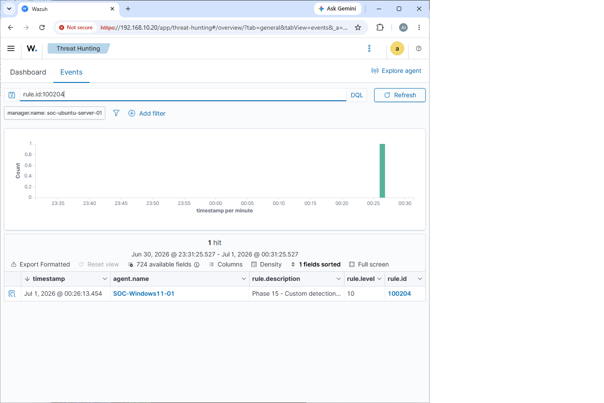

# Enterprise SOC Home Lab

A hands-on Enterprise Security Operations Center (SOC) Home Lab built with VMware Workstation Pro.

This project simulates a small enterprise security environment with segmented networking, a pfSense perimeter firewall, Windows endpoint telemetry, centralized log collection, Wazuh SIEM monitoring, attack simulation, and custom detection engineering.

The purpose of this lab is to build practical SOC analyst and detection engineering skills through real deployment, troubleshooting, validation, and documentation.

---

## Project Status

**Current Status: Phase 15 Completed**

The lab now includes:

- pfSense firewall deployment
- Windows 11 endpoint deployment
- Ubuntu Wazuh Server deployment
- Wazuh Agent installation and registration
- Sysmon deployment on Windows
- Windows Security and Sysmon log collection
- Attack simulation and detection validation
- Custom Wazuh detection rules
- MITRE ATT&CK mapping
- Dashboard and CLI alert validation
- Reusable detection validation scripts
- Final Phase 15 detection engineering documentation

---

## Project Objectives

- Build an enterprise-style virtual network
- Deploy a pfSense perimeter firewall
- Deploy Windows and Linux virtual machines
- Configure endpoint security logging
- Collect Windows Security and Sysmon logs
- Deploy Wazuh as the SIEM platform
- Register and monitor a Windows endpoint with Wazuh Agent
- Simulate common attacker behaviors
- Create custom detection rules
- Validate detections in Wazuh Dashboard and CLI
- Document each deployment and validation phase in GitHub

---

## Lab Architecture

| Component | Hostname | Purpose |
|---|---|---|
| Firewall | SOC-pfSense-01 | Perimeter firewall and network gateway |
| Wazuh Server | SOC-Ubuntu-Server-01 | Wazuh Manager, Indexer, and Dashboard |
| Windows Endpoint | SOC-Windows11-01 | Monitored Windows workstation |
| Kali Linux | SOC-Kali-01 | Security testing and future attacker workstation |
| Host Machine | AI_AGENT001 | VMware Workstation Pro host |

---

## Core Technologies

| Category | Technology |
|---|---|
| Virtualization | VMware Workstation Pro |
| Firewall | pfSense CE |
| SIEM / XDR | Wazuh |
| Endpoint Logging | Windows Event Logs, Sysmon |
| Operating Systems | Windows 11, Ubuntu Server, Kali Linux |
| Detection Mapping | MITRE ATT&CK |
| Documentation | GitHub Markdown |

---

## Lab Network Diagram



---

## Wazuh Log Flow



---

## Repository Structure

```text
enterprise-soc-home-lab/
├── README.md
├── docs/
│   ├── 01-host-preparation.md
│   ├── 02-vmware-installation.md
│   ├── 03-pfsense-installation.md
│   ├── 04-pfsense-network-configuration.md
│   ├── 05-windows-endpoint-deployment.md
│   ├── 06-windows-endpoint-logging-preparation.md
│   ├── 07-ubuntu-server-deployment.md
│   ├── 08-kali-linux-deployment.md
│   ├── 09-lab-network-stabilization.md
│   ├── 10-enterprise-soc-network-validation.md
│   ├── 11-wazuh-server-installation.md
│   ├── 12-wazuh-agent-installation.md
│   ├── 13-sysmon-deployment.md
│   ├── 14-attack-simulation-detection-validation.md
│   └── 15-detection-engineering-final-documentation.md
├── diagrams/
│   ├── README.md
│   ├── enterprise-soc-home-lab-network-diagram.png
│   ├── enterprise-soc-home-lab-network-diagram.drawio
│   ├── wazuh-log-flow-diagram.png
│   └── wazuh-log-flow-diagram.drawio
├── screenshots/
│   ├── vmware/
│   └── 15-detection-engineering-final-documentation/
│       ├── 30-phase15-rule100200-detected.png
│       ├── 31-phase15-rule100201-detected.png
│       ├── 32-phase15-rule100202-detected.png
│       ├── 33-phase15-rule100203-detected.png
│       └── 34-phase15-rule100204-detected.png
└── scripts/
    ├── README.md
    └── phase15-detection-engineering/
        ├── README.md
        ├── trigger-encoded-powershell.ps1
        ├── trigger-net-user.ps1
        ├── trigger-net-localgroup-admins.ps1
        ├── trigger-schtasks.ps1
        ├── trigger-failed-logon.ps1
        └── wazuh-alert-validation-queries.sh
```

> Note: Some early phase file names may be adjusted as the project evolves. The documentation is organized by phase.

---

## Phase Progress

| Phase | Description | Status |
|---:|---|:---:|
| 01 | Host preparation | ✅ Completed |
| 02 | VMware Workstation installation | ✅ Completed |
| 03 | pfSense firewall deployment | ✅ Completed |
| 04 | pfSense network configuration | ✅ Completed |
| 05 | Windows 11 endpoint deployment | ✅ Completed |
| 06 | Windows endpoint logging preparation | ✅ Completed |
| 07 | Ubuntu Server deployment | ✅ Completed |
| 08 | Kali Linux deployment | ✅ Completed |
| 09 | Lab network stabilization | ✅ Completed |
| 10 | Enterprise SOC network validation | ✅ Completed |
| 11 | Wazuh Server installation | ✅ Completed |
| 12 | Wazuh Agent installation | ✅ Completed |
| 13 | Sysmon deployment | ✅ Completed |
| 14 | Attack simulation and detection validation | ✅ Completed |
| 15 | Detection engineering and final documentation | ✅ Completed |

---

## Documentation

| Document | Description |
|---|---|
| [01 - Host Preparation](docs/01-host-preparation.md) | Prepare the Windows host for virtualization |
| [02 - VMware Installation](docs/02-vmware-installation.md) | Install VMware Workstation Pro and configure virtual networking |
| [03 - pfSense Installation](docs/03-pfsense-installation.md) | Deploy pfSense CE firewall |
| [09 - Lab Network Stabilization](docs/09-lab-network-stabilization.md) | Stabilize and validate lab network connectivity |
| [11 - Wazuh Server Installation](docs/11-wazuh-server-installation.md) | Install Wazuh Server components |
| [12 - Wazuh Agent Installation](docs/12-wazuh-agent-installation.md) | Register and validate Windows Wazuh Agent |
| [13 - Sysmon Deployment](docs/13-sysmon-deployment.md) | Deploy Sysmon on Windows endpoint |
| [14 - Attack Simulation and Detection Validation](docs/14-attack-simulation-detection-validation.md) | Simulate attacks and validate Wazuh alerts |
| [15 - Detection Engineering and Final Documentation](docs/15-detection-engineering-final-documentation.md) | Create and validate custom Wazuh detection rules |

---

## Diagrams

Architecture and data flow diagrams are stored in the `diagrams/` folder.

| Diagram | Description |
|---|---|
| [Enterprise SOC Home Lab Network Diagram](diagrams/enterprise-soc-home-lab-network-diagram.png) | Overall SOC lab network topology |
| [Wazuh Log Flow Diagram](diagrams/wazuh-log-flow-diagram.png) | Windows telemetry forwarding and Wazuh detection flow |
| [Diagrams README](diagrams/README.md) | Explanation of diagram files and usage |

---

## Scripts

Reusable detection validation scripts are stored in the `scripts/` folder.

| Script Location | Description |
|---|---|
| [scripts/README.md](scripts/README.md) | Overview of all lab scripts |
| [scripts/phase15-detection-engineering/](scripts/phase15-detection-engineering/) | Phase 15 trigger and validation scripts |

These scripts are used to trigger and validate custom Wazuh detection rules for:

- Encoded PowerShell
- Account discovery
- Local group enumeration
- Scheduled task command activity
- Failed logon events

---

## Phase 15 Summary

Phase 15 focused on custom detection engineering with Wazuh.

Custom rules were created in:

```bash
/var/ossec/etc/rules/phase15_windows_detection_rules.xml
```

The final custom rules used child-rule logic with `<if_sid>` because Wazuh built-in rules were already matching several events before the original standalone custom rules matched.

Full Phase 15 documentation:

[docs/15-detection-engineering-final-documentation.md](docs/15-detection-engineering-final-documentation.md)

---

## Validated Custom Rules

| Custom Rule ID | Parent Rule ID | Detection | Log Source | MITRE ATT&CK | Status |
|---:|---:|---|---|---|:---:|
| 100200 | 92057 | Encoded PowerShell command | Sysmon Event ID 1 | T1059.001 | ✅ |
| 100201 | 92036 | Local user enumeration using `net user` | Sysmon Event ID 1 | T1087.001 | ✅ |
| 100202 | 92036 | Local administrators group enumeration | Sysmon Event ID 1 | T1069.001 | ✅ |
| 100203 | 92032 | Scheduled task command execution using `schtasks` | Sysmon Event ID 1 | T1053.005 | ✅ |
| 100204 | 60122 | Windows failed logon event | Security Event ID 4625 | T1110 | ✅ |

---

## Detection Validation Screenshots

The following screenshots were captured during Phase 15 validation.

### Rule 100200 - Encoded PowerShell Detection



### Rule 100201 - Local User Enumeration Detection



### Rule 100202 - Local Administrators Group Enumeration Detection


### Rule 100203 - Scheduled Task Command Detection



### Rule 100204 - Windows Failed Logon Detection



---

## Key Detection Engineering Work

### Encoded PowerShell Detection

Validated encoded PowerShell execution using Sysmon process creation telemetry.

Example behavior:

```powershell
powershell.exe -NoProfile -ExecutionPolicy Bypass -EncodedCommand <base64_payload>
```

Result:

```text
Custom rule 100200 triggered successfully.
```

---

### Local User Enumeration Detection

Validated local user enumeration using:

```powershell
cmd.exe /c net user
```

Result:

```text
Custom rule 100201 triggered successfully.
```

---

### Local Administrators Group Enumeration Detection

Validated local administrators group enumeration using:

```powershell
cmd.exe /c "net localgroup administrators"
```

Result:

```text
Custom rule 100202 triggered successfully.
```

---

### Scheduled Task Command Detection

Validated scheduled task command activity using:

```powershell
cmd.exe /c schtasks /query
```

Result:

```text
Custom rule 100203 triggered successfully.
```

---

### Failed Logon Detection

Validated Windows failed logon detection using:

```powershell
runas /user:%COMPUTERNAME%\fakeuser cmd
```

An incorrect password was entered to generate Security Event ID `4625`.

Result:

```text
Custom rule 100204 triggered successfully.
```

---

## Troubleshooting Highlights

Several custom rules did not trigger during the first attempt.

The investigation showed that Wazuh built-in rules were already matching the same events. The custom rules were then converted into child rules using `<if_sid>`.

Another issue involved command-line spacing. Some Windows command lines appeared with multiple spaces, such as:

```text
net  user
schtasks  /query
```

This was solved by using PCRE2 regular expressions with `\s+`.

Example:

```xml
<field name="win.eventdata.commandLine" type="pcre2">(?i)\bnet\s+user\b</field>
```

---

## Skills Demonstrated

This project demonstrates practical SOC and detection engineering skills, including:

- Virtual lab design
- Firewall deployment
- Network segmentation
- Windows endpoint deployment
- Linux server administration
- Wazuh Server installation
- Wazuh Agent deployment
- Sysmon deployment
- Windows Security Event log analysis
- Sysmon Event ID 1 process creation analysis
- Custom Wazuh rule creation
- Wazuh child-rule logic using `<if_sid>`
- PCRE2 command-line matching
- MITRE ATT&CK mapping
- Alert validation in Wazuh Dashboard
- Alert validation using CLI and `jq`
- Attack simulation and detection validation
- GitHub-based technical documentation
- Reusable detection validation script creation
- PowerShell and Bash scripting for SOC lab validation

---

## Final Project Outcome

The Enterprise SOC Home Lab now provides an end-to-end security monitoring environment.

The lab can:

- Collect Windows endpoint telemetry
- Forward Sysmon and Security logs to Wazuh
- Generate Wazuh alerts from suspicious endpoint activity
- Detect encoded PowerShell usage
- Detect account discovery
- Detect local administrator group enumeration
- Detect scheduled task command activity
- Detect failed logon attempts
- Map detections to MITRE ATT&CK techniques
- Validate detections through both Dashboard and CLI

---

## Next Steps

Potential future improvements include:

- Add Elastic / ELK SIEM comparison
- Add Kali Linux attack simulation workflows
- Add Sigma rule conversion practice
- Add YARA or file integrity detection examples
- Add Active Response testing in Wazuh
- Add email or Slack alerting integration
- Add dashboards for detection metrics
- Add incident response playbooks
- Add additional Windows attack techniques mapped to MITRE ATT&CK

---

## Project Completion Statement

This Enterprise SOC Home Lab has completed the core deployment and detection engineering workflow through Phase 15.

The project demonstrates the ability to deploy a SOC lab environment, collect endpoint telemetry, simulate attack behaviors, engineer custom detections, troubleshoot SIEM rule logic, and document results in a professional GitHub portfolio format.
