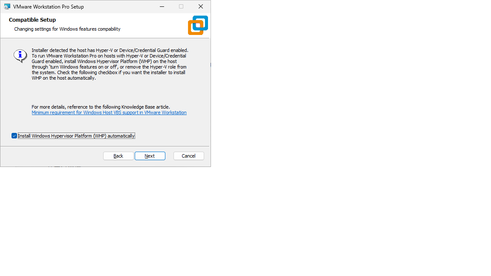
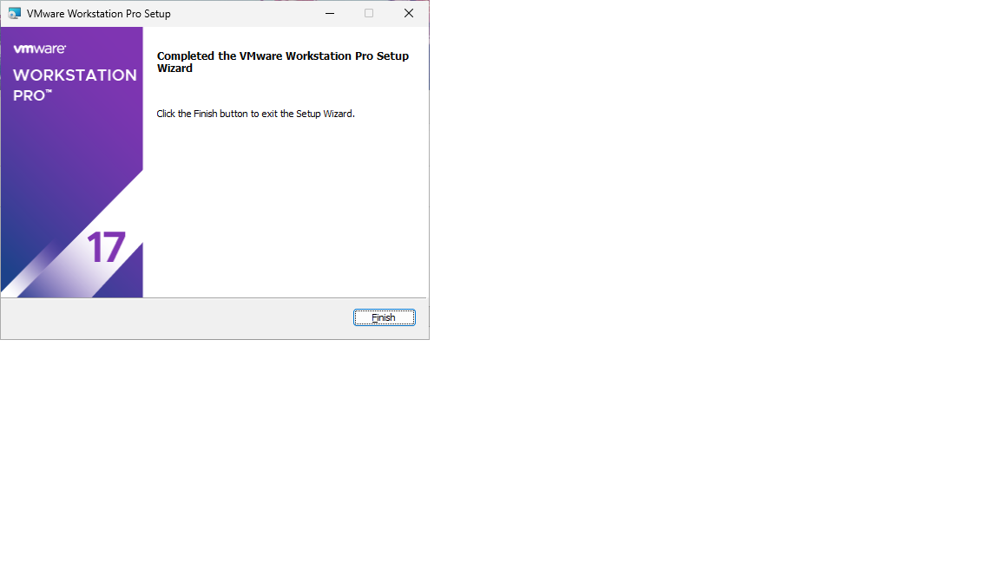
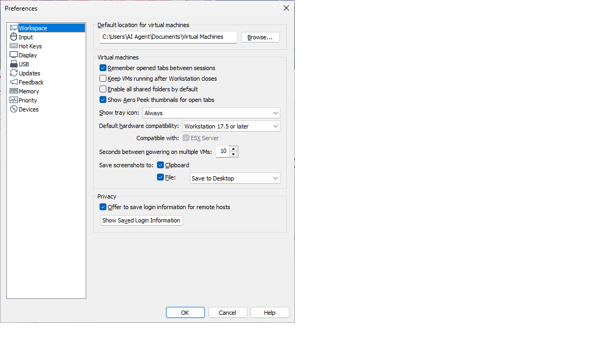
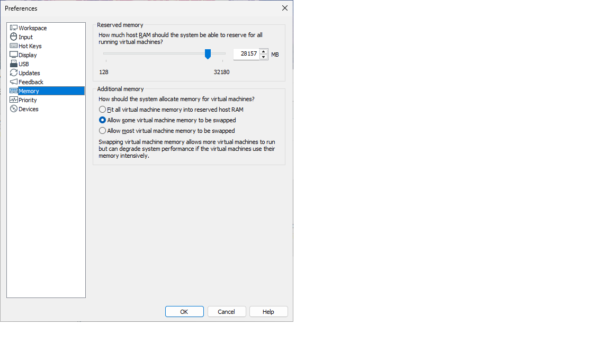
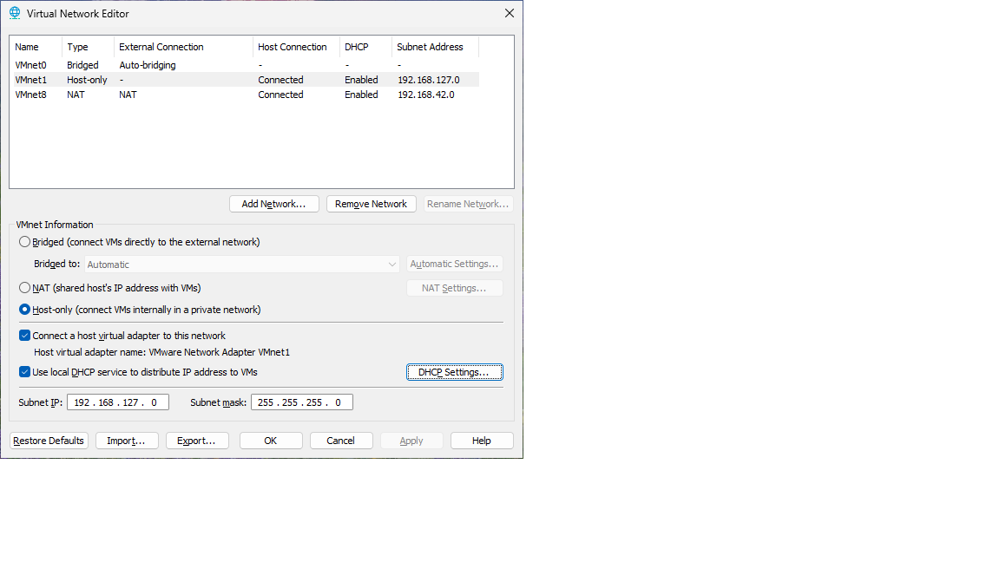
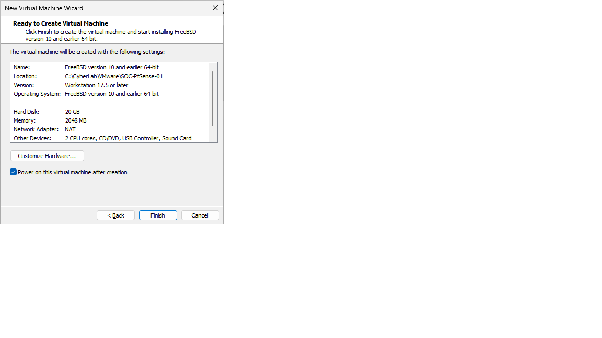
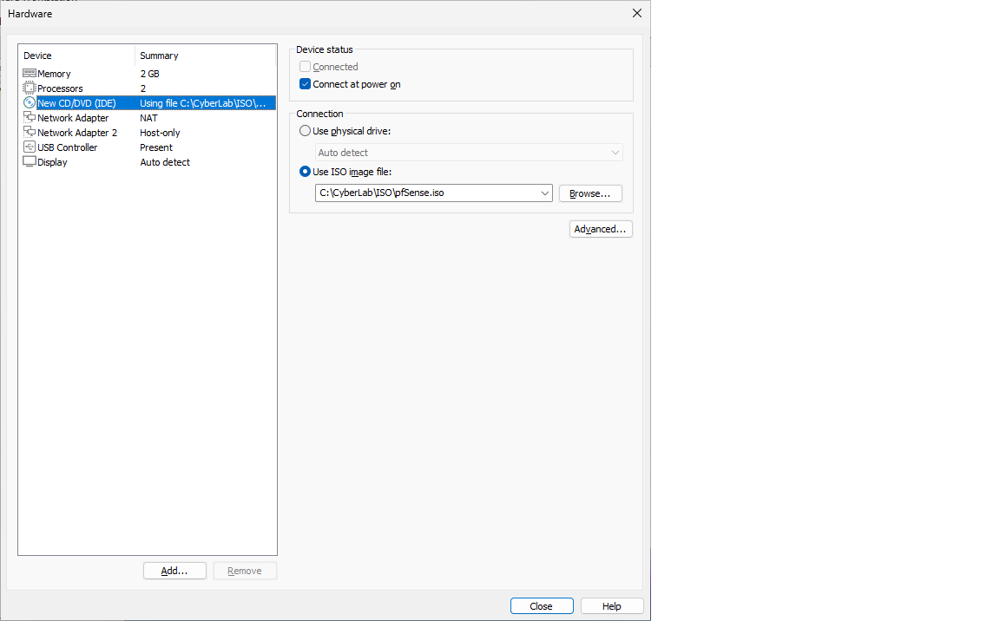
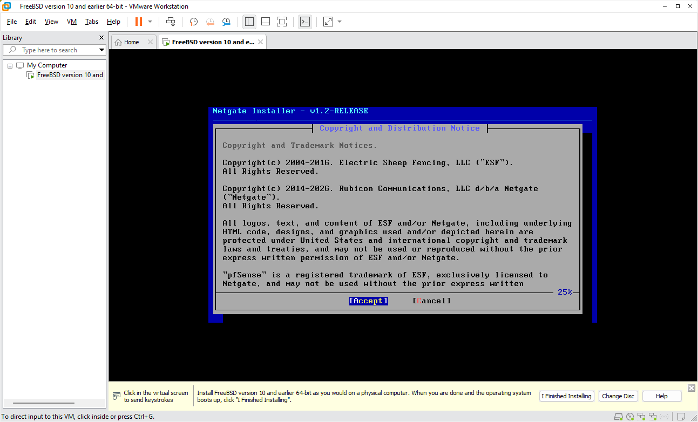

# VMware Workstation Pro Installation

## 🎯 Objective

Prepare a professional virtualization environment for building an **Enterprise SOC Home Lab**.

This document records the installation and initial configuration of **VMware Workstation Pro 17.6.4**, which will host all virtual machines used throughout this project.

---

## Step 1 – Hyper-V Compatibility Check

Before installing VMware Workstation Pro, Windows 11 detected **Virtualization-Based Security (VBS)** and **Windows Hypervisor Platform (WHP)**.

To ensure VMware could run properly, the virtualization environment was reviewed and Windows security settings were verified.

Memory Integrity was temporarily disabled during compatibility testing.

> [!NOTE]
> Modern versions of VMware Workstation can coexist with Windows Hypervisor Platform (WHP), but understanding VBS compatibility is important when building enterprise labs.

### Screenshot



**Figure 1.** Windows detected Hyper-V/WHP during VMware installation.

---

## Step 2 – VMware Installation Completed

VMware Workstation Pro **17.6.4** was installed successfully.

### Verification

* [x] VMware starts successfully
* [x] No installation errors
* [x] VMware Library is accessible

### Screenshot



**Figure 2.** VMware Workstation Pro installation completed successfully.

---

## Step 3 – Configure VMware Preferences

The default virtual machine storage location was changed.

### Default Location

```text
Documents\Virtual Machines
```

### New Location

```text
C:\CyberLab\VMware
```

> [!TIP]
> Keeping every virtual machine inside a dedicated project directory makes backup, migration, and documentation much easier.

### Screenshot



**Figure 3.** VMware Preferences configured to use the CyberLab directory.

---

## Step 4 – Review Global Memory Settings

The VMware global memory configuration was reviewed before creating any virtual machines.

### Host Specification

| Component | Specification     |
| --------- | ----------------- |
| CPU       | AMD Ryzen 7 7730U |
| Memory    | 32 GB RAM         |
| Storage   | 500 GB SSD        |

This hardware provides sufficient resources for running multiple virtual machines simultaneously.

### Screenshot



**Figure 4.** VMware global memory configuration.

---

## Step 5 – Configure Virtual Networks

The VMware Virtual Network Editor was reviewed before creating the firewall.

### Network Design

| Network  | Purpose         |
| -------- | --------------- |
| `VMnet0` | Bridged         |
| `VMnet1` | Host-only (LAN) |
| `VMnet8` | NAT (WAN)       |

> [!IMPORTANT]
> Separating WAN and LAN traffic is a fundamental requirement for building an enterprise firewall.

### Screenshot



**Figure 5.** VMware Virtual Network Editor showing VMnet0, VMnet1, and VMnet8.

---

## Step 6 – Create the First Enterprise Virtual Machine

The first virtual machine was created.

### Virtual Machine Name

```text
SOC-pfSense-01
```

### Hardware Configuration

| Item         | Configuration  |
| ------------ | -------------- |
| CPU          | 2 Cores        |
| Memory       | 2 GB           |
| Disk         | 20 GB          |
| Provisioning | Thin Provision |
| Disk Type    | Single VMDK    |

### Screenshot



**Figure 6.** Initial configuration of the pfSense virtual machine.

---

## Step 7 – Configure Dual Network Adapters

Two virtual network adapters were configured.

| Adapter   | Network              | Purpose |
| --------- | -------------------- | ------- |
| Adapter 1 | `VMnet8 (NAT)`       | WAN     |
| Adapter 2 | `VMnet1 (Host-only)` | LAN     |

> [!IMPORTANT]
> Every enterprise firewall should have at least two network interfaces to separate external and internal traffic.

### Screenshot



**Figure 7.** The pfSense virtual machine configured with separate WAN and LAN interfaces.

---

## Step 8 – First Boot Verification

The virtual machine powered on successfully.

The pfSense installer booted correctly from the ISO image.

### Verification

* [x] Virtual machine boots successfully
* [x] ISO mounted correctly
* [x] pfSense installer starts normally

### Screenshot



**Figure 8.** First successful boot of the pfSense virtual machine.


---

## Lessons Learned

* VMware should be configured before deploying guest operating systems.
* Enterprise virtual machines should follow a consistent naming convention.
* Network planning should be completed before installing operating systems.
* A dual-network firewall architecture provides a realistic enterprise environment.

---

## Next Step

Install **pfSense Community Edition** and configure the WAN/LAN interfaces for the Enterprise SOC Home Lab.
