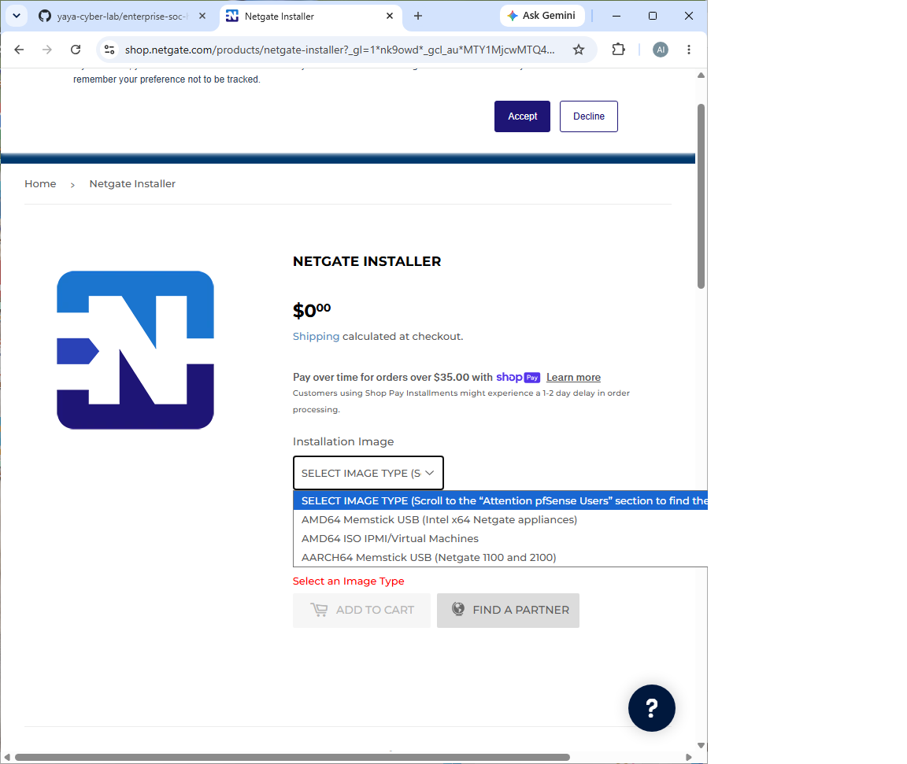
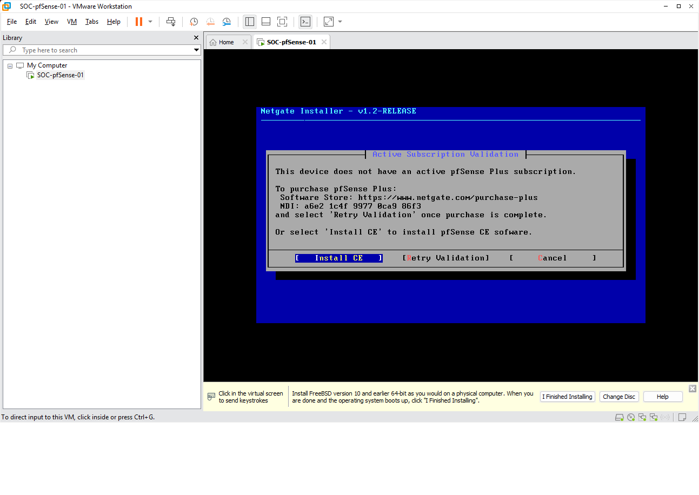
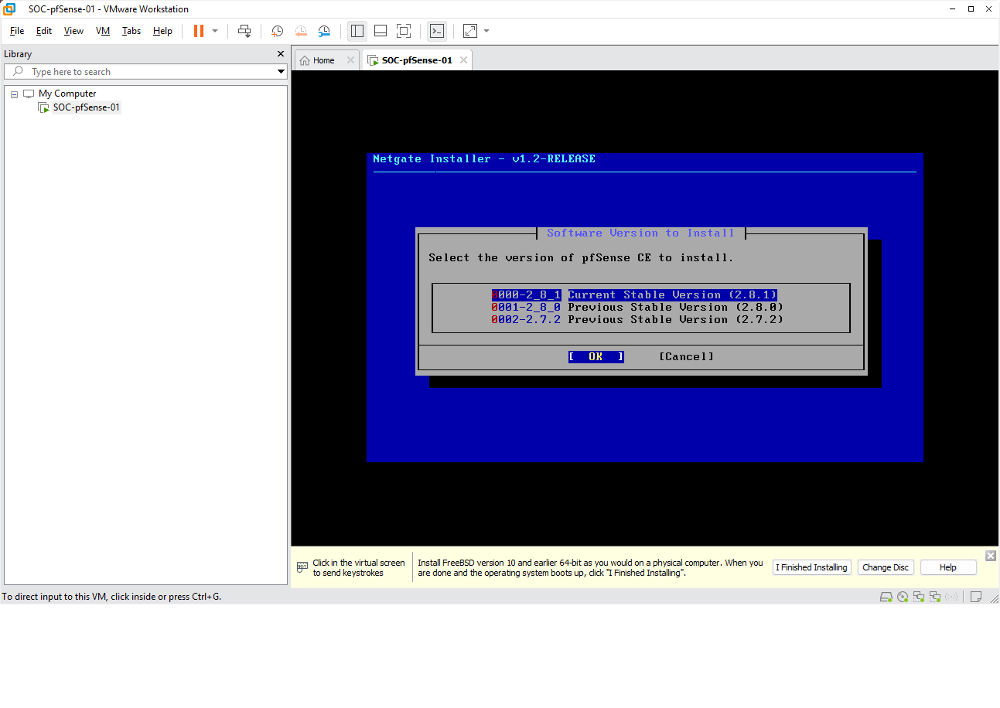
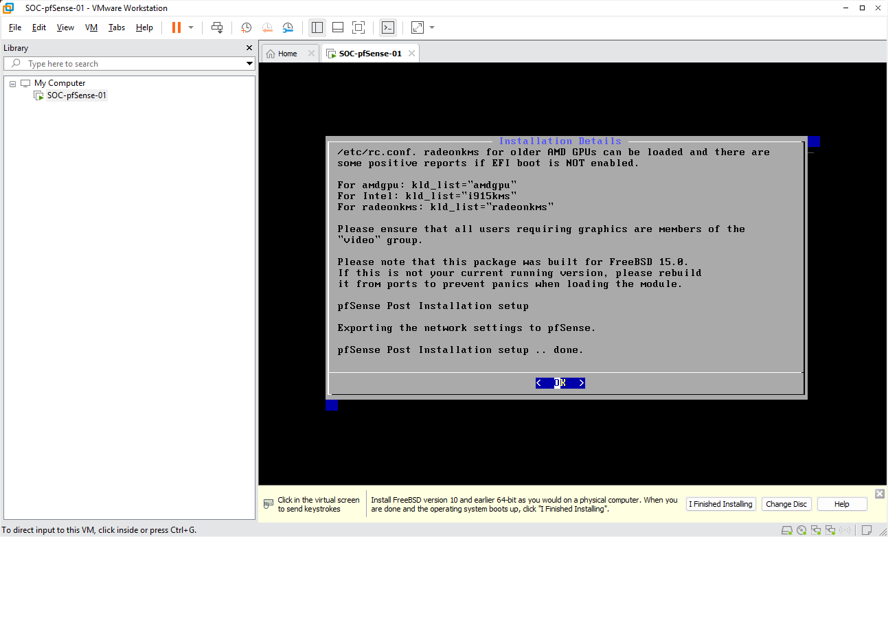
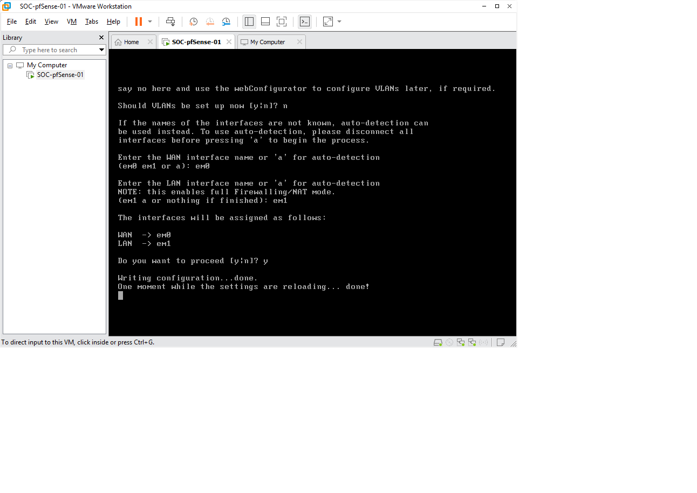
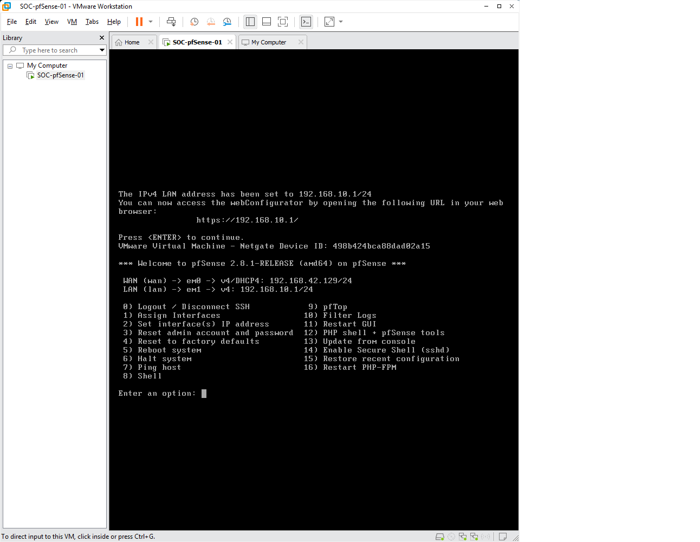
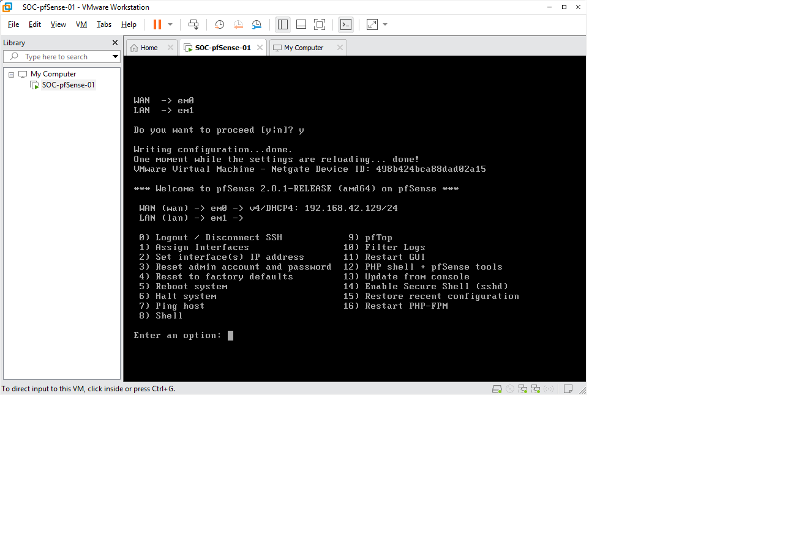

# pfSense Community Edition Installation

## Objective

Deploy and configure a pfSense Community Edition firewall to serve as the perimeter security device for the Enterprise SOC Home Lab.

This firewall will provide:

* WAN and LAN network segmentation
* DHCP services
* Internet access for internal systems
* Future security monitoring and logging capabilities

---

## Environment Overview

### Virtual Machine Information

| Item                 | Configuration             |
| -------------------- | ------------------------- |
| Virtual Machine Name | SOC-pfSense-01            |
| Operating System     | pfSense CE 2.8.1          |
| Platform             | VMware Workstation Pro 17 |
| CPU                  | 2 Cores                   |
| Memory               | 2 GB                      |
| Disk                 | 20 GB                     |
| Disk Controller      | SCSI                      |
| Firmware             | BIOS                      |

---

## Network Architecture

The firewall was deployed with two virtual network adapters.

| Interface | VMware Network     | Purpose |
| --------- | ------------------ | ------- |
| em0       | VMnet8 (NAT)       | WAN     |
| em1       | VMnet1 (Host-only) | LAN     |

### Network Topology

```text
Internet
    │
    │
VMnet8 (NAT)
    │
    │
WAN (em0)
┌──────────────┐
│   pfSense    │
└──────────────┘
LAN (em1)
    │
VMnet1 (Host-only)
    │
Future Systems:
• Windows 11
• Ubuntu Server
• Kali Linux
• Wazuh SIEM
• Elastic Stack
```

---

## Installation Procedure

### Step 1 – Boot the Installer

The pfSense Community Edition installation ISO was mounted through VMware Workstation.

The virtual machine successfully booted into the Netgate Installer environment.

### Screenshot



**Figure 1.** pfSense installer startup screen.

---

### Step 2 – Select Community Edition

The Community Edition (CE) installation option was selected.

No pfSense Plus subscription was required.

### Screenshot



**Figure 2.** Selection of pfSense Community Edition.

---

### Step 3 – Configure Storage

The firewall virtual disk was configured using:

```text
ZFS
Stripe
```

Since the lab uses a single virtual disk, redundancy was not required.

### Screenshot


**Figure 3.** ZFS storage configuration using a single-disk stripe layout.

---

### Step 4 – Select Software Version

The latest stable release was selected:

```text
pfSense CE 2.8.1
```

### Screenshot



**Figure 4.** Selection of the current stable release.

---

### Step 5 – Complete Installation

The installation process successfully completed and the system rebooted from the virtual disk.

### Screenshot



**Figure 5.** Successful installation of pfSense CE 2.8.1.

---

## WAN and LAN Configuration

### Interface Assignment

The firewall interfaces were manually assigned.

| Interface | Assignment |
| --------- | ---------- |
| WAN       | em0        |
| LAN       | em1        |

### Screenshot



**Figure 6.** WAN and LAN interface assignment.

---

## LAN Configuration

The LAN interface was configured with a static IP address.

| Setting          | Value          |
| ---------------- | -------------- |
| LAN IP Address   | 192.168.10.1   |
| Subnet Mask      | /24            |
| DHCP Enabled     | Yes            |
| DHCP Range Start | 192.168.10.100 |
| DHCP Range End   | 192.168.10.200 |

### Screenshot



**Figure 7.** LAN network configuration.

---

## Final Configuration

### WAN

```text
WAN (em0)
DHCP
192.168.42.129/24
```

### LAN

```text
LAN (em1)
192.168.10.1/24
```

### DHCP Scope

```text
192.168.10.100
to
192.168.10.200
```

---

## Verification

The following items were verified successfully:

* [x] pfSense CE installed successfully
* [x] System booted successfully
* [x] WAN interface obtained DHCP address
* [x] LAN interface assigned correctly
* [x] DHCP server enabled
* [x] Dual-NIC architecture operational

### Screenshot



**Figure 8.** Final pfSense console menu after successful deployment.

---

## Troubleshooting Notes

During the initial installation attempt, the Netgate Installer experienced an installation failure.

Observed errors included:

```text
Failed to install pfSense
Cannot connect to installer daemon
vm_fault: pager read error
```

The issue was resolved by:

1. Removing the failed virtual machine.
2. Creating a new virtual machine using the same hardware specifications.
3. Reinstalling pfSense CE 2.8.1 successfully.

This troubleshooting process demonstrates practical experience with virtualization deployment and problem resolution.

---

## Lessons Learned

* Enterprise firewalls require separate WAN and LAN interfaces.
* VMware virtual networking must be planned before deployment.
* pfSense can serve as the central gateway for a SOC home lab.
* Installation failures should be investigated methodically rather than assuming configuration errors.
* Maintaining documentation and screenshots improves repeatability and project quality.

---

## Next Step

Deploy a Windows 11 virtual machine connected to the LAN network (VMnet1) and verify connectivity through the pfSense firewall.

Planned VM Name:

```text
SOC-Windows11-01
```
