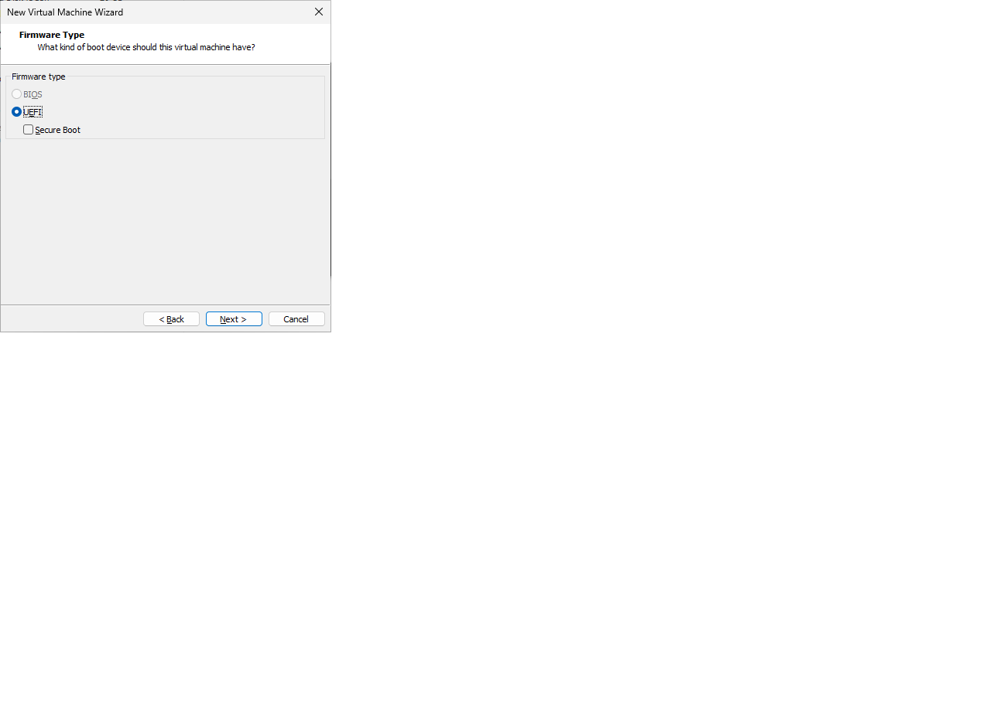
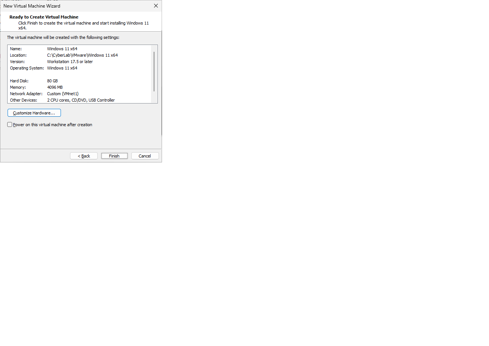
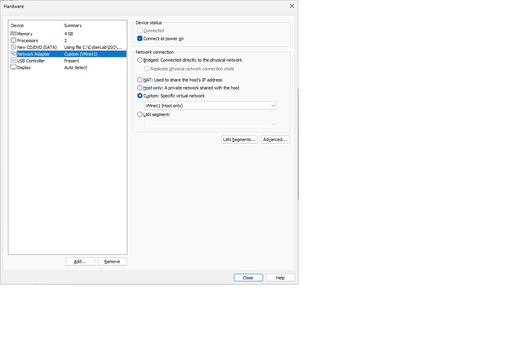
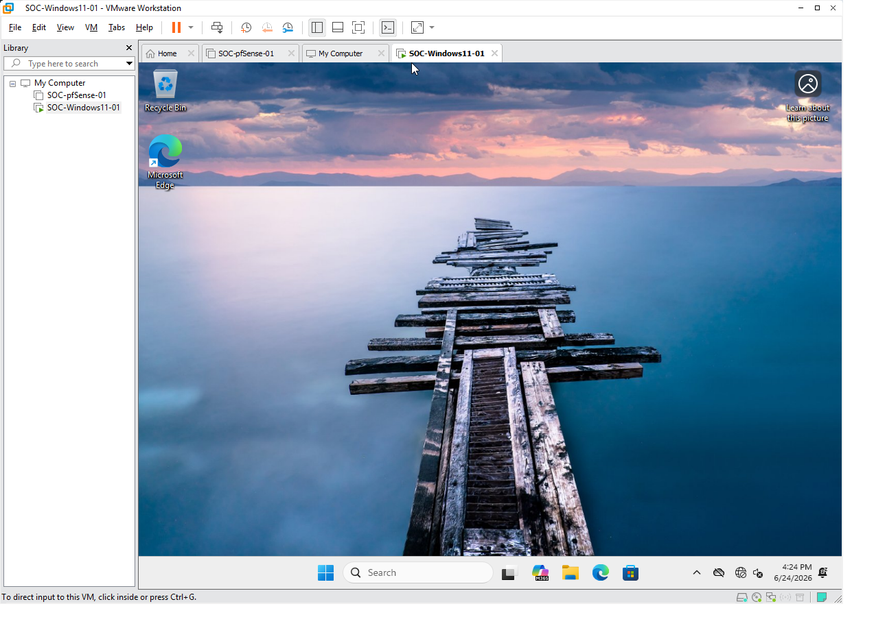

# Windows 11 Endpoint Deployment

## Objective

Deploy a Windows 11 Pro virtual machine as the first enterprise endpoint in the Enterprise SOC Home Lab.

This Windows endpoint will later be used for:

* Sysmon deployment
* Windows Event Log collection
* PowerShell logging
* Windows Defender monitoring
* Wazuh Agent installation
* Attack simulation
* Detection engineering

---

# Environment Overview

## Virtual Machine Information

| Item                 | Configuration             |
| -------------------- | ------------------------- |
| Virtual Machine Name | SOC-Windows11-01          |
| Operating System     | Windows 11 Pro            |
| Platform             | VMware Workstation Pro 17 |
| Firmware             | UEFI                      |
| Secure Boot          | Enabled                   |
| TPM                  | Enabled                   |
| CPU                  | 2 Virtual Cores           |
| Memory               | 4 GB                      |
| Disk                 | 80 GB NVMe                |
| Network              | VMnet1 (Host-only)        |

---

# Enterprise Network Architecture

The Windows endpoint is connected to the internal LAN behind the pfSense firewall.

```text
Internet
    │
Home Router
    │
VMnet8 (NAT)
    │
WAN (em0)
┌──────────────┐
│   pfSense    │
└──────────────┘
LAN (em1)
    │
VMnet1 (Host-only)
    │
SOC-Windows11-01
```

---

# Virtual Machine Configuration

## Firmware

The virtual machine was configured using:

* UEFI Firmware
* Secure Boot Enabled
* Virtual TPM Enabled

This configuration satisfies Microsoft's Windows 11 hardware requirements.

### Screenshot


**Figure 1.** Windows 11 firmware configuration.

---

## Virtual Hardware

The virtual machine was configured with the following hardware.

| Component    | Configuration      |
| ------------ | ------------------ |
| CPU          | 2 Virtual Cores    |
| Memory       | 4 GB               |
| Virtual Disk | 80 GB              |
| Disk Type    | NVMe               |
| Network      | VMnet1 (Host-only) |

### Screenshot


**Figure 2.** Virtual hardware configuration.

---

## Network Configuration

The network adapter was connected to the internal enterprise LAN.

VMware Network:

```text
VMnet1
```

Purpose:

* Internal enterprise network
* Protected by pfSense firewall
* Receives DHCP from pfSense

### Screenshot



**Figure 3.** Windows endpoint connected to VMnet1.

---

# Windows Installation

The Windows 11 installation ISO was booted from VMware Workstation.

The following installation options were selected.

* Windows 11 Pro
* Custom Installation
* 80 GB Virtual Disk

### Screenshot


**Figure 4.** Windows Setup.

---

## Local Administrator Account

A local administrator account was created.

Username:

```text
socadmin
```

A local account was used instead of a Microsoft account to simplify enterprise lab deployment.

---

## Windows Desktop

The installation completed successfully.

The Windows endpoint booted normally into the desktop.

### Screenshot



**Figure 5.** Windows 11 desktop after installation.

---

# Validation

The following items were verified successfully.

* [x] Windows 11 Pro installed
* [x] UEFI boot successful
* [x] Secure Boot enabled
* [x] Virtual TPM enabled
* [x] Windows desktop loaded successfully
* [x] VM connected to VMnet1

---

# Lessons Learned

* Windows 11 requires UEFI, Secure Boot, and TPM.
* VMware Workstation provides a virtual TPM through encrypted VM metadata.
* Enterprise endpoints should be deployed behind a firewall instead of connecting directly to the Internet.
* Using consistent virtual machine naming improves long-term lab management.

---

# Next Step

Configure the Windows endpoint for enterprise security.

Planned tasks:

* Install VMware Tools
* Rename the computer to **SOC-WIN11-01**
* Verify network connectivity through pfSense
* Install Windows Updates
* Create a snapshot
* Install Sysmon
* Enable PowerShell logging
* Install the Wazuh Agent
* Begin centralized log collection

---

# Skills Demonstrated

* VMware Virtualization
* Windows 11 Deployment
* Enterprise Endpoint Configuration
* UEFI / Secure Boot / TPM
* Enterprise Network Design
* Firewall Segmentation
* Technical Documentation

```
```

