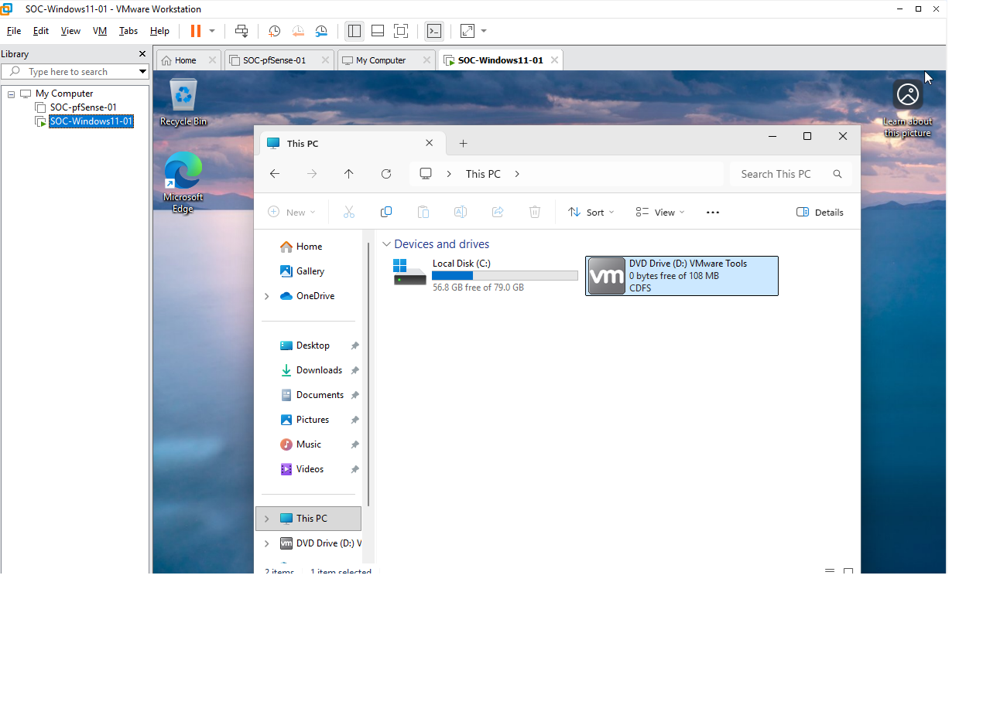
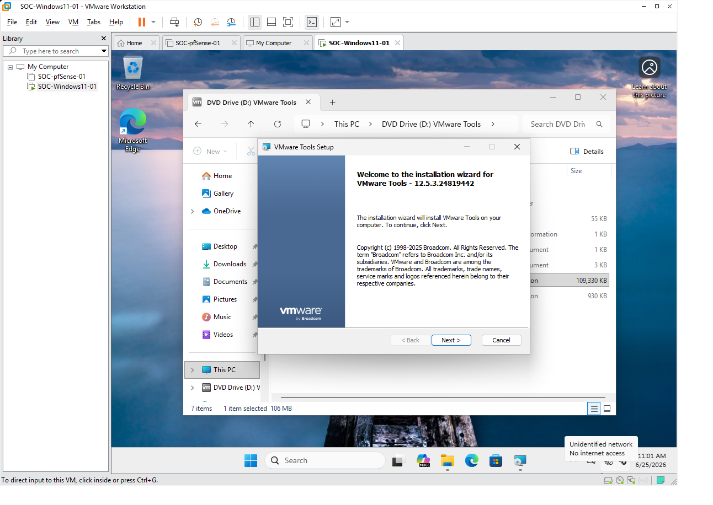
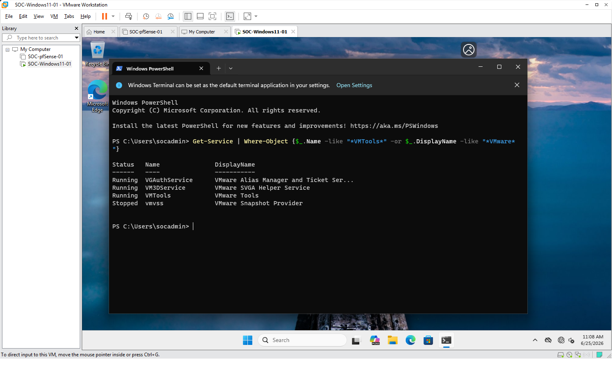
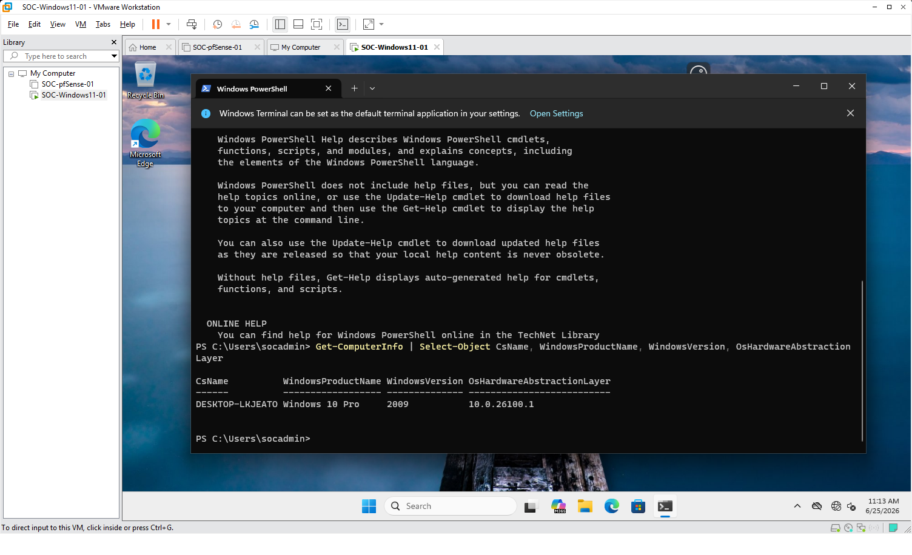
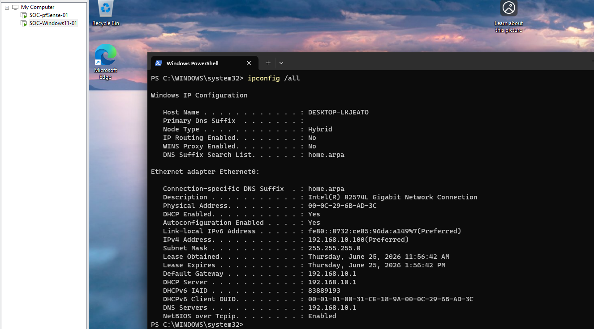
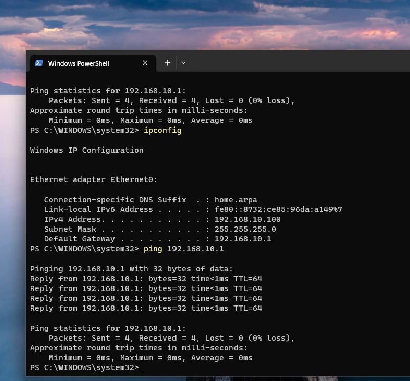
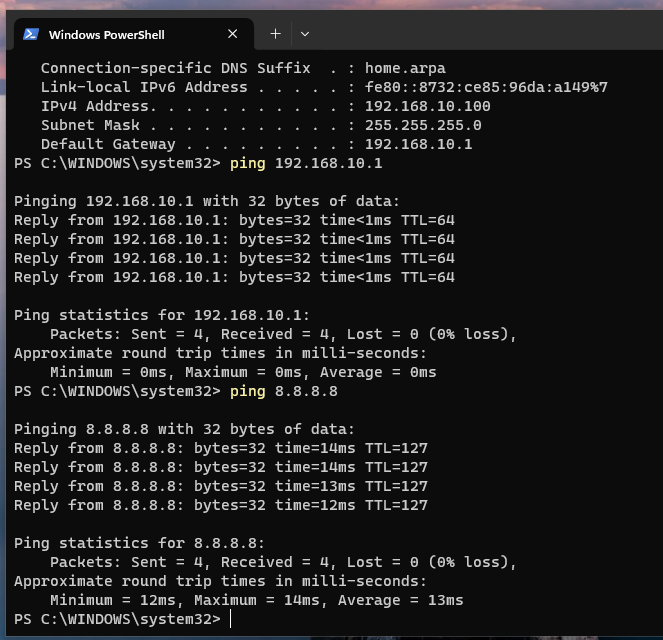
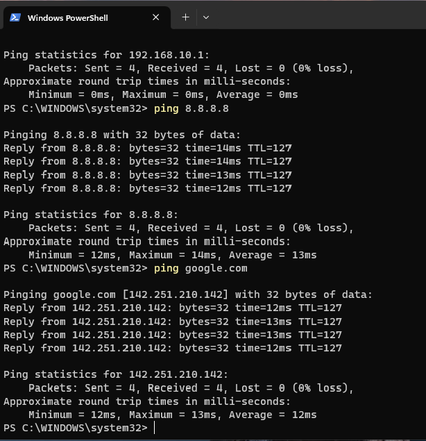
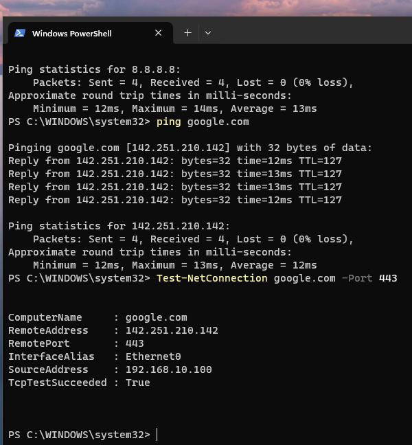
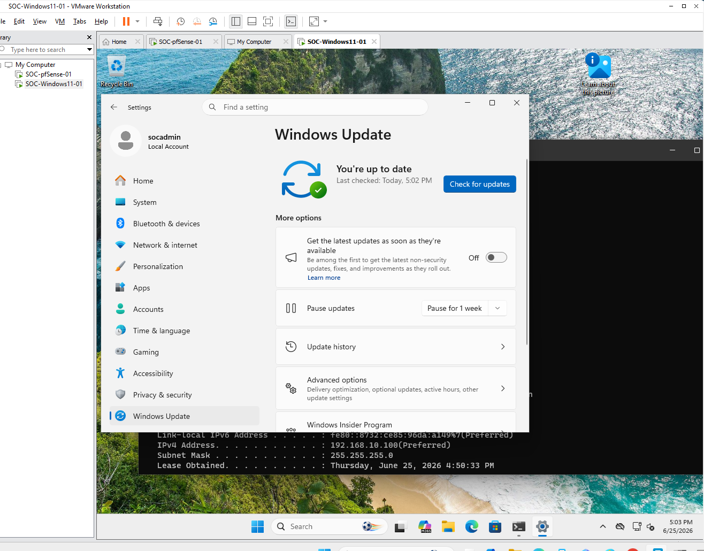

# VMware Tools and Windows Network Validation

## Objective

Install VMware Tools on the Windows 11 endpoint and validate that the endpoint can successfully communicate through the pfSense firewall to reach the Internet.

This phase confirms that the first enterprise Windows endpoint is correctly connected to the internal SOC lab network and is ready for future endpoint hardening, security logging, Sysmon deployment, Wazuh Agent deployment, and SIEM integration.

---

## Lab Environment

| Item                    | Configuration             |
| ----------------------- | ------------------------- |
| Endpoint Name           | SOC-Windows11-01          |
| Hostname                | DESKTOP-LKJEATO           |
| Operating System        | Windows 11 Pro            |
| User Account            | socadmin                  |
| Virtualization Platform | VMware Workstation Pro 17 |
| Firewall                | pfSense CE                |
| Windows Network         | VMnet1 / Host-only        |
| pfSense LAN             | VMnet1 / Host-only        |
| pfSense WAN             | VMnet8 / NAT              |

---

## Network Architecture

The Windows 11 endpoint is placed behind the pfSense firewall on the internal LAN network.

```text
Internet
    |
Home Router
    |
VMware VMnet8
NAT Network
    |
pfSense WAN
    |
pfSense Firewall
    |
pfSense LAN
192.168.10.1
    |
VMware VMnet1
Host-only Network
    |
SOC-Windows11-01
192.168.10.100
```

---

## VMware Tools Installation

VMware Tools was installed on the Windows 11 virtual machine to improve guest operating system integration, display performance, mouse control, driver support, and overall virtual machine usability.

Installation steps:

```text
VMware Workstation Pro
VM > Install VMware Tools
Windows 11 Guest
Run setup64.exe
Select Typical Installation
Restart Windows 11 VM
```



**Figure 1: VMware Tools installer mounted inside the Windows 11 virtual machine.**



**Figure 2: VMware Tools installation wizard.**



**Figure 3: VMware Tools installation completed successfully.**

---

## VMware Tools Service Verification

After rebooting the Windows endpoint, VMware Tools service status was verified using PowerShell.

```powershell
Get-Service | Where-Object {$_.Name -like "*VMTools*" -or $_.DisplayName -like "*VMware*"}
```

Expected result:

```text
VMware Tools service is running
```



**Figure 4: VMware Tools service running on SOC-Windows11-01.**

---

## Initial Network Issue

During the first network validation attempt, the Windows 11 endpoint received an IP address from the VMware VMnet1 DHCP service instead of the pfSense LAN DHCP service.

Initial issue observed:

```text
IPv4 Address    : 192.168.127.128
DHCP Server     : 192.168.127.254
DNS Servers     : 192.168.127.1
Default Gateway : Blank
```

This indicated that the Windows endpoint was connected to VMnet1 but was not receiving the correct gateway information from pfSense.

The issue was resolved by disabling the local VMware DHCP service on VMnet1 and allowing pfSense to provide DHCP services for the internal LAN.

Resolution:

```text
VMware Workstation Pro
Edit > Virtual Network Editor
Change Settings
VMnet1
Disable: Use local DHCP service to distribute IP address to VMs
Apply changes
Restart pfSense
Renew Windows DHCP lease
```

---

## Correct Windows IP Configuration

After correcting the VMnet1 DHCP configuration, the Windows 11 endpoint successfully received its IP configuration from the pfSense LAN interface.

PowerShell command used:

```powershell
ipconfig /all
```

Validated result:

```text
Host Name       : DESKTOP-LKJEATO
IPv4 Address    : 192.168.10.100
Subnet Mask     : 255.255.255.0
Default Gateway : 192.168.10.1
DHCP Server     : 192.168.10.1
DNS Servers     : 192.168.10.1
DNS Suffix      : home.arpa
```



**Figure 5: Windows 11 endpoint receiving DHCP configuration from pfSense LAN.**

---

## pfSense LAN Gateway Test

The Windows 11 endpoint successfully communicated with the pfSense LAN gateway.

PowerShell command used:

```powershell
ping 192.168.10.1
```

Expected result:

```text
Reply from 192.168.10.1
```



**Figure 6: Successful ping test from Windows 11 endpoint to pfSense LAN gateway.**

---

## Internet IP Connectivity Test

Internet IP connectivity was validated by pinging a public IP address.

PowerShell command used:

```powershell
ping 8.8.8.8
```

Expected result:

```text
Reply from 8.8.8.8
```

This confirmed that the Windows endpoint could route traffic through the pfSense firewall to the Internet.



**Figure 7: Successful Internet IP connectivity test through pfSense.**

---

## DNS Resolution Test

DNS resolution was validated by pinging an external domain name.

PowerShell command used:

```powershell
ping google.com
```

Expected result:

```text
google.com resolves to a public IP address
Reply from external IP address
```

This confirmed that DNS resolution was working through the pfSense firewall.



**Figure 8: Successful DNS resolution test from the Windows 11 endpoint.**

---

## HTTPS Connectivity Test

HTTPS connectivity was validated using PowerShell.

PowerShell command used:

```powershell
Test-NetConnection google.com -Port 443
```

Expected result:

```text
TcpTestSucceeded : True
```



**Figure 9: Successful HTTPS connectivity test from Windows 11 endpoint.**

---

## Windows Update

After VMware Tools installation and network validation, Windows Update was completed to bring the endpoint closer to a realistic enterprise baseline.

Status:

```text
Windows Update: Completed
```



**Figure 10: Windows Update completed on the Windows 11 endpoint.**

---

## Validation Summary

| Validation Item                     | Result         |
| ----------------------------------- | -------------- |
| VMware Tools installed              | Completed      |
| VMware Tools service verified       | Completed      |
| Windows connected to VMnet1         | Completed      |
| VMware VMnet1 DHCP issue identified | Completed      |
| VMware VMnet1 DHCP disabled         | Completed      |
| Windows received DHCP from pfSense  | Completed      |
| Windows IPv4 address assigned       | 192.168.10.100 |
| pfSense LAN gateway assigned        | 192.168.10.1   |
| DHCP server verified as pfSense     | 192.168.10.1   |
| DNS server verified as pfSense      | 192.168.10.1   |
| Ping to pfSense LAN gateway         | Successful     |
| Internet IP connectivity            | Successful     |
| DNS resolution                      | Successful     |
| HTTPS connectivity                  | Successful     |
| Windows Update                      | Completed      |

---

## Troubleshooting Summary

| Issue                                            | Cause                                                       | Resolution                                      |
| ------------------------------------------------ | ----------------------------------------------------------- | ----------------------------------------------- |
| Default Gateway was blank                        | Windows received DHCP from VMware VMnet1 instead of pfSense | Disabled VMware DHCP on VMnet1                  |
| DHCP Server showed 192.168.127.254               | VMware Host-only DHCP was still active                      | Allowed pfSense LAN to provide DHCP             |
| Windows could not properly route through pfSense | No default gateway was assigned                             | Renewed DHCP lease after correcting VMnet1 DHCP |

---

## Skills Demonstrated

* VMware Tools installation
* Windows endpoint preparation
* VMware virtual network troubleshooting
* pfSense DHCP validation
* Default gateway troubleshooting
* Internal LAN connectivity testing
* Internet routing through pfSense
* DNS validation
* HTTPS connectivity validation
* PowerShell network testing
* Windows Update baseline preparation
* Endpoint baseline documentation
* GitHub technical documentation

---

## Security Relevance

This phase establishes the network foundation required for future SOC operations.

A properly routed endpoint is required before deploying endpoint monitoring tools such as Sysmon, Wazuh Agent, or Elastic Agent. By validating DHCP, DNS, gateway, Internet routing, and HTTPS connectivity through pfSense, this endpoint is now ready for security logging and centralized monitoring.

---

## Next Phase

The next phase will focus on Windows endpoint logging preparation.

Planned activities:

```text
Enable PowerShell logging
Enable Script Block Logging
Enable Module Logging
Enable PowerShell transcription
Prepare Sysmon deployment folder
Install Sysmon
Verify Sysmon Event ID 1
Prepare for Wazuh Agent deployment
```
