# Windows Endpoint Logging Preparation

## Objective

Configure the Windows 11 endpoint to generate security-relevant logs for future SOC monitoring, Sysmon deployment, Wazuh Agent deployment, and SIEM integration.

This phase prepares `SOC-Windows11-01` to record PowerShell activity, process creation events, command-line execution details, and PowerShell transcript files.

---

## Lab Environment

| Item                | Configuration    |
| ------------------- | ---------------- |
| Endpoint Name       | SOC-Windows11-01 |
| Hostname            | DESKTOP-LKJEATO  |
| Operating System    | Windows 11 Pro   |
| User Account        | socadmin         |
| Network             | pfSense LAN      |
| Endpoint IP Address | 192.168.10.100   |
| Default Gateway     | 192.168.10.1     |
| DHCP Server         | 192.168.10.1     |
| DNS Server          | 192.168.10.1     |

---

## Logging Preparation Overview

The Windows endpoint was configured to support the following logging capabilities:

| Logging Feature                 | Purpose                                               |
| ------------------------------- | ----------------------------------------------------- |
| PowerShell Script Block Logging | Records PowerShell script block activity              |
| PowerShell Module Logging       | Records PowerShell module and command activity        |
| PowerShell Transcription        | Saves PowerShell session activity to transcript files |
| Process Creation Auditing       | Generates Windows Security Event ID 4688              |
| Command Line Process Auditing   | Adds command-line details to process creation events  |

These logs will later be collected by a SIEM platform and used for detection engineering.

---

## SOC Lab Directory Preparation

A dedicated lab directory structure was created on the Windows endpoint.

PowerShell commands used:

```powershell
New-Item -ItemType Directory -Path "C:\SOC-Lab" -Force
New-Item -ItemType Directory -Path "C:\SOC-Lab\Transcripts" -Force
New-Item -ItemType Directory -Path "C:\SOC-Lab\Tools" -Force
New-Item -ItemType Directory -Path "C:\SOC-Lab\Logs" -Force
```

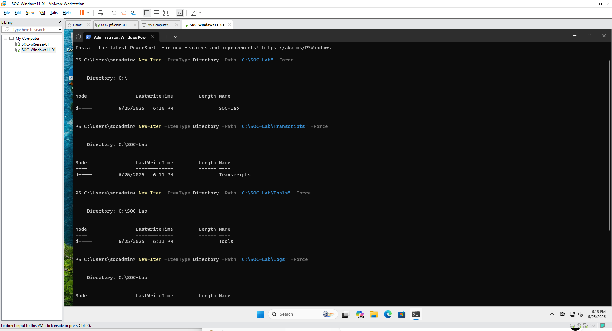

**Figure 12: SOC lab folders created on the Windows 11 endpoint.**

---

## Enable PowerShell Script Block Logging

PowerShell Script Block Logging was enabled through the Windows registry.

PowerShell commands used:

```powershell
New-Item -Path "HKLM:\SOFTWARE\Policies\Microsoft\Windows\PowerShell\ScriptBlockLogging" -Force

New-ItemProperty `
  -Path "HKLM:\SOFTWARE\Policies\Microsoft\Windows\PowerShell\ScriptBlockLogging" `
  -Name "EnableScriptBlockLogging" `
  -Value 1 `
  -PropertyType DWord `
  -Force
```

Verification command:

```powershell
Get-ItemProperty "HKLM:\SOFTWARE\Policies\Microsoft\Windows\PowerShell\ScriptBlockLogging"
```

Expected result:

```text
EnableScriptBlockLogging : 1
```

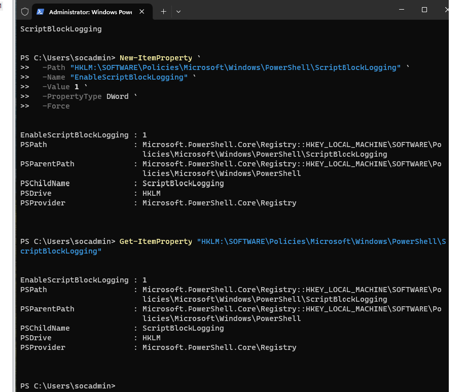

**Figure 13: PowerShell Script Block Logging enabled on SOC-Windows11-01.**

---

## Enable PowerShell Module Logging

PowerShell Module Logging was enabled to capture module-based PowerShell activity.

PowerShell commands used:

```powershell
New-Item -Path "HKLM:\SOFTWARE\Policies\Microsoft\Windows\PowerShell\ModuleLogging\ModuleNames" -Force

New-ItemProperty `
  -Path "HKLM:\SOFTWARE\Policies\Microsoft\Windows\PowerShell\ModuleLogging" `
  -Name "EnableModuleLogging" `
  -Value 1 `
  -PropertyType DWord `
  -Force

New-ItemProperty `
  -Path "HKLM:\SOFTWARE\Policies\Microsoft\Windows\PowerShell\ModuleLogging\ModuleNames" `
  -Name "*" `
  -Value "*" `
  -PropertyType String `
  -Force
```

Verification commands:

```powershell
Get-ItemProperty "HKLM:\SOFTWARE\Policies\Microsoft\Windows\PowerShell\ModuleLogging"

Get-ItemProperty "HKLM:\SOFTWARE\Policies\Microsoft\Windows\PowerShell\ModuleLogging\ModuleNames"
```

Expected result:

```text
EnableModuleLogging : 1
*                   : *
```

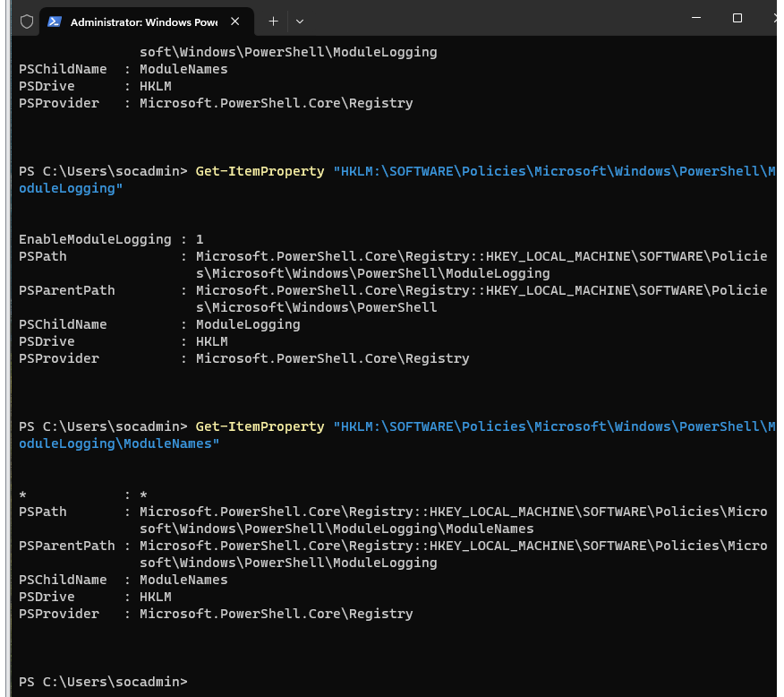

**Figure 14: PowerShell Module Logging enabled on the Windows endpoint.**

---

## Enable PowerShell Transcription

PowerShell Transcription was enabled to save PowerShell session records to a dedicated transcript directory.

PowerShell commands used:

```powershell
New-Item -Path "HKLM:\SOFTWARE\Policies\Microsoft\Windows\PowerShell\Transcription" -Force

New-ItemProperty `
  -Path "HKLM:\SOFTWARE\Policies\Microsoft\Windows\PowerShell\Transcription" `
  -Name "EnableTranscripting" `
  -Value 1 `
  -PropertyType DWord `
  -Force

New-ItemProperty `
  -Path "HKLM:\SOFTWARE\Policies\Microsoft\Windows\PowerShell\Transcription" `
  -Name "EnableInvocationHeader" `
  -Value 1 `
  -PropertyType DWord `
  -Force

New-ItemProperty `
  -Path "HKLM:\SOFTWARE\Policies\Microsoft\Windows\PowerShell\Transcription" `
  -Name "OutputDirectory" `
  -Value "C:\SOC-Lab\Transcripts" `
  -PropertyType String `
  -Force
```

Verification command:

```powershell
Get-ItemProperty "HKLM:\SOFTWARE\Policies\Microsoft\Windows\PowerShell\Transcription"
```

Expected result:

```text
EnableTranscripting     : 1
EnableInvocationHeader  : 1
OutputDirectory         : C:\SOC-Lab\Transcripts
```

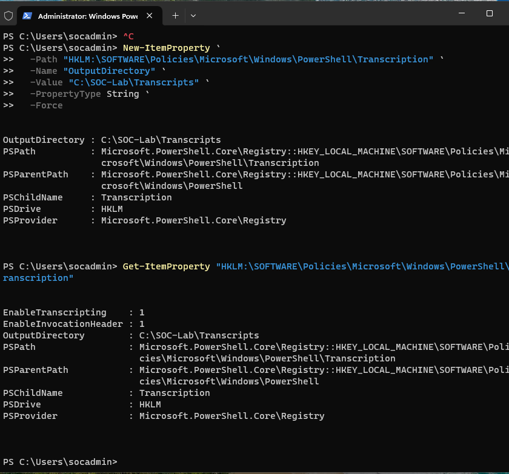

**Figure 15: PowerShell Transcription enabled with transcript output directory configured.**

---

## Enable Process Creation Auditing

Windows Process Creation Auditing was enabled to generate Security Event ID 4688.

PowerShell command used:

```powershell
auditpol /set /subcategory:"Process Creation" /success:enable /failure:enable
```

Verification command:

```powershell
auditpol /get /subcategory:"Process Creation"
```

Expected result:

```text
Process Creation    Success and Failure
```

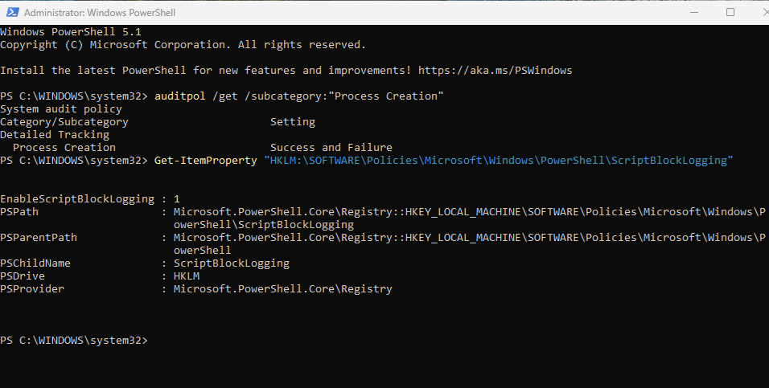

**Figure 16: Process Creation Auditing and Script Block Logging validation.**

---

## Enable Command Line Process Auditing

Command-line process auditing was enabled so that Windows Security Event ID 4688 can include command-line details.

PowerShell commands used:

```powershell
New-Item -Path "HKLM:\SOFTWARE\Microsoft\Windows\CurrentVersion\Policies\System\Audit" -Force

New-ItemProperty `
  -Path "HKLM:\SOFTWARE\Microsoft\Windows\CurrentVersion\Policies\System\Audit" `
  -Name "ProcessCreationIncludeCmdLine_Enabled" `
  -Value 1 `
  -PropertyType DWord `
  -Force
```

Verification command:

```powershell
Get-ItemProperty "HKLM:\SOFTWARE\Microsoft\Windows\CurrentVersion\Policies\System\Audit"
```

Expected result:

```text
ProcessCreationIncludeCmdLine_Enabled : 1
```

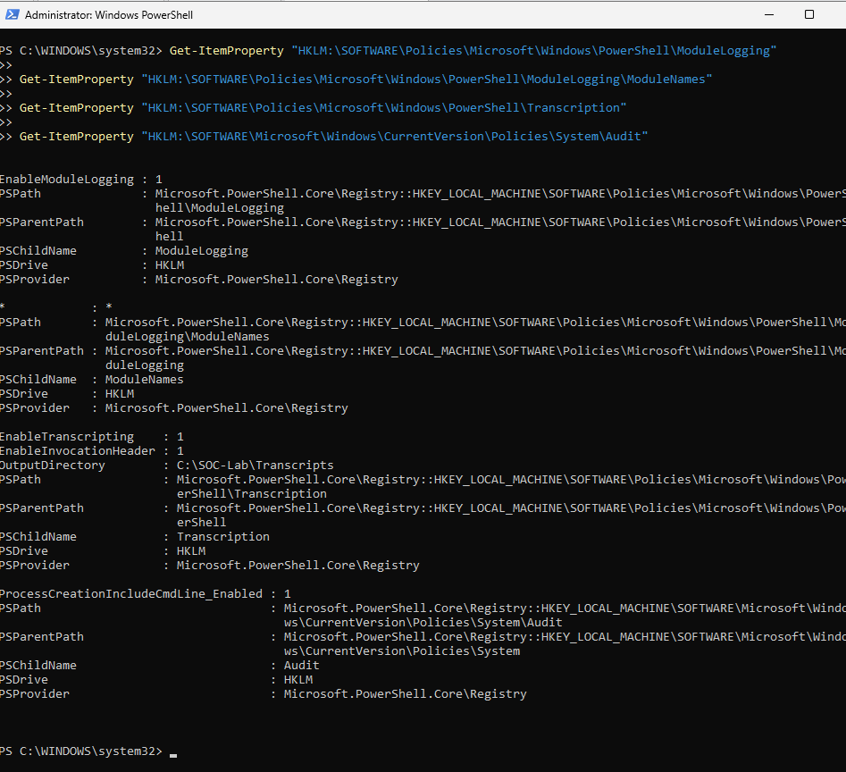

**Figure 17: Module Logging, Transcription, and Command Line Auditing validation.**

---

## Generate Test Events

After enabling logging, a new Administrator PowerShell window was opened and test commands were executed to generate PowerShell and process creation events.

PowerShell commands used:

```powershell
$Marker = "PHASE6_LOGGING_TEST_20260625"

Write-Output $Marker
whoami
hostname
Get-Date
Get-Process | Select-Object -First 5

powershell.exe -NoProfile -Command "Write-Output PHASE6_CHILD_PROCESS_TEST_20260625"
cmd.exe /c "echo PHASE6_CMD_PROCESS_TEST_20260625"
```

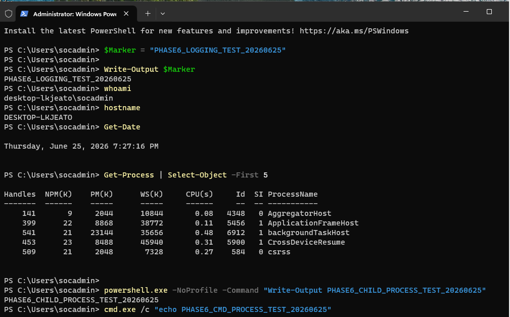

**Figure 18: Phase 6 test events generated after reopening Administrator PowerShell.**

---

## Validate PowerShell Operational Log

PowerShell Operational logs were searched for the Phase 6 test markers.

PowerShell command used:

```powershell
Get-WinEvent -LogName "Microsoft-Windows-PowerShell/Operational" -MaxEvents 100 |
Where-Object {
    $_.Message -like "*PHASE6_LOGGING_TEST_20260625*" -or
    $_.Message -like "*PHASE6_CHILD_PROCESS_TEST_20260625*"
} |
Select-Object TimeCreated, Id, ProviderName, Message |
Format-List
```

Expected result:

```text
PowerShell Operational events containing the Phase 6 test marker
```

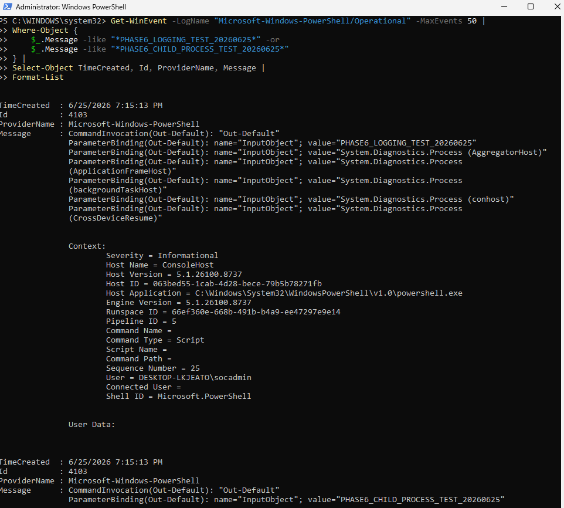

**Figure 19: PowerShell Operational log validation showing Phase 6 test activity.**

---

## Validate Windows Security Event ID 4688

Windows Security logs were searched for process creation events.

PowerShell command used:

```powershell
Get-WinEvent -FilterHashtable @{
    LogName='Security'
    Id=4688
} -MaxEvents 50 |
Where-Object {
    $_.Message -like "*powershell.exe*" -or
    $_.Message -like "*cmd.exe*" -or
    $_.Message -like "*PHASE6*"
} |
Select-Object TimeCreated, Id, ProviderName, Message |
Format-List
```

Expected fields:

```text
New Process Name
Creator Process Name
Process Command Line
```

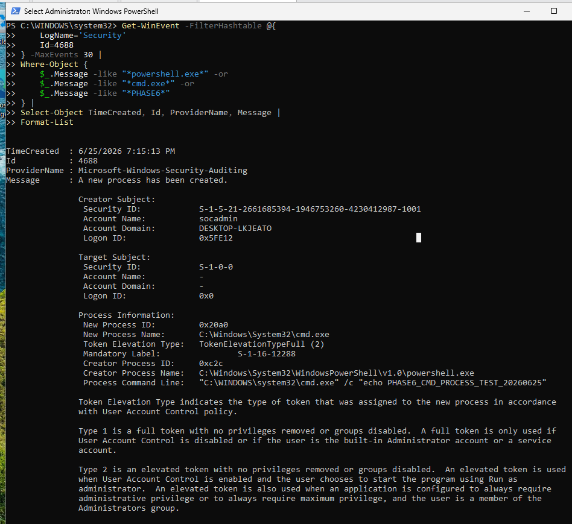

**Figure 20: Windows Security Event ID 4688 process creation validation.**

---

## Validate PowerShell Transcript File Creation

PowerShell transcript output was validated by checking the transcript directory.

PowerShell command used:

```powershell
Get-ChildItem "C:\SOC-Lab\Transcripts" -Recurse |
Sort-Object LastWriteTime -Descending |
Select-Object -First 10 FullName, LastWriteTime, Length
```

A transcript file was also reviewed using:

```powershell
$LatestTranscript = Get-ChildItem "C:\SOC-Lab\Transcripts" -Recurse |
Sort-Object LastWriteTime -Descending |
Select-Object -First 1

Get-Content $LatestTranscript.FullName -Tail 30
```

Expected result:

```text
PowerShell transcript file created under C:\SOC-Lab\Transcripts
```

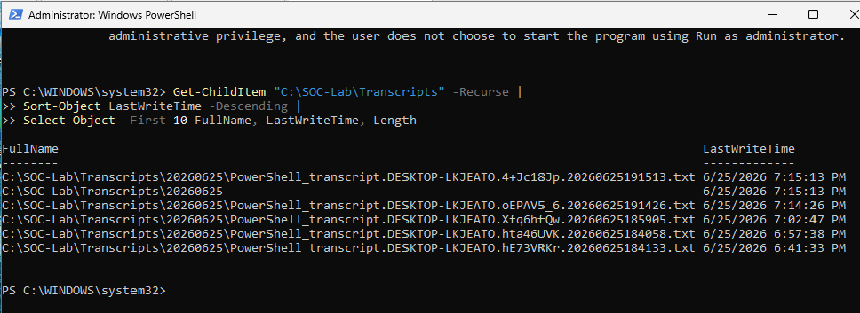

**Figure 21: PowerShell transcript file created on the Windows endpoint.**

---

## Phase 6 Validation Summary

A final validation summary was executed to confirm the enabled logging settings.

PowerShell command used:

```powershell
Write-Host "`n=== Phase 6 Validation Summary ==="

Write-Host "`n[1] Process Creation Auditing"
auditpol /get /subcategory:"Process Creation"

Write-Host "`n[2] Script Block Logging"
Get-ItemProperty "HKLM:\SOFTWARE\Policies\Microsoft\Windows\PowerShell\ScriptBlockLogging" |
Select-Object EnableScriptBlockLogging

Write-Host "`n[3] Module Logging"
Get-ItemProperty "HKLM:\SOFTWARE\Policies\Microsoft\Windows\PowerShell\ModuleLogging" |
Select-Object EnableModuleLogging

Write-Host "`n[4] Transcription"
Get-ItemProperty "HKLM:\SOFTWARE\Policies\Microsoft\Windows\PowerShell\Transcription" |
Select-Object EnableTranscripting, EnableInvocationHeader, OutputDirectory

Write-Host "`n[5] Command Line Auditing"
Get-ItemProperty "HKLM:\SOFTWARE\Microsoft\Windows\CurrentVersion\Policies\System\Audit" |
Select-Object ProcessCreationIncludeCmdLine_Enabled

Write-Host "`n[6] Transcript Files"
Get-ChildItem "C:\SOC-Lab\Transcripts" -Recurse -ErrorAction SilentlyContinue |
Sort-Object LastWriteTime -Descending |
Select-Object -First 5 FullName, LastWriteTime, Length
```

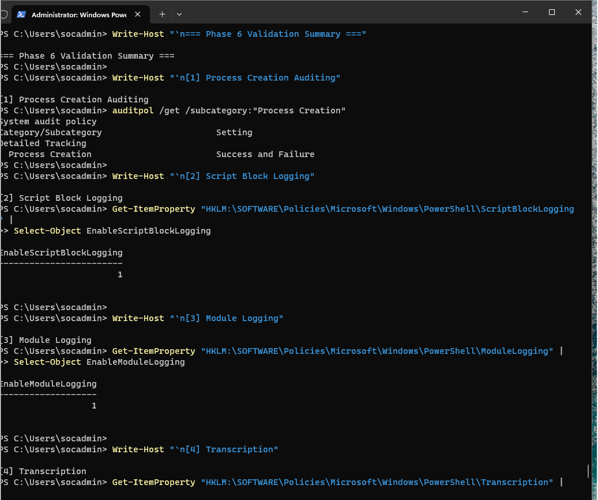

**Figure 22: Final Phase 6 validation summary.**

---

## Validation Summary

| Validation Item                           | Result    |
| ----------------------------------------- | --------- |
| SOC lab folders created                   | Completed |
| PowerShell Script Block Logging enabled   | Completed |
| PowerShell Module Logging enabled         | Completed |
| PowerShell Transcription enabled          | Completed |
| Process Creation Auditing enabled         | Completed |
| Command Line Process Auditing enabled     | Completed |
| PowerShell test events generated          | Completed |
| PowerShell Operational log validated      | Completed |
| Security Event ID 4688 validated          | Completed |
| PowerShell transcript file created        | Completed |
| Endpoint prepared for Sysmon              | Completed |
| Endpoint prepared for SIEM log forwarding | Completed |

---

## Troubleshooting Notes

During this phase, logging settings were validated directly from PowerShell and the Windows registry.

Key validation evidence:

```text
Process Creation Auditing = Success and Failure
EnableScriptBlockLogging = 1
EnableModuleLogging = 1
EnableTranscripting = 1
ProcessCreationIncludeCmdLine_Enabled = 1
```

This confirms that the Windows endpoint is generating security-relevant telemetry for future SOC monitoring.

---

## Skills Demonstrated

* Windows endpoint logging preparation
* PowerShell security logging configuration
* Script Block Logging configuration
* Module Logging configuration
* PowerShell Transcription configuration
* Windows Security auditing
* Process Creation Auditing
* Command Line Process Auditing
* Event Viewer validation
* PowerShell event log analysis
* Security Event ID 4688 validation
* SOC endpoint baseline documentation

---

## Security Relevance

This phase establishes the endpoint logging foundation required for SOC operations.

PowerShell activity and process creation events are important sources of evidence during security investigations. By enabling PowerShell logging, transcription, process creation auditing, and command-line auditing, the endpoint can now generate useful telemetry for later collection by Wazuh, Elastic, or another SIEM platform.

This prepares the lab for the next major step: deploying Sysmon and forwarding endpoint security logs into the centralized SOC monitoring platform.

---

## Next Phase

The next phase will focus on Sysmon deployment.

Planned activities:

```text
Download Sysmon
Prepare Sysmon configuration
Install Sysmon
Verify Sysmon service
Generate Sysmon test events
Validate Sysmon Event ID 1
Prepare Sysmon logs for SIEM collection
```
