# Ubuntu Server Deployment

## Objective

Deploy an Ubuntu Server virtual machine as a Linux endpoint in the Enterprise SOC Home Lab.

This Ubuntu Server will support future SOC lab components, including:

* Linux endpoint logging
* SSH administration
* Network validation
* Wazuh agent testing
* Elastic / SIEM integration
* Attack simulation and detection testing

---

## Lab Environment

| Item                 | Configuration              |
| -------------------- | -------------------------- |
| Virtual Machine Name | SOC-Ubuntu-Server-01       |
| Operating System     | Ubuntu Server 24.04.4 LTS  |
| Hostname             | soc-ubuntu-server-01       |
| Username             | socadmin                   |
| Platform             | VMware Workstation Pro     |
| CPU                  | 2 virtual cores            |
| Disk                 | 40 GB                      |
| Network              | VMnet1 / SOC LAN           |
| IP Address           | 192.168.10.102             |
| Default Gateway      | pfSense LAN - 192.168.10.1 |
| SSH                  | Enabled                    |

---

## Network Design

The Ubuntu Server was deployed inside the internal SOC network behind the pfSense firewall.

```text
Internet
   |
Windows Host
   |
VMware NAT / Bridged WAN
   |
pfSense Firewall
   |-- WAN
   |-- LAN: 192.168.10.1/24
            |
            |-- Windows 11 Endpoint
            |-- Ubuntu Server: 192.168.10.102
```

This design allows the Ubuntu Server to operate as an internal Linux endpoint while outbound traffic passes through pfSense.

---

## Step 1: Download Ubuntu Server ISO

Ubuntu Server 24.04.4 LTS ISO was downloaded and saved to the local ISO directory.

```text
C:\CyberLab\ISO
```

The ISO file was renamed for easier lab management.

```text
ubuntu-server-24.04.iso
```

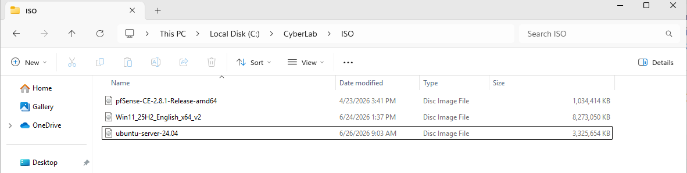

**Figure 19: Ubuntu Server 24.04 LTS ISO downloaded**

---

## Step 2: Configure Virtual Disk Capacity

The Ubuntu Server virtual disk was configured with a 40 GB maximum capacity.

The virtual disk was stored as multiple files to make the VM easier to move, copy, and back up during the lab build.

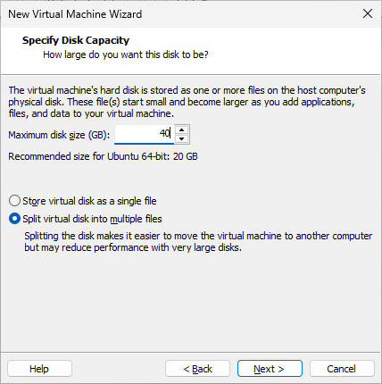

**Figure 20: Ubuntu Server virtual disk capacity configured**

---

## Step 3: Configure Network Adapter

The Ubuntu Server VM network adapter was connected to the internal SOC LAN.

```text
Network Adapter: Custom VMnet1
```

This allows the Ubuntu Server to communicate with pfSense LAN and other internal SOC endpoints.

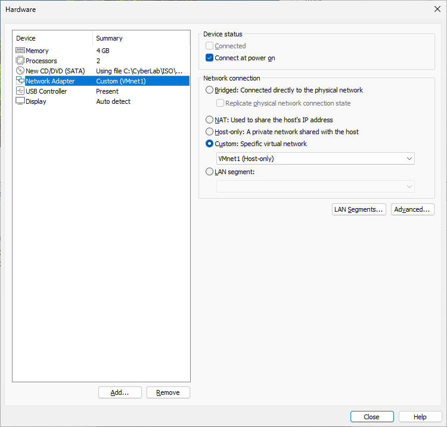

**Figure 21: Ubuntu Server network adapter connected to VMnet1**

---

## Step 4: Start Ubuntu Server Installation

Ubuntu Server installation was started from the ISO.

The following installation options were selected:

```text
Language: English
Keyboard: English (US)
Installation Type: Ubuntu Server
```

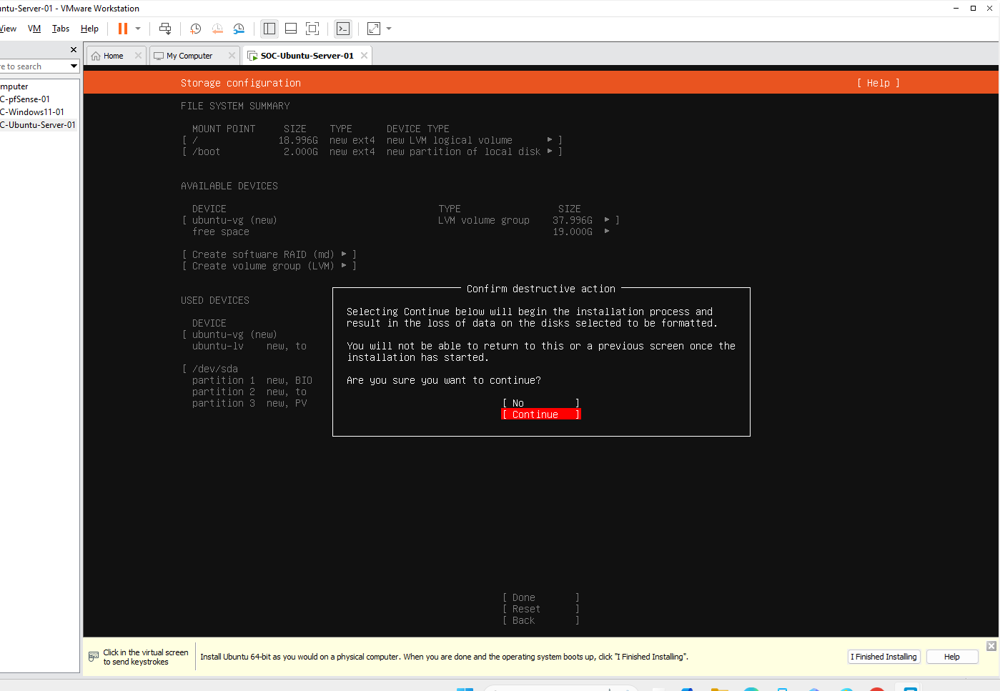

**Figure 22: Ubuntu Server installation started**

---

## Step 5: Configure User Profile

The Ubuntu Server user profile was configured during installation.

```text
Hostname: soc-ubuntu-server-01
Username: socadmin
```

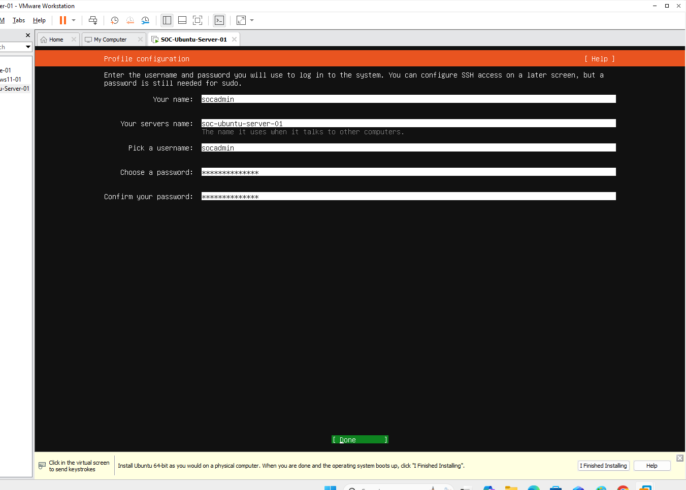

**Figure 23: Ubuntu Server user profile configured**

---

## Step 6: Enable OpenSSH Server

OpenSSH Server was enabled during installation to support remote administration.

This allows the Ubuntu Server to be managed remotely from other internal SOC lab machines.

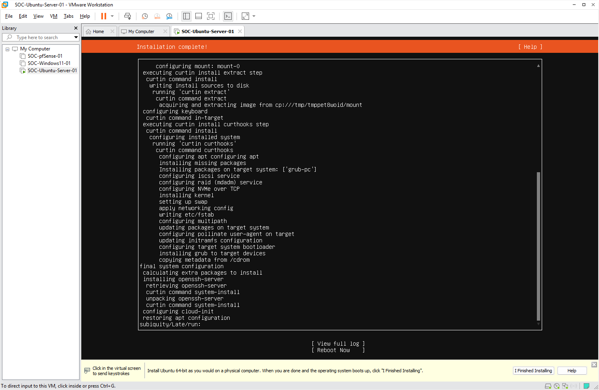

**Figure 24: OpenSSH Server enabled during Ubuntu installation**

---

## Step 7: Complete Installation

After the installation completed, the Ubuntu Server VM was rebooted.

The installation media was disconnected after reboot so the VM could boot from the installed virtual disk.

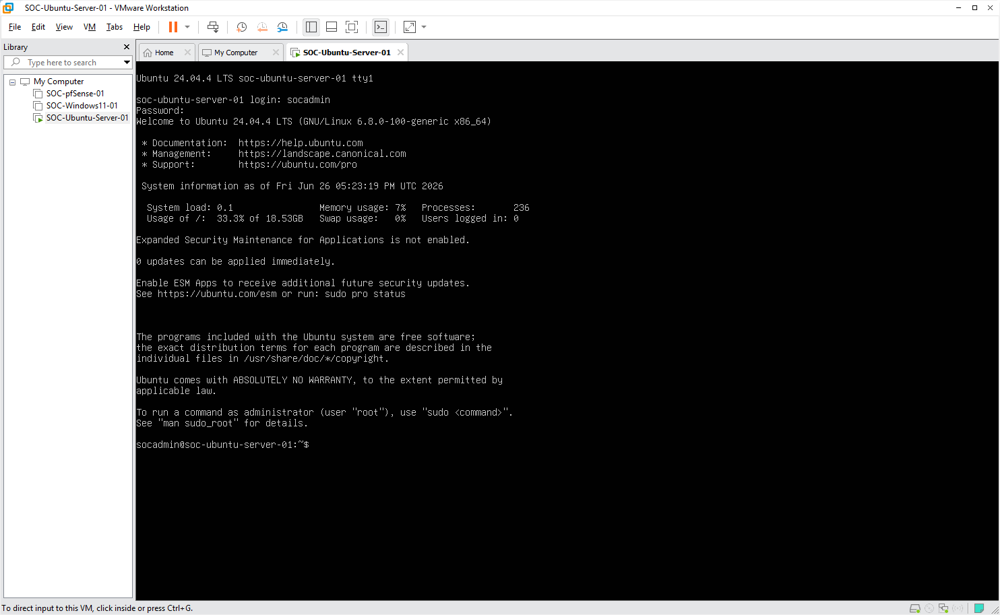

**Figure 25: Ubuntu Server installation completed**

---

## Step 8: First Login Validation

After reboot, the first login was completed successfully.

The following commands were used for initial validation:

```bash
hostname
whoami
lsb_release -a
```

Validation results:

```text
Hostname: soc-ubuntu-server-01
User: socadmin
OS: Ubuntu 24.04.4 LTS
```

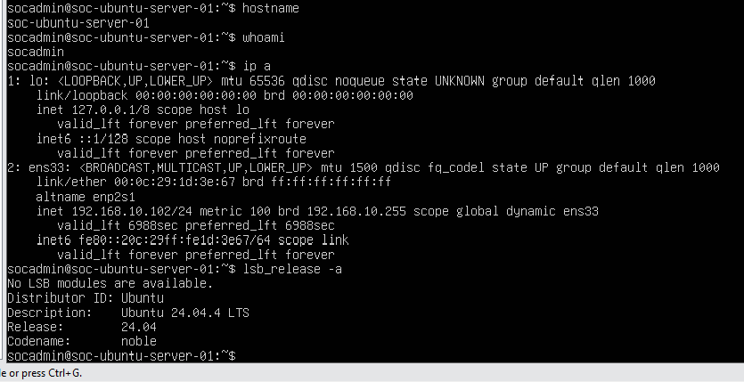

**Figure 26: Ubuntu Server first login completed**

---

## Step 9: IP Address Validation

The Ubuntu Server network interface was validated using:

```bash
ip a
```

The Ubuntu Server successfully received an IP address from the SOC LAN DHCP service.

```text
Interface: ens33
IP Address: 192.168.10.102/24
Gateway: 192.168.10.1
```

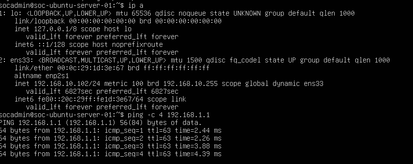

**Figure 27: Ubuntu Server received SOC LAN IP address**

---

## Step 10: Network Connectivity Test

Internal and external network connectivity were tested.

The following commands were used:

```bash
ping -c 4 192.168.10.1
ping -c 4 8.8.8.8
ping -c 4 google.com
```

Validation results:

| Test                     | Result     |
| ------------------------ | ---------- |
| Ping pfSense LAN gateway | Successful |
| Ping external IP address | Successful |
| DNS resolution test      | Successful |

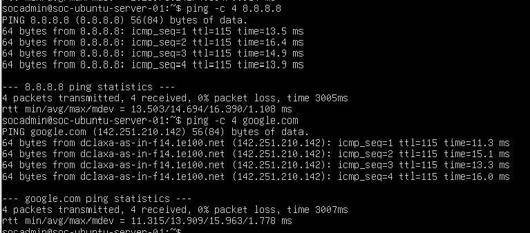

**Figure 28: Ubuntu Server network connectivity validated**

---

## Step 11: System Update

The Ubuntu Server package index was updated and available upgrades were installed.

```bash
sudo apt update
sudo apt upgrade -y
```

Basic administration and troubleshooting tools were installed.

```bash
sudo apt install -y net-tools curl wget vim git unzip htop tree openssh-server
```

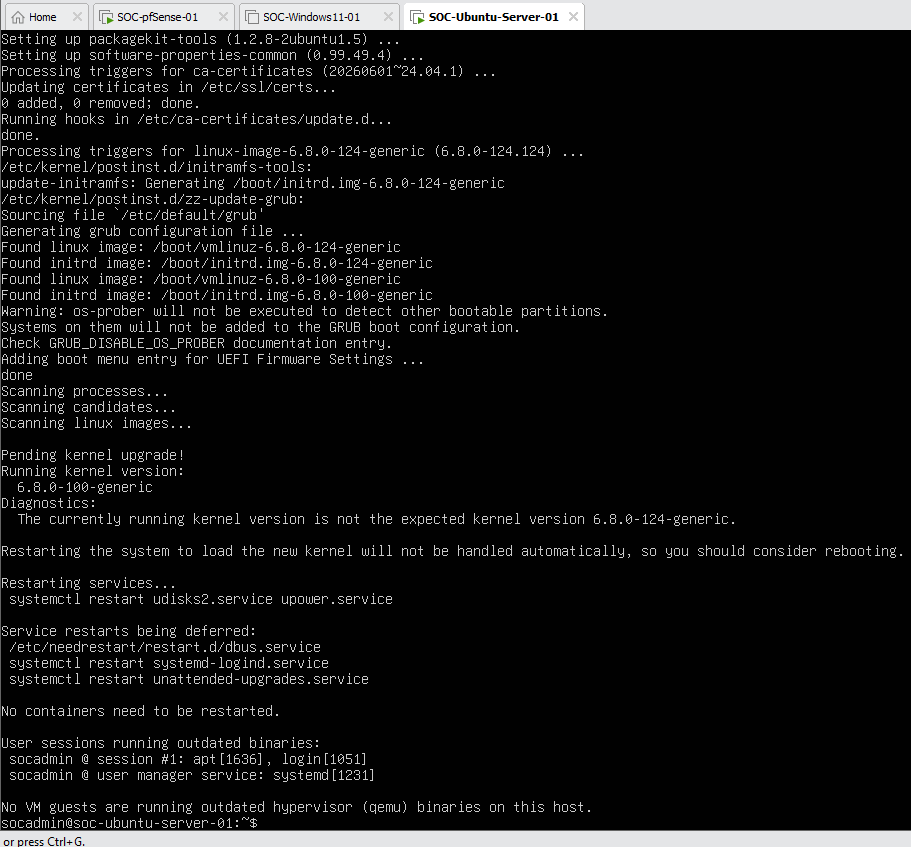

**Figure 29: Ubuntu Server system update completed**

---

## Step 12: SSH Service Validation

The SSH service was checked after installation and update.

```bash
sudo systemctl status ssh
```

The service showed active running status.

```text
SSH Status: active running
```

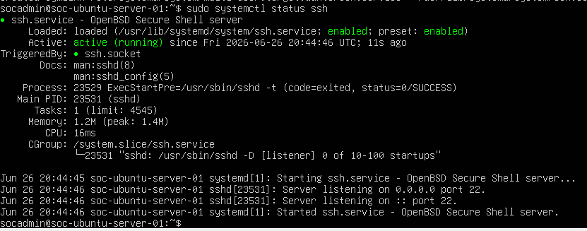

**Figure 30: Ubuntu Server SSH service active**

---

## Step 13: Final Validation

Final validation confirmed that the Ubuntu Server was installed, connected to the SOC LAN, updated, and ready for future SOC lab phases.

Validation checklist:

| Validation Item           | Status    |
| ------------------------- | --------- |
| Ubuntu Server installed   | Completed |
| Hostname configured       | Completed |
| SOC LAN IP assigned       | Completed |
| pfSense LAN reachable     | Completed |
| Internet access validated | Completed |
| DNS resolution validated  | Completed |
| System updated            | Completed |
| Basic tools installed     | Completed |
| SSH enabled and active    | Completed |

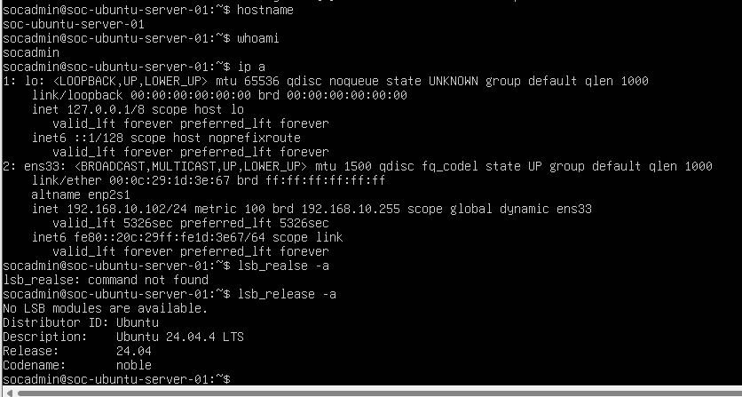

**Figure 31: Ubuntu Server final validation completed**

---

## Result

Ubuntu Server was successfully deployed as a Linux endpoint inside the Enterprise SOC Home Lab.

The VM is ready for future phases, including:

* Kali Linux deployment
* Wazuh SIEM deployment
* Linux log forwarding
* Elastic Stack integration
* Detection engineering
* Attack simulation and event collection

---

## README Status Update

The project README status table should be updated as follows:

```markdown
| Ubuntu Server Deployment | ✅ Completed |
| Kali Linux Deployment | ⏳ Planned |
```
