# Kali Linux Deployment

## Objective

Deploy a Kali Linux virtual machine as the attack simulation workstation in the Enterprise SOC Home Lab.

This Kali Linux system will be used for future security testing and detection engineering tasks, including:

* Network scanning
* Reconnaissance testing
* Attack simulation
* Log generation
* MITRE ATT&CK technique testing
* Wazuh and Elastic SIEM detection validation

---

## Lab Environment

| Item                 | Configuration              |
| -------------------- | -------------------------- |
| Virtual Machine Name | SOC-kali-01                |
| Operating System     | Kali Linux                 |
| Platform             | VMware Workstation Pro     |
| Guest OS Type        | Debian 12.x 64-bit         |
| Username             | kaliadmin                  |
| Network              | VMnet1 / SOC LAN           |
| IP Address           | 192.168.10.103             |
| Default Gateway      | pfSense LAN - 192.168.10.1 |
| DNS                  | pfSense LAN - 192.168.10.1 |
| SSH                  | Enabled                    |

---

## Network Design

Kali Linux was deployed inside the internal SOC lab network.

The Kali VM is connected to the same SOC LAN as the Windows 11 endpoint and Ubuntu Server. This allows Kali to simulate attacker activity against internal lab systems while pfSense, Windows, Ubuntu, and future SIEM components can observe and collect logs.

```text
Internet
   |
Windows Host
   |
pfSense Firewall
   |-- WAN
   |-- LAN: 192.168.10.1/24
            |
            |-- Windows 11 Endpoint
            |-- Ubuntu Server: 192.168.10.102
            |-- Kali Linux: 192.168.10.103
```

Kali Linux was intentionally placed on the internal SOC LAN instead of being bridged directly to the physical network.

---

## Step 1: Download Kali Linux ISO

The Kali Linux installer ISO was downloaded from the official Kali Linux download page.

The ISO was saved in the local ISO directory:

```text
C:\CyberLab\ISO
```

The ISO file was renamed for easier lab management:

```text
kali-linux-installer-amd64.iso
```

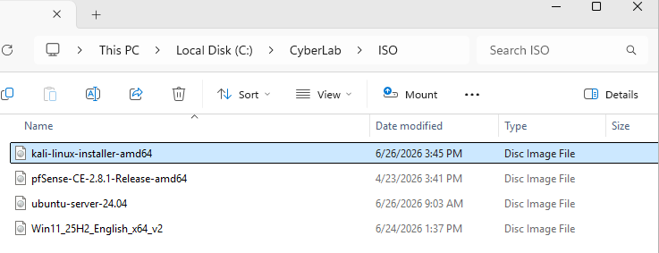

**Figure 32: Kali Linux installer ISO downloaded**

---

## Step 2: Create Kali Linux Virtual Machine

A new virtual machine was created in VMware Workstation.

Virtual machine name:

```text
SOC-kali-01
```

Virtual machine location:

```text
C:\CyberLab\VMware\SOC-kali-01
```

The guest operating system was configured as:

```text
Linux
Debian 12.x 64-bit
```

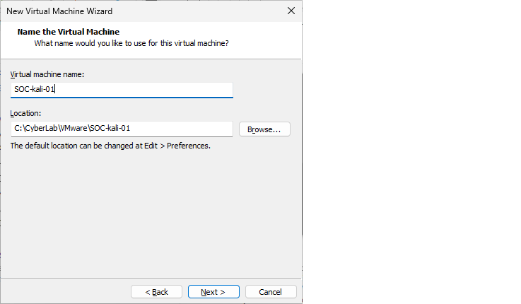

**Figure 33: Kali Linux virtual machine created in VMware Workstation**

---

## Step 3: Configure Virtual Disk Capacity

The Kali Linux virtual disk was configured with sufficient space for the operating system, security tools, package updates, and future lab activity.

Disk configuration:

```text
Maximum disk size: 60 GB
Virtual disk type: Split virtual disk into multiple files
```

Splitting the virtual disk into multiple files makes the VM easier to move, copy, and back up during the lab build.

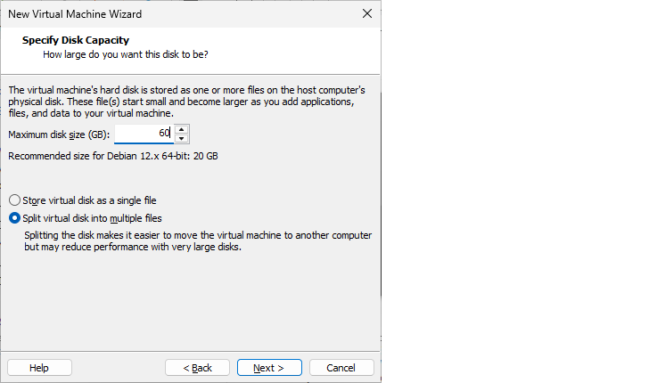

**Figure 34: Kali Linux virtual disk capacity configured**

---

## Step 4: Configure Network Adapter

The Kali Linux network adapter was connected to the internal SOC LAN.

```text
Network Adapter: Custom VMnet1
```

This places Kali Linux in the same internal network as the Ubuntu Server and Windows 11 endpoint.

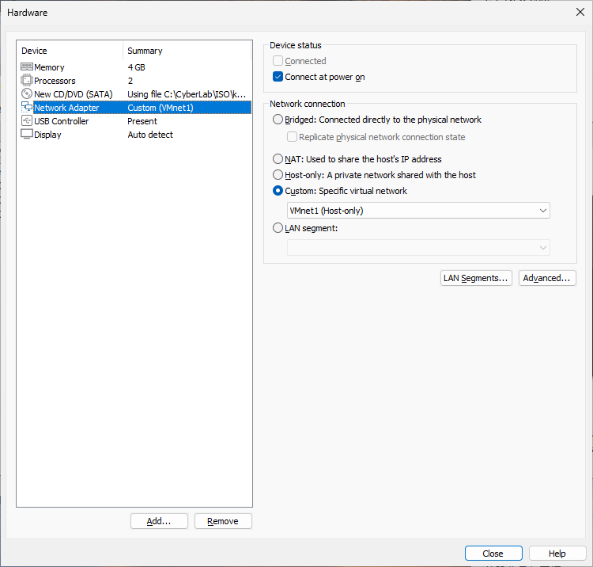

**Figure 35: Kali Linux network adapter connected to VMnet1**

---

## Step 5: Start Kali Linux Installation

The Kali Linux installer was started from the ISO.

The graphical installer was selected to complete the installation.

```text
Install Mode: Graphical Install
Language: English
Location: United States
Keyboard: American English
```

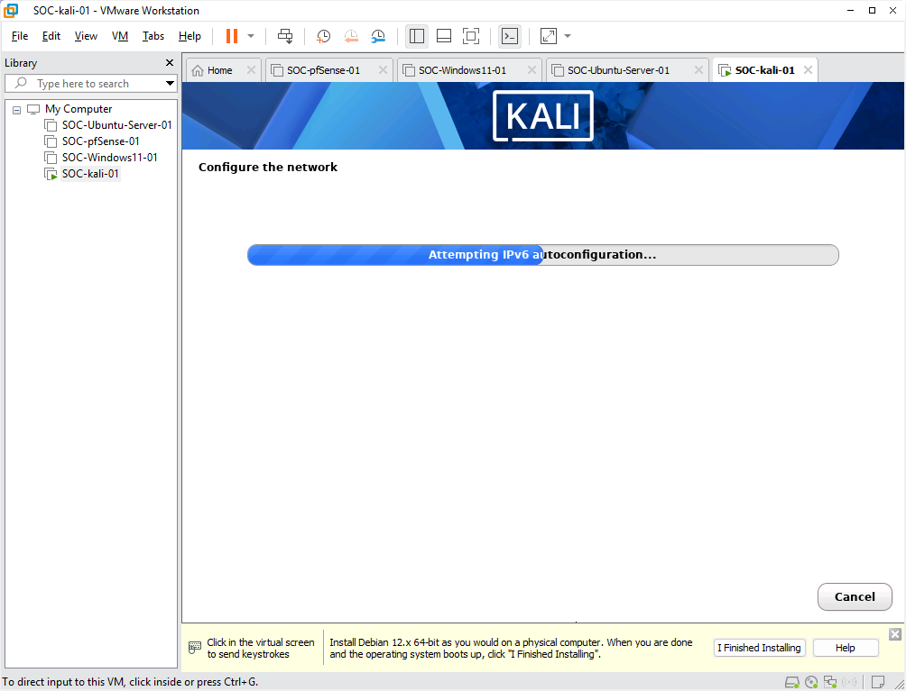

**Figure 36: Kali Linux graphical installation started**

---

## Step 6: Configure User Profile

A standard user account was created during the Kali Linux installation.

```text
Username: kaliadmin
```

This account will be used for daily administration and security testing tasks.

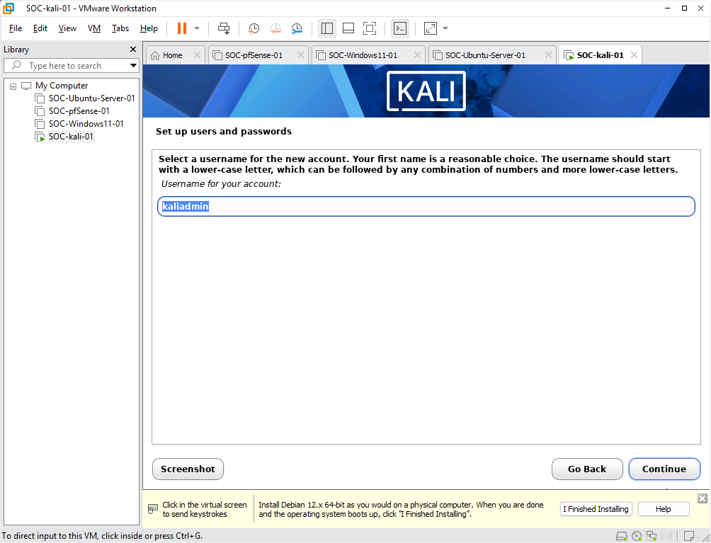

**Figure 37: Kali Linux user profile configured**

---

## Step 7: Configure Disk Partitioning

Guided disk partitioning was selected for the Kali Linux installation.

Partitioning options:

```text
Guided - use entire disk
All files in one partition
Finish partitioning and write changes to disk
```

The changes were written to the virtual disk to continue the installation.

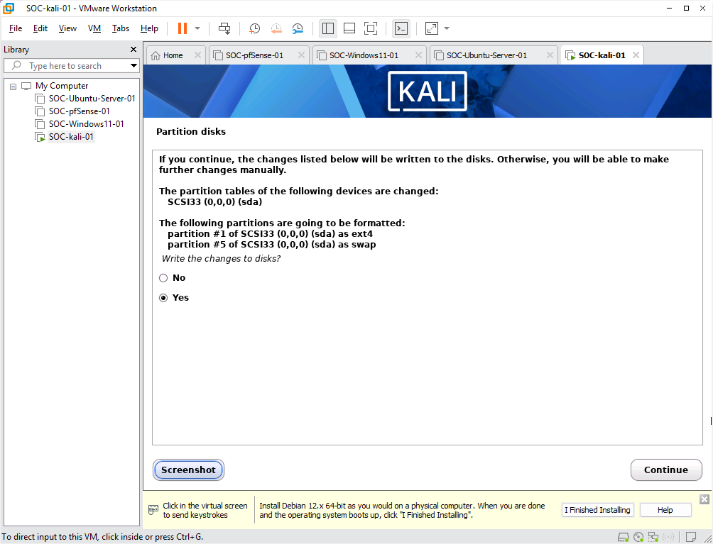

**Figure 38: Kali Linux disk partitioning configured**

---

## Step 8: Select Software Packages

The default Kali Linux desktop and tool selections were used.

The installation included the Kali desktop environment and commonly used security tools for lab testing.

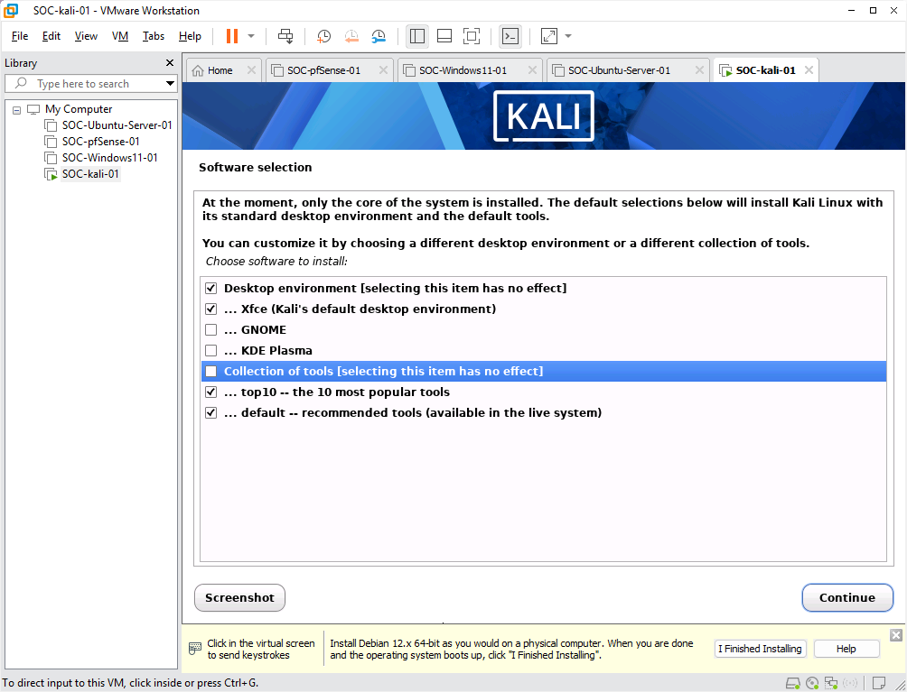

**Figure 39: Kali Linux software package selection**

---

## Step 9: Install GRUB Bootloader

The GRUB bootloader was installed to allow the Kali Linux VM to boot from the virtual disk.

GRUB was installed to the primary virtual disk:

```text
/dev/sda
```

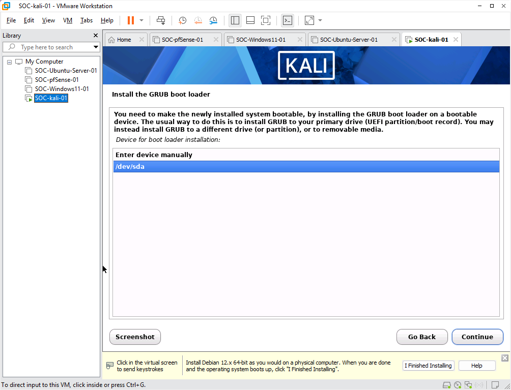

**Figure 40: Kali Linux GRUB bootloader installation**

---

## Step 10: Complete Installation

After the installation finished, the Kali Linux VM was rebooted.

The installation media was disconnected so the VM could boot from the installed virtual disk.

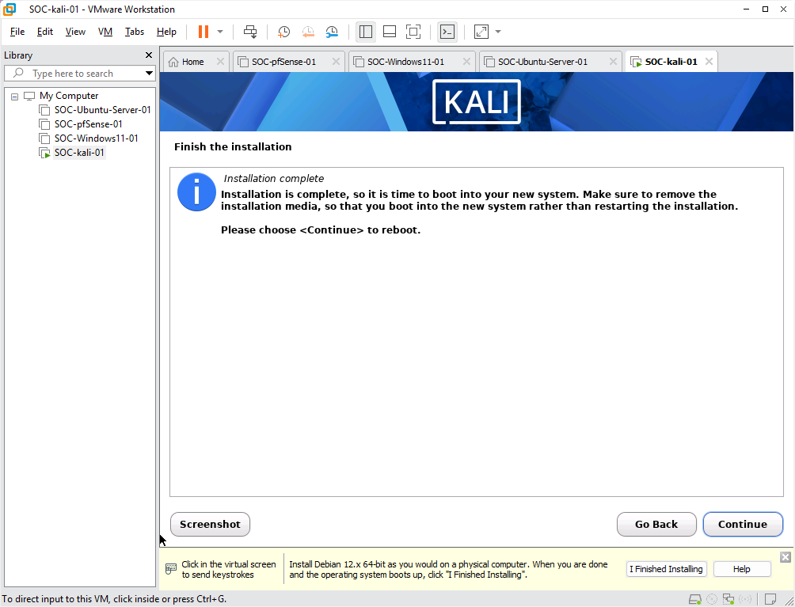

**Figure 41: Kali Linux installation completed**

---

## Step 11: First Login

After reboot, Kali Linux successfully loaded the desktop environment.

The user logged in with the configured Kali account.

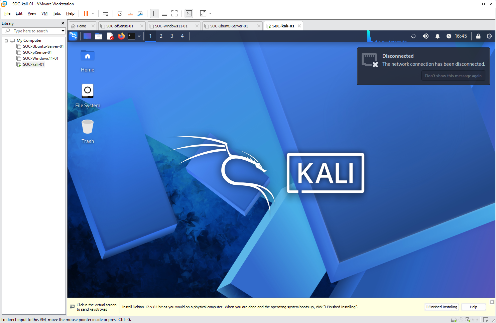

**Figure 42: Kali Linux first login completed**

---

## Step 12: IP Address Validation

The Kali Linux network interface was validated using the following command:

```bash
ip a
```

The Kali VM successfully received an IP address from the SOC LAN DHCP service.

```text
Interface: eth0
IP Address: 192.168.10.103/24
Default Gateway: 192.168.10.1
```

The routing table was also checked:

```bash
ip route
```

The default route pointed to the pfSense LAN gateway.

```text
default via 192.168.10.1 dev eth0
```

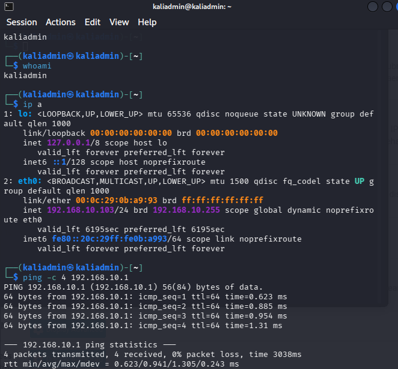

**Figure 43: Kali Linux received SOC LAN IP address**

---

## Step 13: Network Connectivity Test

Internal and external network connectivity were tested from Kali Linux.

The following commands were used:

```bash
ping -c 4 192.168.10.1
ping -c 4 192.168.10.102
ping -c 4 8.8.8.8
ping -c 4 google.com
```

Validation results:

| Test                  | Purpose                         | Result     |
| --------------------- | ------------------------------- | ---------- |
| `ping 192.168.10.1`   | Test pfSense LAN gateway        | Successful |
| `ping 192.168.10.102` | Test Ubuntu Server reachability | Successful |
| `ping 8.8.8.8`        | Test external IP connectivity   | Successful |
| `ping google.com`     | Test DNS resolution             | Successful |

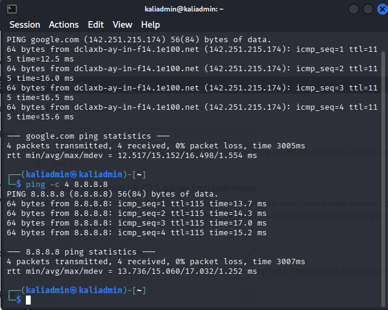

**Figure 44: Kali Linux network connectivity validated**

---

## Step 14: DNS Validation

DNS resolution was validated after confirming pfSense was functioning as the DNS forwarder and resolver for the internal SOC LAN.

The intended DNS design is:

```text
Kali Linux
   |
DNS: 192.168.10.1
   |
pfSense DNS Resolver
   |
External DNS
```

This allows internal lab clients to use pfSense as their DNS server instead of directly using public DNS servers.

The following command was used to confirm DNS resolution:

```bash
ping -c 4 google.com
```

DNS resolution was successful.

---

## Step 15: System Update

The Kali Linux package index was updated and available upgrades were installed.

```bash
sudo apt update
sudo apt upgrade -y
```

Basic administration and troubleshooting tools were installed:

```bash
sudo apt install -y net-tools curl wget git vim htop tree openssh-server
```

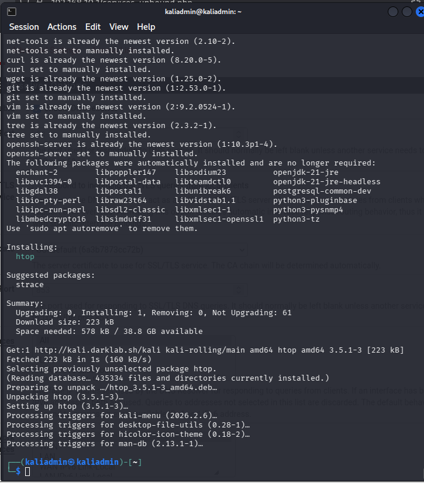

**Figure 45: Kali Linux system update completed**

---

## Step 16: SSH Service Validation

The SSH service was enabled and started.

```bash
sudo systemctl enable --now ssh
sudo systemctl status ssh
```

The SSH service showed active running status.

```text
SSH Status: active running
```

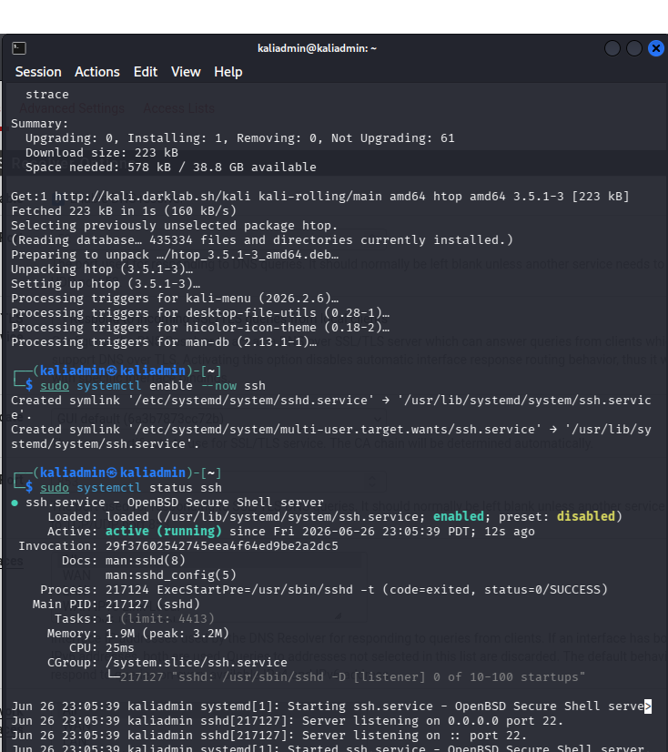

**Figure 46: Kali Linux SSH service active**

---

## Final Validation

Kali Linux deployment was completed successfully.

| Validation Item                    | Status    |
| ---------------------------------- | --------- |
| Kali Linux installed               | Completed |
| Kali desktop login completed       | Completed |
| SOC LAN IP assigned                | Completed |
| pfSense LAN gateway reachable      | Completed |
| Ubuntu Server reachable            | Completed |
| External IP connectivity validated | Completed |
| DNS resolution validated           | Completed |
| System updated                     | Completed |
| Basic tools installed              | Completed |
| SSH enabled and active             | Completed |

---

## Result

Kali Linux was successfully deployed as the attack simulation workstation inside the Enterprise SOC Home Lab.

The VM is ready for future phases, including:

* Network scanning
* Windows endpoint testing
* Linux endpoint testing
* Wazuh alert generation
* Elastic SIEM event validation
* MITRE ATT&CK detection testing

---


