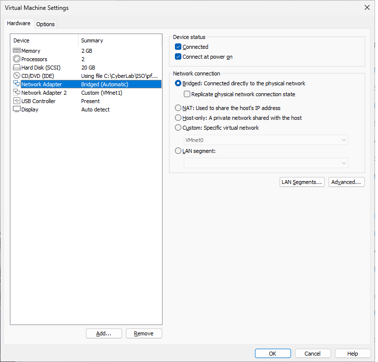
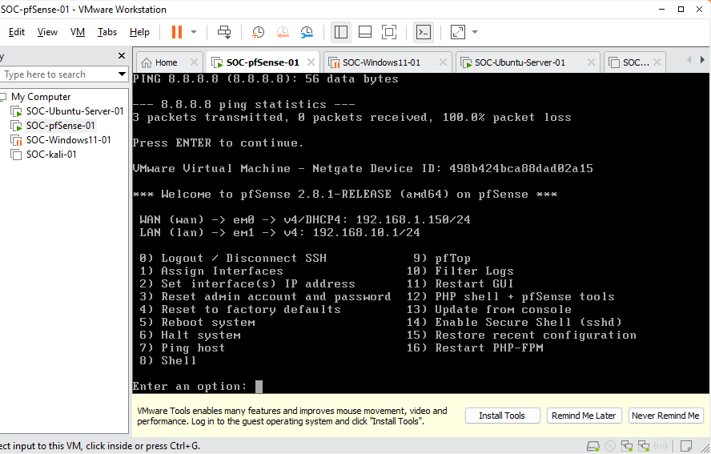
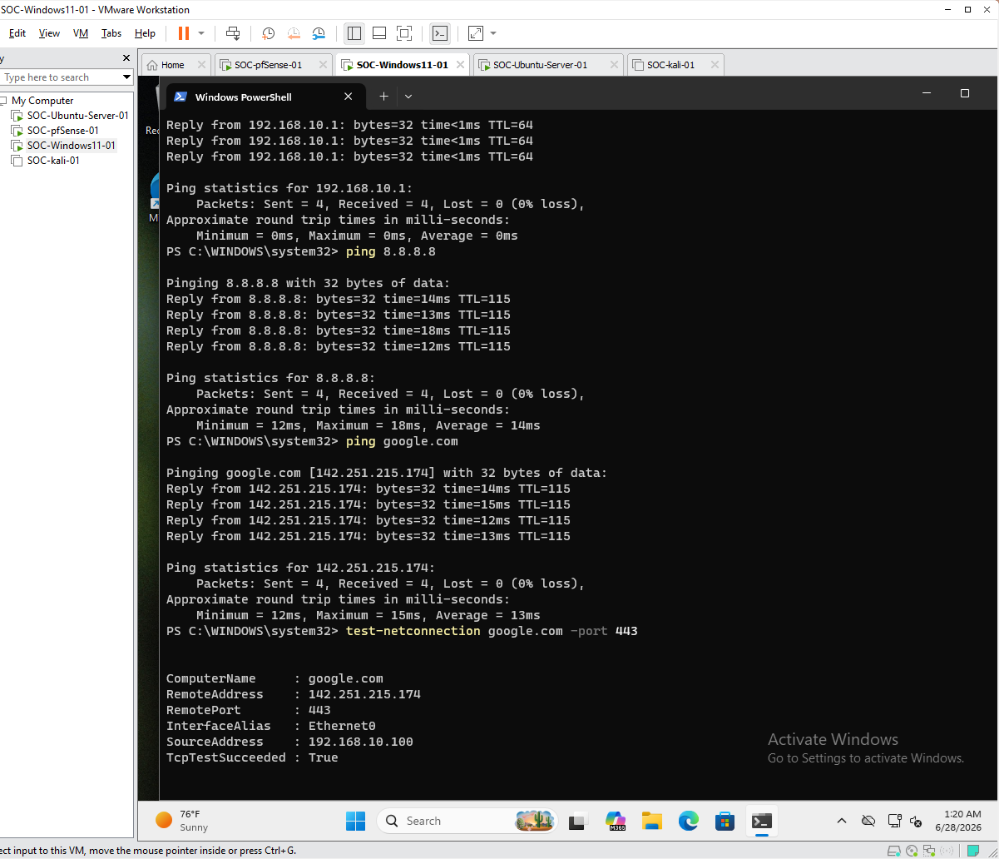
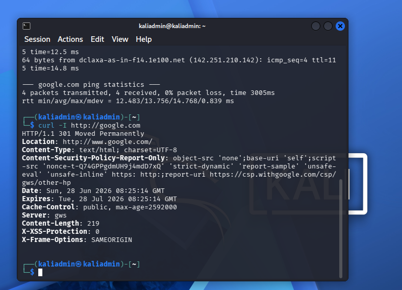
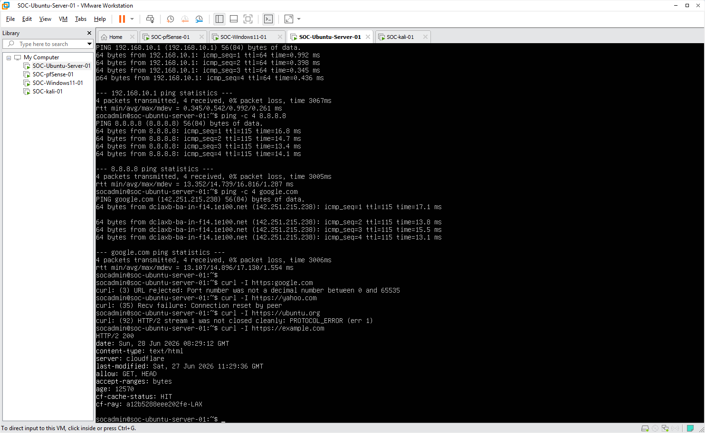
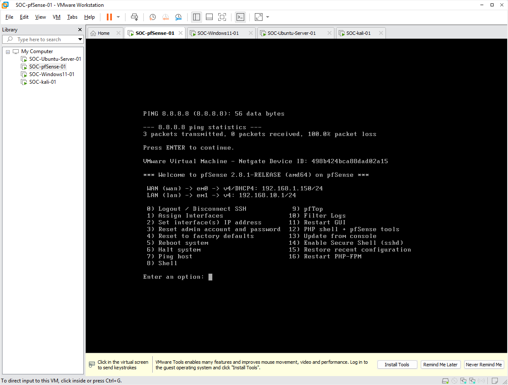

# Phase 09 - Lab Network Stabilization

## Objective

The objective of this phase was to stabilize the Enterprise SOC Home Lab network and verify that all internal lab systems could access the Internet through the pfSense firewall.

This phase focused on confirming a reliable network design before moving forward with SIEM deployment, endpoint monitoring, centralized logging, and attack simulation.

---

## Lab Network Goal

The goal was to ensure that the internal SOC lab systems could communicate through the pfSense LAN gateway and reach the Internet successfully.

The required internal systems included:

* `SOC-Windows11-01`
* `SOC-Kali-01`
* `SOC-Ubuntu-server-01`

The pfSense firewall was used as the main gateway for the internal lab network.

---

## Final Network Design

After testing different VMware networking options, the stable working design was selected.

```text
                        Internet
                            │
                      Home Router
                            │
                    Bridged Network
                            │
                       WAN (em0)
                    ┌──────────────┐
                    │   pfSense    │
                    │   Firewall   │
                    └──────────────┘
                       LAN (em1)
                            │
                    VMware Host-only
                    192.168.10.0/24
                            │
        ┌───────────────────┼───────────────────┐
        │                   │                   │
┌────────────────┐  ┌────────────────┐  ┌──────────────────────┐
│ SOC-Windows11  │  │ SOC-Kali       │  │ SOC-Ubuntu-Server    │
│ Endpoint       │  │ Attack Box     │  │ Future SIEM Server   │
└────────────────┘  └────────────────┘  └──────────────────────┘
```

---

## Network Configuration Summary

| Component                          | Configuration   |
| ---------------------------------- | --------------- |
| pfSense WAN                        | Bridged         |
| pfSense LAN                        | Host-only       |
| pfSense LAN IP                     | 192.168.10.1/24 |
| Internal Network                   | 192.168.10.0/24 |
| Windows 11 Endpoint                | Host-only       |
| Kali Linux                         | Host-only       |
| Ubuntu Server                      | Host-only       |
| Default Gateway for Internal Hosts | 192.168.10.1    |

---

## Step 1 - Set pfSense WAN to Bridged Mode

The pfSense WAN adapter was configured to use Bridged networking in VMware Workstation Pro.

This allowed pfSense to receive network access through the physical home network while still acting as the firewall and gateway for the internal SOC lab.

VMware setting:

```text
SOC-pfSense-01
Network Adapter 1: Bridged
Network Adapter 2: Host-only
```



**Figure 09-01.** pfSense WAN adapter configured in Bridged mode.

---

## Step 2 - Verify pfSense Interface Status

The pfSense interface status was checked to confirm that both WAN and LAN were active.

Expected interface design:

| Interface | Role                     | Expected Status |
| --------- | ------------------------ | --------------- |
| WAN / em0 | External network access  | Active          |
| LAN / em1 | Internal SOC lab gateway | Active          |
| LAN IP    | Internal gateway         | 192.168.10.1/24 |

The LAN interface remained the main gateway for all internal lab systems.



**Figure 09-02.** pfSense WAN and LAN interfaces verified.

---

## Step 3 - Verify Windows 11 Endpoint Connectivity

The Windows 11 endpoint was tested to confirm that it could reach the pfSense LAN gateway, public IP addresses, DNS names, and HTTPS services.

Commands used in Windows PowerShell:

```powershell
ipconfig
ping 192.168.10.1
ping 8.8.8.8
ping google.com
Test-NetConnection google.com -Port 443
```

Successful results confirmed that the Windows 11 endpoint had working network access through the pfSense LAN gateway.



**Figure 09-03.** Windows 11 endpoint Internet connectivity verified through pfSense.

---

## Step 4 - Verify Kali Linux Connectivity

Kali Linux was tested to confirm that it could reach the pfSense gateway and the Internet.

Commands used in Kali Linux:

```bash
ip a
ip route
ping -c 4 192.168.10.1
ping -c 4 8.8.8.8
ping -c 4 google.com
curl -I https://google.com
```

Successful results confirmed that Kali Linux could access the Internet through the pfSense LAN gateway.



**Figure 09-04.** Kali Linux Internet connectivity verified through pfSense.

---

## Step 5 - Verify Ubuntu Server Connectivity

Ubuntu Server was tested to confirm that it could reach the pfSense gateway and the Internet.

Commands used in Ubuntu Server:

```bash
ip a
ip route
ping -c 4 192.168.10.1
ping -c 4 8.8.8.8
ping -c 4 google.com
curl -I https://google.com
```

Successful results confirmed that Ubuntu Server could access the Internet through the pfSense LAN gateway.



**Figure 09-05.** Ubuntu Server Internet connectivity verified through pfSense.

---

## Step 6 - Final pfSense Dashboard Verification

The pfSense dashboard was reviewed after testing internal endpoint connectivity.

This confirmed that pfSense remained operational as the firewall and gateway for the lab network.



**Figure 09-06.** pfSense dashboard showing final stable network status.

---

## Known Issue - VMnet8 NAT Testing

During testing, pfSense WAN was also tested with VMware VMnet8 NAT.

In that configuration, pfSense WAN was able to receive a DHCP address from VMnet8. However, the internal lab systems were unable to access the Internet through pfSense when WAN was connected to VMnet8 NAT.

Observed issue:

```text
pfSense WAN on VMnet8 NAT: DHCP address received
Internal hosts: No Internet access through pfSense
```

When pfSense WAN was changed to Bridged mode, the issue was resolved.

Successful working configuration:

```text
pfSense WAN: Bridged
pfSense LAN: Host-only
Internal hosts: Internet access successful
```

For project continuity, Bridged mode was selected as the stable working WAN configuration. VMnet8 NAT troubleshooting will be kept as a future improvement item.

---

## Reason for Selecting Bridged Mode

The main project goal is to complete a working Enterprise SOC Home Lab that supports:

* pfSense firewall routing
* Windows endpoint monitoring
* Kali Linux attack simulation
* Ubuntu Server SIEM preparation
* Future Wazuh deployment
* Centralized log collection
* Detection engineering

Because Bridged mode provided stable Internet connectivity for all internal lab systems, it was selected as the current production lab configuration.

This decision allowed the project to move forward without spending excessive time troubleshooting VMware NAT behavior.

---

## Final Validation Results

| System               | Gateway Test | Internet IP Test | DNS Test   | HTTPS Test |  Status  |
| -------------------- | ------------ | ---------------- | ---------- | ---------- | :------: |
| SOC-Windows11-01     | Successful   | Successful       | Successful | Successful | ✅ Passed |
| SOC-Kali-01          | Successful   | Successful       | Successful | Successful | ✅ Passed |
| SOC-Ubuntu-server-01 | Successful   | Successful       | Successful | Successful | ✅ Passed |
| pfSense Firewall     | Active       | Active           | Active     | Active     | ✅ Passed |

---

## Skills Demonstrated

This phase demonstrated the following skills:

* VMware virtual networking
* pfSense WAN / LAN troubleshooting
* Network segmentation
* Gateway verification
* DNS troubleshooting
* Linux network testing
* Windows network testing
* Connectivity validation
* Technical decision making
* Documentation of known issues and future improvements

---

## Phase 09 Result

Phase 09 was completed successfully.

The Enterprise SOC Home Lab network was stabilized using pfSense WAN in Bridged mode and pfSense LAN in Host-only mode. Windows 11, Kali Linux, and Ubuntu Server were all able to access the Internet through the pfSense LAN gateway.

The lab network is now stable enough to continue with Ubuntu Server SIEM preparation and future Wazuh deployment.

---

## Completion Checklist

| Task                                        | Status    |
| ------------------------------------------- | --------- |
| pfSense WAN configured in Bridged mode      | Completed |
| pfSense LAN confirmed as internal gateway   | Completed |
| Windows 11 network connectivity verified    | Completed |
| Kali Linux network connectivity verified    | Completed |
| Ubuntu Server network connectivity verified | Completed |
| DNS resolution verified                     | Completed |
| HTTPS connectivity verified                 | Completed |
| VMnet8 NAT issue documented                 | Completed |
| Stable lab network selected                 | Completed |

---

## Next Phase

```text
Phase 10 - Ubuntu Server Preparation for SIEM
```

The next phase prepares `SOC-Ubuntu-server-01` as the future SIEM server for the Enterprise SOC Home Lab.
