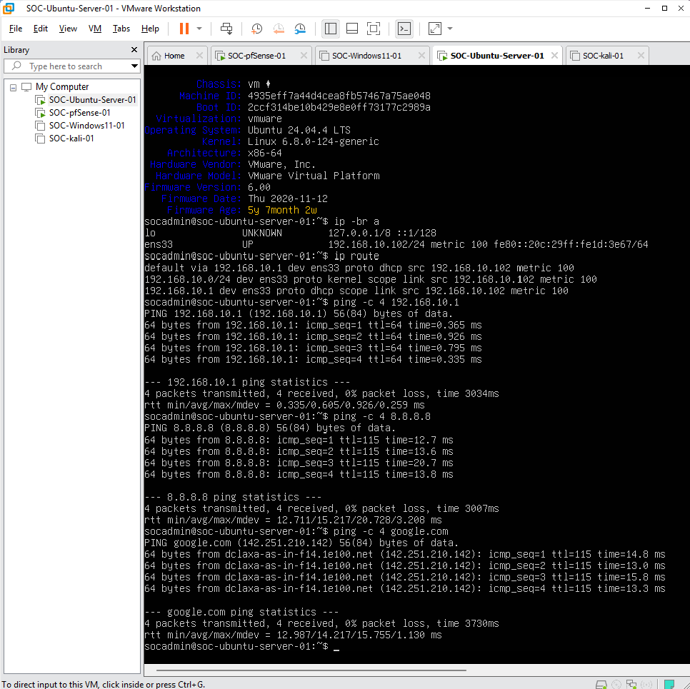
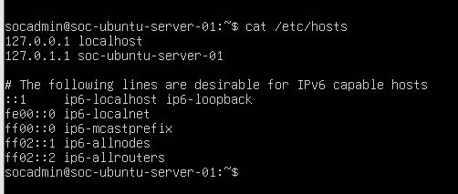
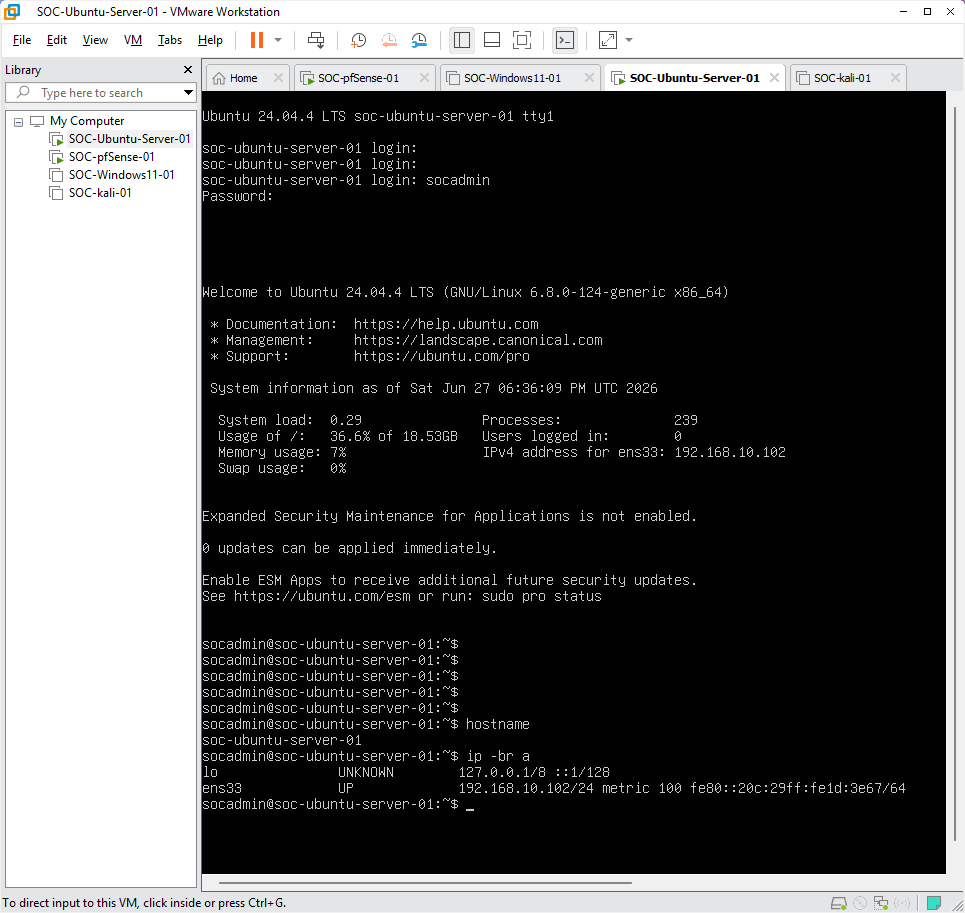
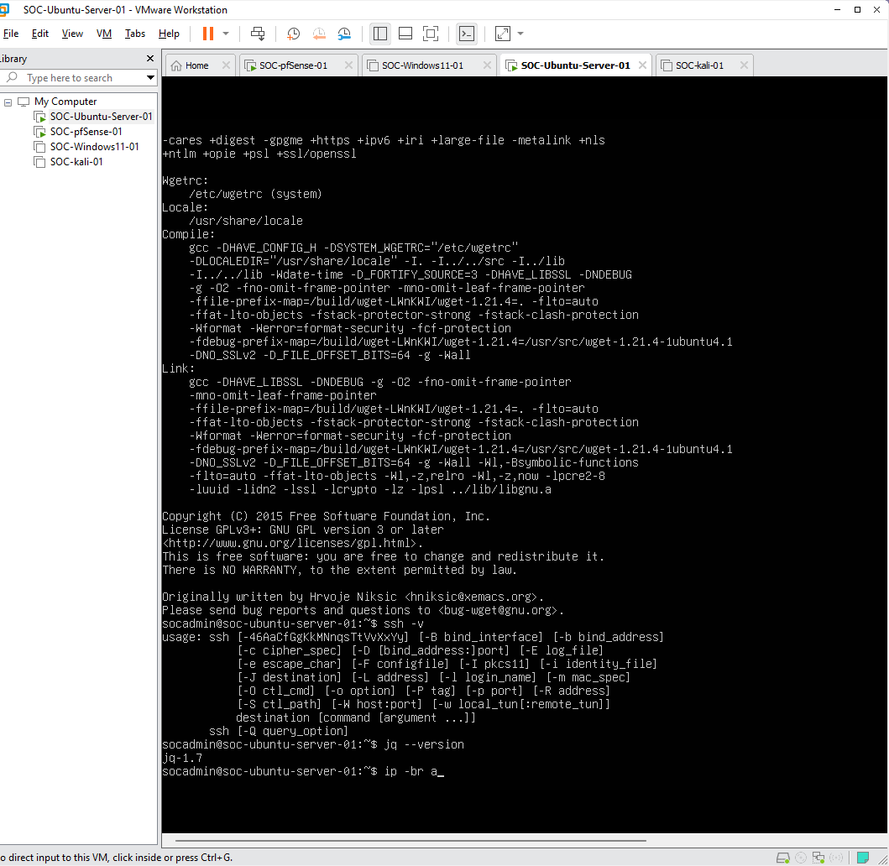
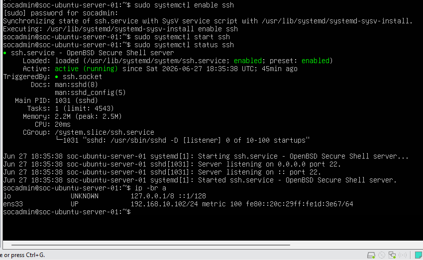
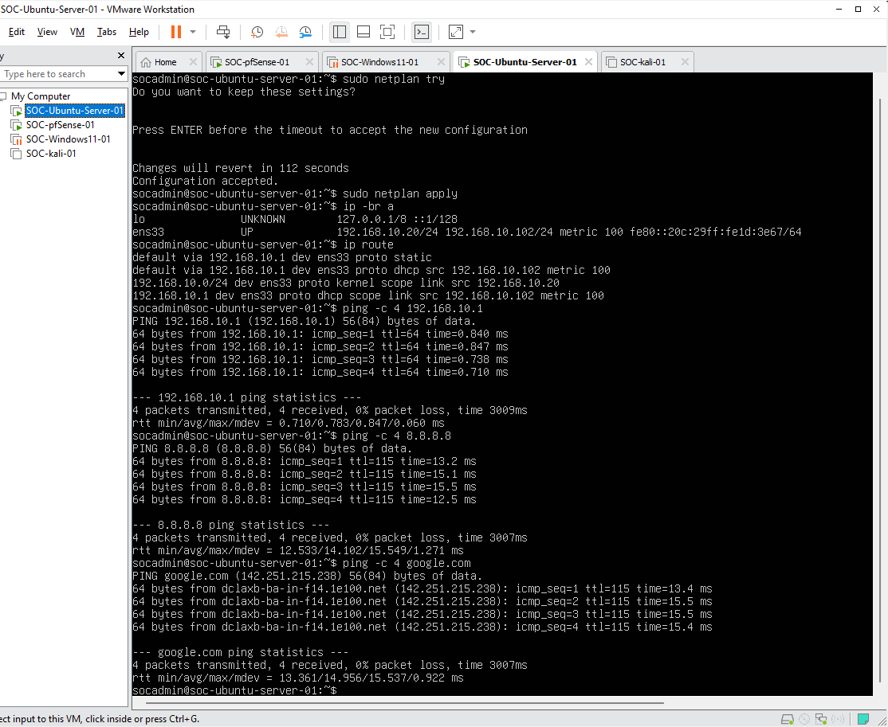
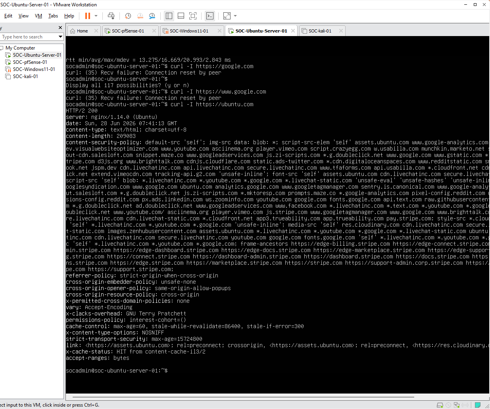

# Phase 10 - Ubuntu Server Preparation for SIEM

## Objective

The objective of this phase was to prepare `SOC-Ubuntu-server-01` as the future SIEM server for the Enterprise SOC Home Lab.

This Ubuntu Server will be used later for security monitoring components such as Wazuh, Elastic Stack, log collection, dashboard access, and agent communication from Windows and Linux endpoints.

---

## Lab Role

| Item                 | Configuration                       |
| -------------------- | ----------------------------------- |
| Virtual Machine Name | SOC-Ubuntu-server-01                |
| Operating System     | Ubuntu Server                       |
| Lab Role             | Future SIEM / Log Management Server |
| Network Segment      | pfSense LAN                         |
| Gateway              | 192.168.10.1                        |
| Planned Static IP    | 192.168.10.20                       |
| SSH Access           | Enabled                             |
| Internet Access      | Verified                            |

---

## Network Context

The Enterprise SOC Home Lab uses pfSense as the main firewall and gateway.

At this stage of the project, pfSense WAN is configured in Bridged mode as the stable working configuration. The internal lab systems, including Windows, Kali, and Ubuntu Server, are connected to the pfSense LAN network.

The Ubuntu Server is expected to communicate with:

* pfSense LAN gateway
* Windows endpoint
* Kali Linux endpoint
* Internet package repositories
* Future SIEM agents and dashboards

---

## Step 1 - Verify Current Ubuntu Network Status

The current Ubuntu Server network configuration was checked before applying additional system preparation.

Commands used:

```bash
whoami
hostname
hostnamectl
ip -br a
ip route
```

Basic connectivity tests were also performed:

```bash
ping -c 4 192.168.10.1
ping -c 4 8.8.8.8
ping -c 4 google.com
```


**Figure 10-01.** Ubuntu Server current network status before SIEM preparation.

---

## Step 2 - Configure Ubuntu Hostname

The Ubuntu Server hostname was configured to match the SOC lab naming standard.

Command used:

```bash
sudo hostnamectl set-hostname soc-ubuntu-server-01
```

The hostname was verified with:

```bash
hostname
hostnamectl
```

The `/etc/hosts` file was also reviewed to confirm the local hostname entry.

```bash
cat /etc/hosts
```

If needed, the file was edited with:

```bash
sudo nano /etc/hosts
```

Expected local hostname entry:

```text
127.0.1.1 soc-ubuntu-server-01
```


**Figure 10-02.** Ubuntu Server hostname configured as `soc-ubuntu-server-01`.

---

## Step 3 - Update Ubuntu Server

The Ubuntu Server package index and installed packages were updated.

Commands used:

```bash
sudo apt update
sudo apt upgrade -y
```

After the update process completed, the server was rebooted.

```bash
sudo reboot
```

After reboot, the server was checked again to confirm that hostname, network, and Internet connectivity were still working.

```bash
hostname
ip -br a
ping -c 4 google.com
```


**Figure 10-03.** Ubuntu Server updated and rebooted successfully.

---

## Step 4 - Install Required Base Tools

Several base tools were installed to prepare the Ubuntu Server for future SIEM installation and administration.

Command used:

```bash
sudo apt install -y curl wget vim nano net-tools unzip gnupg lsb-release ca-certificates apt-transport-https software-properties-common openssh-server jq
```

Installed tools included:

| Tool                       | Purpose                                           |
| -------------------------- | ------------------------------------------------- |
| curl                       | Test web access and download installation scripts |
| wget                       | Download files from the command line              |
| vim / nano                 | Edit Linux configuration files                    |
| net-tools                  | Use legacy network commands such as `netstat`     |
| unzip                      | Extract compressed files                          |
| gnupg                      | Manage package signing keys                       |
| lsb-release                | Identify Ubuntu release information               |
| ca-certificates            | Support trusted HTTPS connections                 |
| apt-transport-https        | Support HTTPS package repositories                |
| software-properties-common | Manage software repositories                      |
| openssh-server             | Enable SSH access to the server                   |
| jq                         | Process JSON output for future security tools     |

Version checks were performed with:

```bash
curl --version
wget --version
ssh -V
jq --version
```


**Figure 10-04.** Required base tools installed on Ubuntu Server.

---

## Step 5 - Enable and Verify SSH Service

SSH was enabled so the Ubuntu Server can be managed remotely from Kali Linux or Windows PowerShell.

Commands used:

```bash
sudo systemctl enable ssh
sudo systemctl start ssh
sudo systemctl status ssh
```

Expected service status:

```text
active (running)
```

The server IP address was checked with:

```bash
ip -br a
```

SSH connectivity can be tested from Kali Linux or Windows PowerShell with:

```bash
ssh <ubuntu-username>@192.168.10.20
```


**Figure 10-05.** SSH service enabled and running on Ubuntu Server.

---

## Step 6 - Configure Static IP Address

Because this Ubuntu Server will be used as a future SIEM server, it should use a stable IP address.

Target static IP configuration:

| Item         | Value            |
| ------------ | ---------------- |
| IP Address   | 192.168.10.20/24 |
| Gateway      | 192.168.10.1     |
| DNS Server 1 | 192.168.10.1     |
| DNS Server 2 | 8.8.8.8          |

The network interface name was checked first:

```bash
ip -br a
```

The Netplan configuration file was located with:

```bash
ls /etc/netplan/
```

A backup was created before making changes:

```bash
sudo cp /etc/netplan/*.yaml /etc/netplan/backup-netplan.yaml
```

The Netplan configuration file was edited:

```bash
sudo nano /etc/netplan/00-installer-config.yaml
```

Example Netplan configuration:

```yaml
network:
  version: 2
  ethernets:
    ens33:
      dhcp4: no
      addresses:
        - 192.168.10.20/24
      routes:
        - to: default
          via: 192.168.10.1
      nameservers:
        addresses:
          - 192.168.10.1
          - 8.8.8.8
```

> Note: The interface name must match the actual Ubuntu network interface name shown by `ip -br a`.

The configuration was tested and applied:

```bash
sudo netplan try
sudo netplan apply
```

The final network configuration was verified:

```bash
ip -br a
ip route
ping -c 4 192.168.10.1
ping -c 4 8.8.8.8
ping -c 4 google.com
```


**Figure 10-06.** Ubuntu Server static IP configuration verified.

---

## Step 7 - Final Internet Connectivity Validation

Final connectivity testing confirmed that the Ubuntu Server can access the pfSense LAN gateway, public IP addresses, DNS names, and HTTPS websites.

Commands used:

```bash
hostname
hostnamectl
ip -br a
ip route
systemctl status ssh --no-pager
ping -c 4 192.168.10.1
ping -c 4 8.8.8.8
ping -c 4 google.com
curl -I https://google.com
```

Successful results confirmed:

* Ubuntu hostname is configured
* Ubuntu network interface is active
* Gateway route points to pfSense LAN
* DNS resolution is working
* Internet connectivity is working
* HTTPS connection test is working
* SSH service is enabled and running


**Figure 10-07.** Ubuntu Server final Internet connectivity test.

---

## Phase 10 Result

Phase 10 was completed successfully.

The Ubuntu Server is now prepared as the future SIEM server for the Enterprise SOC Home Lab. The system was updated, required administration tools were installed, SSH was enabled, and Internet connectivity was verified through the pfSense LAN gateway.

---

## Completion Checklist

| Task                                 | Status    |
| ------------------------------------ | --------- |
| Ubuntu Server network status checked | Completed |
| Hostname configured                  | Completed |
| System packages updated              | Completed |
| Base tools installed                 | Completed |
| SSH service enabled                  | Completed |
| Static IP prepared or verified       | Completed |
| Internet connectivity verified       | Completed |
| Server ready for SIEM installation   | Completed |

---

## Next Phase

The next phase will focus on SIEM platform installation.

Recommended next step:

```text
Phase 11 - Install Wazuh Server on Ubuntu
```

Wazuh is recommended as the first SIEM platform for this project because it provides endpoint agents, dashboards, security alerts, vulnerability detection, file integrity monitoring, and MITRE ATT&CK mapping in a way that is suitable for a resume-ready SOC Home Lab.
