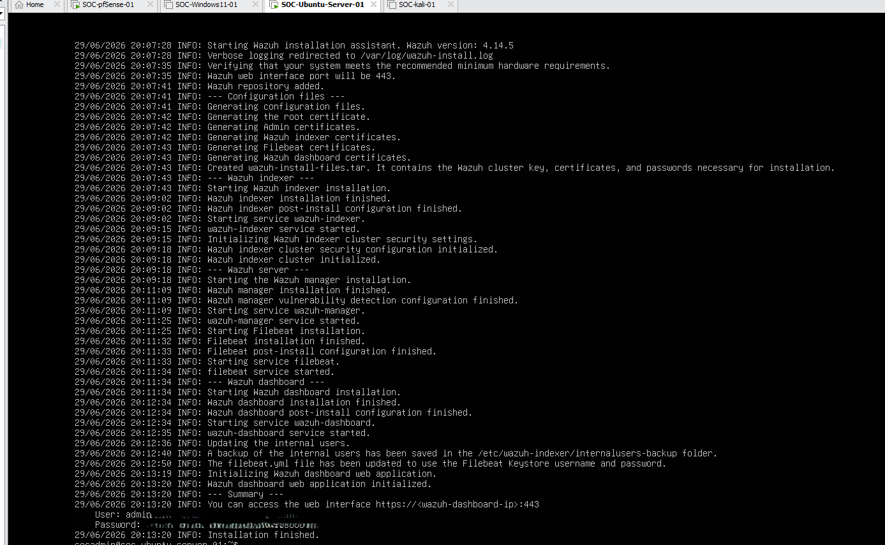
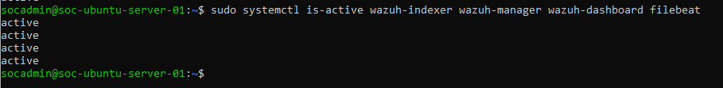
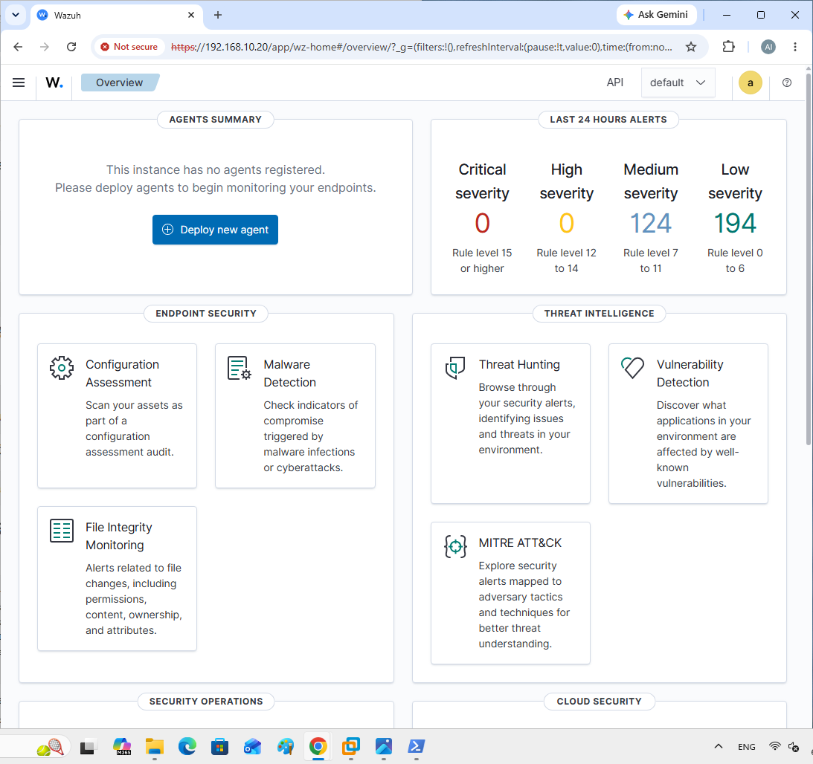

# Phase 11 - Wazuh Server Installation

## Objective

Deploy Wazuh All-in-One on the Ubuntu Server virtual machine and verify that the Wazuh Dashboard is accessible from the SOC lab network.

This phase installs and validates the main Wazuh server components:

* Wazuh Indexer
* Wazuh Manager
* Wazuh Dashboard
* Filebeat

After this phase, the lab is ready for endpoint agent deployment and centralized log collection.

---

# Environment Overview

| Item | Configuration |
| ---- | ------------- |
| Virtual Machine | SOC-Ubuntu-Server-01 |
| Platform | VMware Workstation Pro |
| Operating System | Ubuntu Server |
| Deployment Type | Wazuh All-in-One |
| Wazuh Version | 4.14 |
| CPU | 4 vCPU |
| Memory | 8 GB RAM |
| Disk | 60 GB |
| Network | Internal SOC LAN |
| Dashboard Access | HTTPS |
| Default Dashboard Port | 443 |

---

# Step 1 - Prepare the Ubuntu Server VM

Before installing Wazuh, the Ubuntu Server VM was adjusted to provide enough resources for an All-in-One deployment.

The final VM configuration was:

```text
CPU: 4 vCPU
Memory: 8 GB RAM
Disk: 60 GB
```

During installation troubleshooting, the original VM resource allocation was too small. The VM was upgraded from 2 vCPU / 4 GB RAM to 4 vCPU / 8 GB RAM.

The Ubuntu LVM root filesystem was also expanded to make more disk space available for the Wazuh installation.

Useful verification commands:

```bash
df -h /
df -i /
free -h
nproc
lsblk
```

Expected result:

```text
Enough available disk space
Enough available inodes
Approximately 8 GB RAM
4 CPU cores
```

---

# Step 2 - Download the Wazuh Installation Script

The Wazuh installation script was downloaded from the Wazuh package repository.

```bash
cd ~
curl -L -o wazuh-install.sh https://packages.wazuh.com/4.14/wazuh-install.sh
```

The script file was verified:

```bash
ls -lh wazuh-install.sh
```

Expected result:

```text
wazuh-install.sh exists in the current directory
```

---

# Step 3 - Run the Wazuh All-in-One Installation

The Wazuh All-in-One installation was started with:

```bash
sudo bash ./wazuh-install.sh -a
```

The `-a` option installs the main Wazuh components on the same server:

```text
Wazuh Indexer
Wazuh Manager
Wazuh Dashboard
Filebeat
```

The installation completed successfully and generated the Wazuh credentials archive.

---

# Step 4 - Save the Wazuh Password File

After installation, the password file was extracted from the generated archive.

```bash
sudo tar -O -xvf wazuh-install-files.tar wazuh-install-files/wazuh-passwords.txt
```

The admin password was saved securely.

Important security note:

```text
Do not upload plaintext Wazuh passwords to GitHub.
Do not commit wazuh-install-files.tar to the repository.
Only upload redacted screenshots.
```

Screenshot evidence:



**Figure 07 - Wazuh password file redacted**

---

# Step 5 - Verify Wazuh Services

After installation, all Wazuh services were checked with:

```bash
sudo systemctl is-active wazuh-indexer wazuh-manager wazuh-dashboard filebeat
```

Expected output:

```text
active
active
active
active
```

Important note:

The correct service name is:

```text
wazuh-dashboard
```

A previous typo was entered as:

```text
wazuh-dashborad
```

That typo caused the dashboard service check to return `inactive`, but the actual Wazuh Dashboard service was working correctly.

Screenshot evidence:



**Figure 11 - Wazuh services active**

---

# Step 6 - Identify the Ubuntu Server IP Address

The Ubuntu Server IP address was checked using:

```bash
ip -br a
```

The Wazuh Dashboard is accessed through the Ubuntu Server IP address.

Example:

```text
https://192.168.10.x
```

The actual IP address depends on the SOC lab network configuration.

---

# Step 7 - Access Wazuh Dashboard

From a browser on the lab network, the Wazuh Dashboard was opened using HTTPS:

```text
https://<Ubuntu-Server-IP>
```

Example:

```text
https://192.168.10.x
```

Because Wazuh uses a self-signed certificate by default, the browser displayed a security warning.

This warning was expected.

The browser was allowed to continue by selecting:

```text
Advanced
Proceed / Accept the Risk and Continue
```

---

# Step 8 - Log In to Wazuh Dashboard

The dashboard was accessed with the default administrator account:

```text
Username: admin
Password: Generated during installation
```

The password was copied from the Wazuh password file instead of being typed manually.

This avoided login errors caused by the long generated password.

Screenshot evidence:



**Figure 10 - Wazuh dashboard login success**

---

# Troubleshooting Notes

## Issue 1 - Installation Script Was Not Saved

During the first attempt, the installer file was not saved in the current directory.

Verification command:

```bash
ls -lh wazuh-install.sh
```

Result:

```text
No such file or directory
```

Resolution:

The script was downloaded again using an explicit output filename:

```bash
curl -L -o wazuh-install.sh https://packages.wazuh.com/4.14/wazuh-install.sh
```

---

## Issue 2 - Wazuh Dashboard Installation Failed

During an earlier installation attempt, the Wazuh Dashboard installation failed.

The installation log showed a `dpkg` package installation failure while extracting Wazuh Dashboard files.

Useful log command:

```bash
sudo grep -n -i -E "error|failed|fail|dpkg|apt|dashboard|443|permission|denied|unable|timeout|certificate" /var/log/wazuh-install.log | tail -n 120
```

The issue was resolved by increasing VM resources and expanding available disk space.

Final working configuration:

```text
CPU: 4 vCPU
Memory: 8 GB RAM
Disk: 60 GB
```

---

## Issue 3 - Long Dashboard Password

The generated Wazuh admin password was long and difficult to type manually.

Resolution:

SSH was used from the Windows host into the Ubuntu Server, allowing the password to be copied directly from the terminal.

Example SSH command:

```powershell
ssh socadmin@<Ubuntu-Server-IP>
```

Then the password file was viewed:

```bash
sudo tar -O -xvf wazuh-install-files.tar wazuh-install-files/wazuh-passwords.txt
```

The password was copied and pasted into the Wazuh Dashboard login page.

---

# Validation Summary

| Validation Item | Status |
| --------------- | ------ |
| Wazuh installation script downloaded | Completed |
| Wazuh All-in-One installation completed | Completed |
| Wazuh Indexer installed | Completed |
| Wazuh Manager installed | Completed |
| Wazuh Dashboard installed | Completed |
| Filebeat installed | Completed |
| Wazuh services active | Completed |
| Dashboard accessible by HTTPS | Completed |
| Admin login verified | Completed |
| Password screenshot redacted | Completed |

---

# Phase 11 Result

Phase 11 was completed successfully.

The Wazuh server is now installed, running, and accessible through the Wazuh Dashboard.

The SOC lab is ready for the next phase:

```text
Phase 12 - Wazuh Agent Installation on Windows 11 Endpoint
```

The next step is to install the Wazuh Agent on `SOC-Windows11-01` and connect the Windows endpoint to the Wazuh Manager for centralized log collection and security monitoring.
