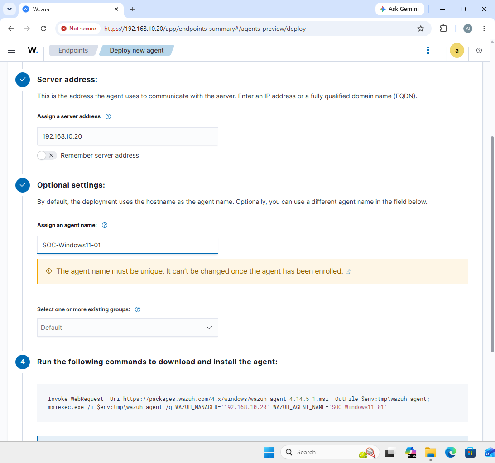
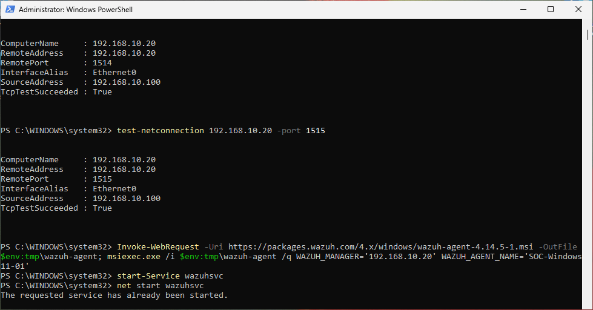
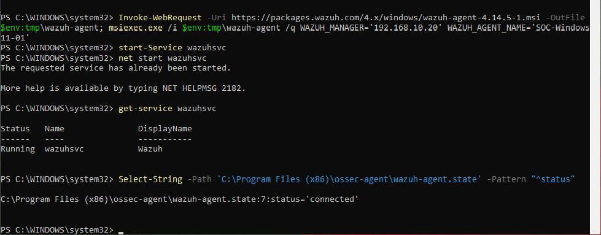
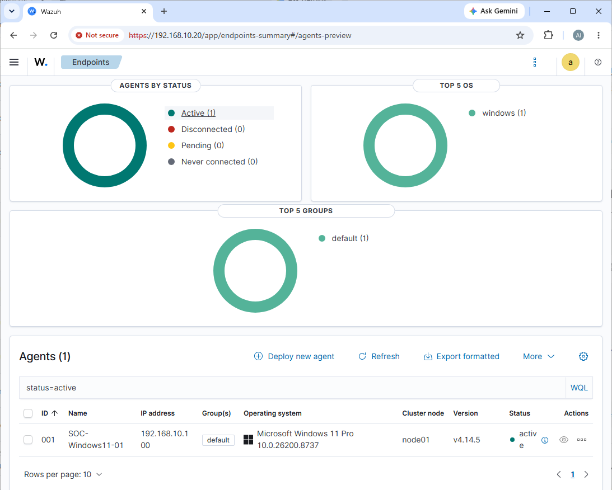

# Phase 12 - Wazuh Agent Installation on Windows 11 Endpoint

## Objective

Install the Wazuh Agent on the Windows 11 endpoint and connect it to the Wazuh Manager.

This phase validates that the Windows endpoint can communicate with the Wazuh server and appears as an active agent in the Wazuh Dashboard.

After this phase, the SOC lab can begin collecting Windows endpoint telemetry for centralized monitoring and detection.

---

# Environment Overview

| Item | Configuration |
| ---- | ------------- |
| Wazuh Server | SOC-Ubuntu-Server-01 |
| Wazuh Manager | Installed in Phase 11 |
| Wazuh Dashboard | Installed in Phase 11 |
| Endpoint | SOC-Windows11-01 |
| Endpoint OS | Windows 11 Pro |
| Agent Type | Wazuh Agent for Windows |
| Agent Status | Active |
| Management Port | 1515/TCP |
| Agent Communication Port | 1514/TCP |
| Dashboard Access | HTTPS |

---

# Phase Prerequisites

Before installing the Windows Wazuh Agent, Phase 11 had to be completed successfully.

Required Phase 11 conditions:

```text
Wazuh Indexer: active
Wazuh Manager: active
Wazuh Dashboard: active
Filebeat: active
Dashboard login: successful
```

The Wazuh Dashboard login was already verified in Phase 11.

---

# Step 1 - Identify the Wazuh Server IP Address

On the Wazuh server VM, the server IP address was checked with:

```bash
ip -br a
```

The Wazuh Manager IP address was identified from the SOC lab network interface.

Example format:

```text
192.168.10.x
```

This IP address was used as the Wazuh Manager address during the Windows Agent deployment.

Important note:

```text
Use the Wazuh server IP address only.
Do not include https://.
Do not use the Dashboard URL as the manager address.
```

---

# Step 2 - Verify Network Connectivity from Windows Endpoint

On `SOC-Windows11-01`, PowerShell was opened as Administrator.

Basic network connectivity to the Wazuh server was tested:

```powershell
ping <Wazuh-Server-IP>
```

The Wazuh agent communication ports were also tested:

```powershell
Test-NetConnection <Wazuh-Server-IP> -Port 1514
Test-NetConnection <Wazuh-Server-IP> -Port 1515
```

Expected result:

```text
TcpTestSucceeded : True
```

Port purpose:

| Port | Purpose |
| ---- | ------- |
| 1514/TCP | Agent event communication to Wazuh Manager |
| 1515/TCP | Agent enrollment / registration |

If these ports are not reachable, the agent may install successfully but fail to connect to the Wazuh Manager.

---

# Step 3 - Generate the Windows Agent Deployment Command

The Wazuh Dashboard was opened from the browser:

```text
https://<Wazuh-Server-IP>
```

Inside the Wazuh Dashboard, the agent deployment wizard was opened:

```text
Agents management > Summary > Deploy new agent
```

The following options were selected:

| Field | Value |
| ----- | ----- |
| Operating system | Windows |
| Architecture | x86_64 |
| Server address | Wazuh Server IP |
| Agent name | SOC-Windows11-01 |
| Agent group | default |

The Wazuh Dashboard generated a Windows installation command.

Screenshot evidence:



**Figure 12 - Wazuh deploy new agent wizard**

---

# Step 4 - Install the Wazuh Agent on Windows 11

On `SOC-Windows11-01`, PowerShell was opened as Administrator.

The agent installation command generated by the Wazuh Dashboard was copied and executed.

Example command format:

```powershell
msiexec.exe /i wazuh-agent-4.14.x-1.msi /q WAZUH_MANAGER="<Wazuh-Server-IP>" WAZUH_AGENT_NAME="SOC-Windows11-01"
```

After installation, the Wazuh Agent service was started:

```powershell
Start-Service wazuhsvc
```

Alternative command:

```powershell
NET START WazuhSvc
```

Screenshot evidence:



**Figure 13 - Windows agent installation command**

---

# Step 5 - Verify the Wazuh Agent Service on Windows

The Windows Wazuh Agent service was checked with:

```powershell
Get-Service wazuhsvc
```

Expected result:

```text
Status   Name      DisplayName
------   ----      -----------
Running  wazuhsvc  Wazuh
```

The local Wazuh Agent state file can also be checked with:

```powershell
Select-String -Path 'C:\Program Files (x86)\ossec-agent\wazuh-agent.state' -Pattern "^status"
```

Expected connected result:

```text
status='connected'
```

Screenshot evidence:



**Figure 14 - Windows Wazuh Agent service running**

---

# Step 6 - Verify Agent Status in Wazuh Dashboard

After the Windows Agent was installed and started, the Wazuh Dashboard was checked again.

Dashboard location:

```text
Agents management > Summary
```

The Windows endpoint appeared in the agent list:

```text
Agent name: SOC-Windows11-01
Status: Active
```

This confirms that the Windows endpoint successfully enrolled with the Wazuh Manager and is communicating with the Wazuh server.

Screenshot evidence:



**Figure 15 - Windows endpoint active in Wazuh Dashboard**

---

# Troubleshooting Notes

## Issue 1 - Agent Does Not Appear in Dashboard

If the Windows endpoint does not appear in the Wazuh Dashboard, check network connectivity first.

From Windows PowerShell:

```powershell
ping <Wazuh-Server-IP>
Test-NetConnection <Wazuh-Server-IP> -Port 1514
Test-NetConnection <Wazuh-Server-IP> -Port 1515
```

If the ping fails, verify the VM network configuration.

If the TCP port tests fail, check firewall rules between the Windows endpoint and the Wazuh server.

---

## Issue 2 - Agent Service Is Not Running

If the agent does not appear as active, verify the Windows service:

```powershell
Get-Service wazuhsvc
```

If the service is stopped, start it:

```powershell
Start-Service wazuhsvc
```

Then check the service again:

```powershell
Get-Service wazuhsvc
```

---

## Issue 3 - Wrong Wazuh Manager Address

The Wazuh Agent must point to the Wazuh Manager IP address.

Correct format:

```text
192.168.10.x
```

Incorrect formats:

```text
https://192.168.10.x
https://192.168.10.x:443
Wazuh Dashboard URL
```

The Dashboard address is used by the browser.

The Wazuh Manager IP is used by the agent.

---

## Issue 4 - Agent Installed but Status Is Not Active

If the agent is installed but the dashboard shows `Disconnected`, `Pending`, or `Never connected`, check the agent state file:

```powershell
Select-String -Path 'C:\Program Files (x86)\ossec-agent\wazuh-agent.state' -Pattern "^status"
```

Common causes:

```text
Wazuh Manager IP address is incorrect
Wazuh Agent service is stopped
Windows endpoint cannot reach port 1514
Windows endpoint cannot reach port 1515
Firewall is blocking traffic
The agent needs more time to appear in the dashboard
```

Wait 1 to 3 minutes after starting the service, then refresh the Wazuh Dashboard.

---

# Validation Summary

| Validation Item | Status |
| --------------- | ------ |
| Wazuh server IP identified | Completed |
| Windows endpoint network connectivity tested | Completed |
| Wazuh agent deployment command generated | Completed |
| Wazuh Agent installed on Windows 11 | Completed |
| Wazuh Agent service started | Completed |
| Wazuh Agent service verified | Completed |
| Windows endpoint enrolled with Wazuh Manager | Completed |
| Agent visible in Wazuh Dashboard | Completed |
| Agent status shows Active | Completed |

---

# Phase 12 Result

Phase 12 was completed successfully.

`SOC-Windows11-01` is now connected to the Wazuh Manager and appears as an active endpoint in the Wazuh Dashboard.

The SOC lab is ready for the next phase:

```text
Phase 13 - Windows Security Event Collection Validation
```

The next step is to confirm that Windows security logs, system events, and PowerShell-related activity are being collected and displayed in Wazuh.
