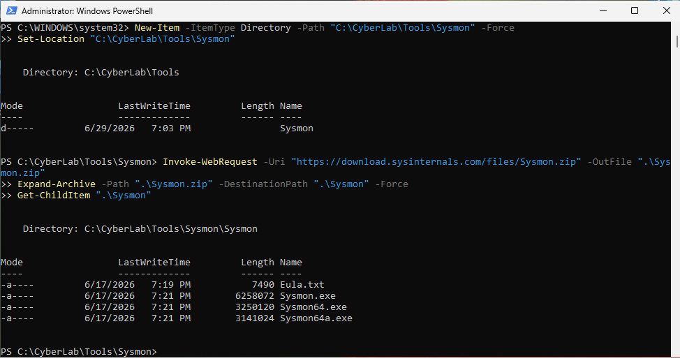
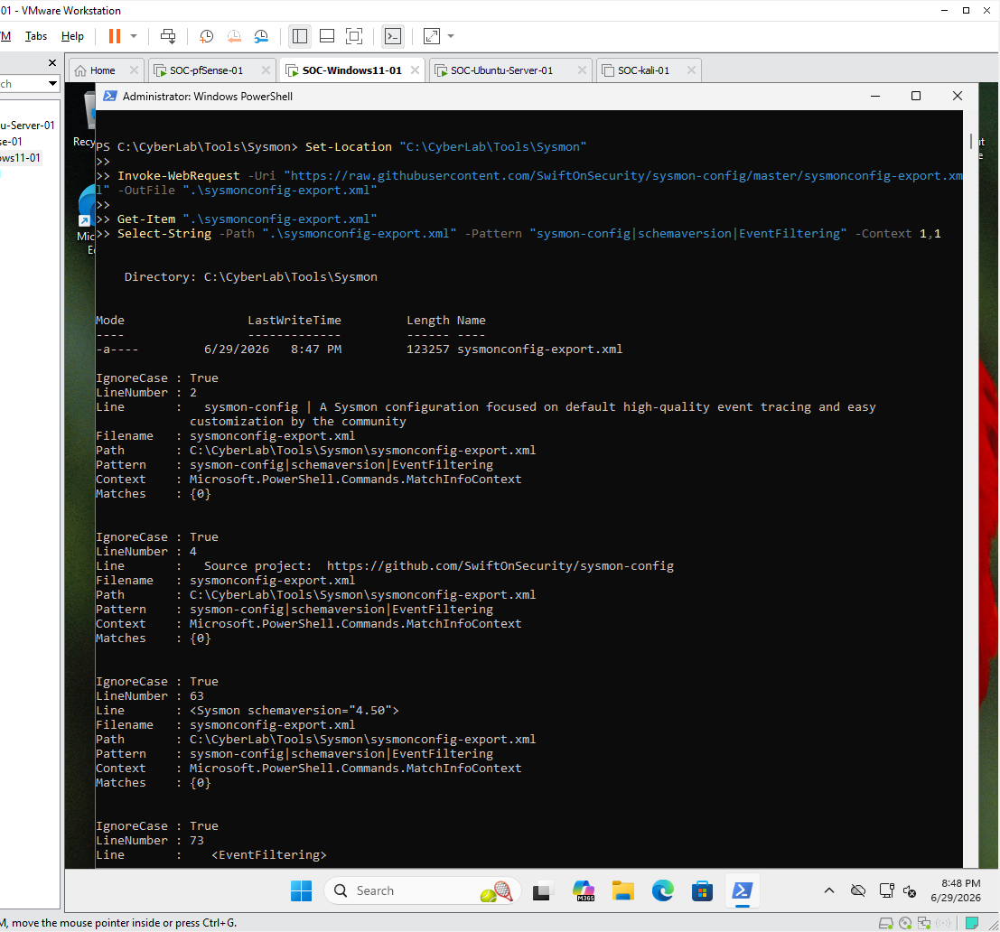
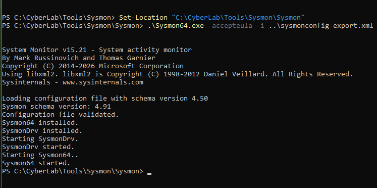
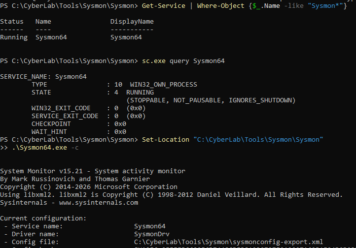
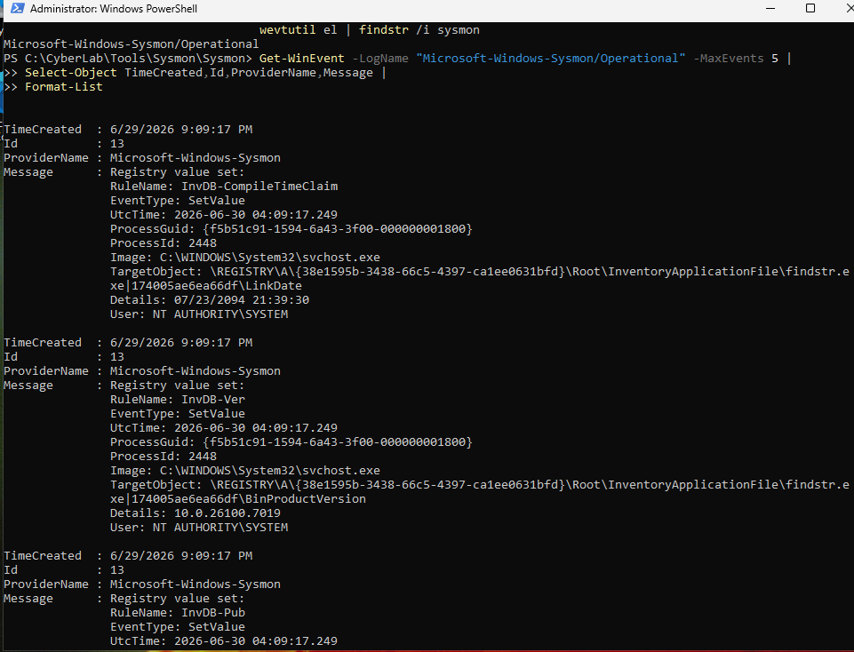
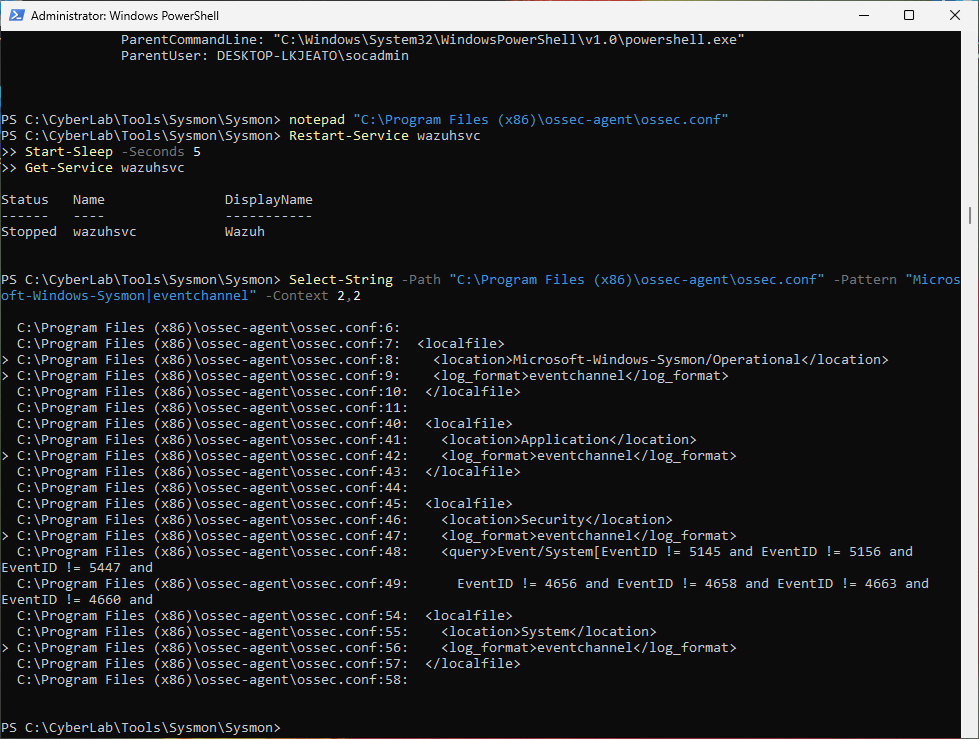
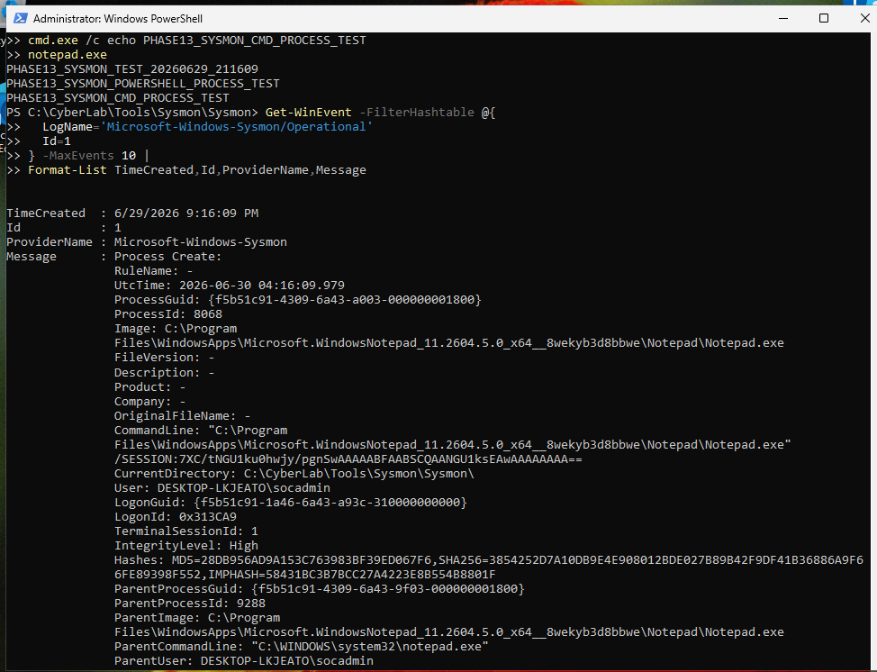

# Phase 13 - Sysmon Deployment on Windows 11 Endpoint

## Objective

Deploy Microsoft Sysmon on the Windows 11 endpoint and configure the Wazuh Agent to collect Sysmon events.

Sysmon provides detailed endpoint telemetry that is useful for SOC monitoring, detection engineering, and incident investigation.

This phase prepares `SOC-Windows11-01` to generate richer Windows endpoint logs, including process creation events and other system activity.

---

# Environment Overview

| Item | Configuration |
| ---- | ------------- |
| Endpoint VM | SOC-Windows11-01 |
| Operating System | Windows 11 Pro |
| Monitoring Agent | Wazuh Agent |
| Endpoint Telemetry Tool | Microsoft Sysmon |
| Sysmon Log Channel | Microsoft-Windows-Sysmon/Operational |
| Wazuh Server | SOC-Ubuntu-Server-01 |
| Deployment Purpose | Endpoint telemetry collection |

---

# Phase Prerequisites

Before starting this phase, the following phases were completed:

| Phase | Status |
| ----- | ------ |
| Phase 11 - Wazuh Server Installation | Completed |
| Phase 12 - Wazuh Agent Installation on Windows 11 Endpoint | Completed |

The Windows endpoint was already connected to the Wazuh Manager and appeared as an active agent in the Wazuh Dashboard.

---

# Step 1 - Create a Sysmon Tools Directory

On `SOC-Windows11-01`, PowerShell was opened as Administrator.

A dedicated directory was created to store Sysmon and its configuration file:

```powershell
New-Item -ItemType Directory -Path "C:\CyberLab\Tools\Sysmon" -Force
Set-Location "C:\CyberLab\Tools\Sysmon"
```

This keeps the Sysmon deployment files organized inside the lab tools directory.

---

# Step 2 - Download and Extract Sysmon

Sysmon was downloaded from Microsoft Sysinternals.

```powershell
Invoke-WebRequest -Uri "https://download.sysinternals.com/files/Sysmon.zip" -OutFile ".\Sysmon.zip"
Expand-Archive -Path ".\Sysmon.zip" -DestinationPath ".\Sysmon" -Force
Get-ChildItem ".\Sysmon"
```

Expected files:

```text
Sysmon.exe
Sysmon64.exe
Eula.txt
```

Screenshot evidence:



**Figure 16 - Sysmon downloaded and extracted**

---

# Step 3 - Download Sysmon Configuration

A Sysmon configuration file was downloaded and saved in the Sysmon tools directory.

```powershell
Set-Location "C:\CyberLab\Tools\Sysmon"

Invoke-WebRequest -Uri "https://raw.githubusercontent.com/SwiftOnSecurity/sysmon-config/master/sysmonconfig-export.xml" -OutFile ".\sysmonconfig-export.xml"

Get-Item ".\sysmonconfig-export.xml"
Select-String -Path ".\sysmonconfig-export.xml" -Pattern "sysmon-config|schemaversion|EventFiltering" -Context 1,1
```

The configuration file defines which Sysmon events should be included or excluded.

Screenshot evidence:



**Figure 17 - Sysmon configuration downloaded**

---

# Step 4 - Install Sysmon

The installation was performed from the extracted Sysmon directory.

```powershell
Set-Location "C:\CyberLab\Tools\Sysmon\Sysmon"
```

Sysmon was installed using the downloaded configuration file:

```powershell
.\Sysmon64.exe -accepteula -i ..\sysmonconfig-export.xml
```

Expected successful installation output:

```text
Sysmon installed.
SysmonDrv installed.
Starting SysmonDrv.
SysmonDrv started.
Starting Sysmon.
Sysmon started.
```

Screenshot evidence:



**Figure 18 - Sysmon installation command**

---

# Step 5 - Verify the Sysmon Service

After installation, the Sysmon service was verified.

```powershell
Get-Service | Where-Object {$_.Name -like "Sysmon*"}
```

Alternative command:

```powershell
sc.exe query Sysmon64
```

Expected result:

```text
STATE              : 4  RUNNING
```

The active Sysmon configuration was also checked:

```powershell
Set-Location "C:\CyberLab\Tools\Sysmon\Sysmon"
.\Sysmon64.exe -c
```

Screenshot evidence:



**Figure 19 - Sysmon service running**

---

# Step 6 - Verify the Sysmon Event Log Channel

The Windows event log channels were checked for Sysmon.

```powershell
wevtutil el | findstr /i sysmon
```

Expected result:

```text
Microsoft-Windows-Sysmon/Operational
```

Recent Sysmon events were also reviewed:

```powershell
Get-WinEvent -LogName "Microsoft-Windows-Sysmon/Operational" -MaxEvents 5 |
Select-Object TimeCreated,Id,ProviderName,Message |
Format-List
```

This confirmed that Sysmon was writing events to the Windows Event Log.

Screenshot evidence:



**Figure 20 - Sysmon event log created**

---

# Step 7 - Configure Wazuh Agent to Collect Sysmon Logs

The Wazuh Agent configuration file was opened as Administrator:

```powershell
notepad "C:\Program Files (x86)\ossec-agent\ossec.conf"
```

The following Sysmon EventChannel collection block was added before the closing `</ossec_config>` tag:

```xml
  <localfile>
    <location>Microsoft-Windows-Sysmon/Operational</location>
    <log_format>eventchannel</log_format>
  </localfile>
```

After saving the file, the Wazuh Agent service was restarted:

```powershell
Restart-Service wazuhsvc
Start-Sleep -Seconds 5
Get-Service wazuhsvc
```

The configuration was verified:

```powershell
Select-String -Path "C:\Program Files (x86)\ossec-agent\ossec.conf" -Pattern "Microsoft-Windows-Sysmon|eventchannel" -Context 2,2
```

Screenshot evidence:



**Figure 21 - Wazuh Agent Sysmon collection configured**

---

# Step 8 - Generate a Local Sysmon Test Event

A test marker and several process execution events were generated from PowerShell.

```powershell
$Marker = "PHASE13_SYSMON_TEST_$(Get-Date -Format yyyyMMdd_HHmmss)"

Write-Output $Marker
powershell.exe -NoProfile -Command "Write-Output PHASE13_SYSMON_POWERSHELL_PROCESS_TEST"
cmd.exe /c echo PHASE13_SYSMON_CMD_PROCESS_TEST
notepad.exe
```

After Notepad opened, it was closed.

Sysmon Event ID 1 process creation events were checked locally:

```powershell
Get-WinEvent -FilterHashtable @{
  LogName='Microsoft-Windows-Sysmon/Operational'
  Id=1
} -MaxEvents 10 |
Format-List TimeCreated,Id,ProviderName,Message
```

Expected result:

```text
Sysmon Event ID 1 process creation events are visible locally.
The output includes process execution activity such as powershell.exe, cmd.exe, or notepad.exe.
```

Screenshot evidence:



**Figure 22 - Sysmon test event generated**

---

# Troubleshooting Notes

## Issue 1 - PowerShell Permission Problems

Sysmon installation requires Administrator privileges.

If the install command fails, confirm that PowerShell was opened with:

```text
Run as Administrator
```

---

## Issue 2 - Sysmon Service Is Not Running

If the Sysmon service is not running, check the service status:

```powershell
Get-Service | Where-Object {$_.Name -like "Sysmon*"}
```

If needed, query the service directly:

```powershell
sc.exe query Sysmon64
```

If Sysmon did not install correctly, reinstall it from the Sysmon directory:

```powershell
Set-Location "C:\CyberLab\Tools\Sysmon\Sysmon"
.\Sysmon64.exe -accepteula -i ..\sysmonconfig-export.xml
```

---

## Issue 3 - Sysmon Event Log Channel Not Found

If this command does not return the Sysmon channel:

```powershell
wevtutil el | findstr /i sysmon
```

Then Sysmon may not have installed successfully.

Recheck the installation output and confirm the Sysmon service exists.

Expected channel:

```text
Microsoft-Windows-Sysmon/Operational
```

---

## Issue 4 - Wazuh Agent Not Collecting Sysmon Logs

If Wazuh does not collect Sysmon logs later, verify that the Wazuh Agent configuration contains this block:

```xml
  <localfile>
    <location>Microsoft-Windows-Sysmon/Operational</location>
    <log_format>eventchannel</log_format>
  </localfile>
```

Then restart the Wazuh Agent:

```powershell
Restart-Service wazuhsvc
Get-Service wazuhsvc
```

Also confirm that Sysmon events are visible locally before troubleshooting Wazuh collection.

---

# Validation Summary

| Validation Item | Status |
| --------------- | ------ |
| Sysmon tools directory created | Completed |
| Sysmon downloaded | Completed |
| Sysmon extracted | Completed |
| Sysmon configuration downloaded | Completed |
| Sysmon installed with configuration file | Completed |
| Sysmon service running | Completed |
| Sysmon Event Log channel created | Completed |
| Local Sysmon events generated | Completed |
| Wazuh Agent configured for Sysmon EventChannel | Completed |
| Wazuh Agent restarted after configuration change | Completed |

---

# Phase 13 Result

Phase 13 was completed successfully.

Sysmon is now deployed on `SOC-Windows11-01`, and the endpoint is generating Sysmon telemetry locally.

The Wazuh Agent has also been configured to collect the Sysmon EventChannel.

The SOC lab is ready for the next phase:

```text
Phase 14 - Wazuh Sysmon Log Collection Validation
```

The next step is to verify that Sysmon events from `SOC-Windows11-01` are visible inside the Wazuh Dashboard.
