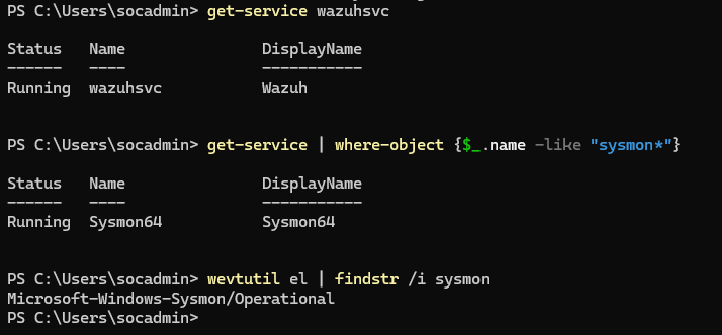
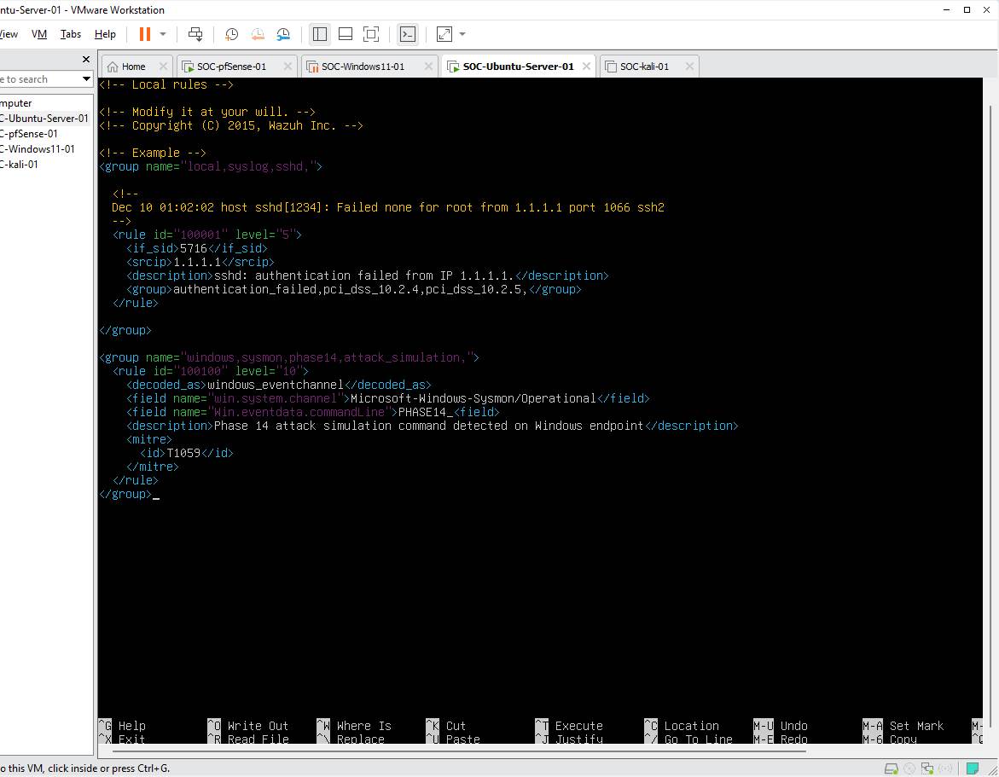
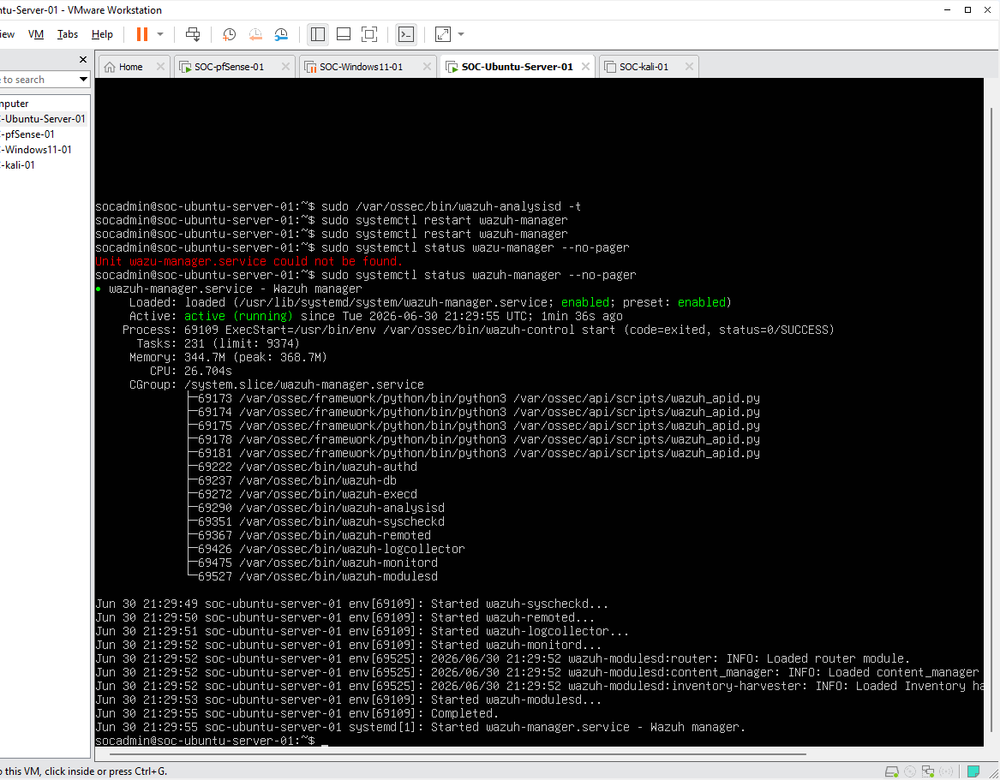
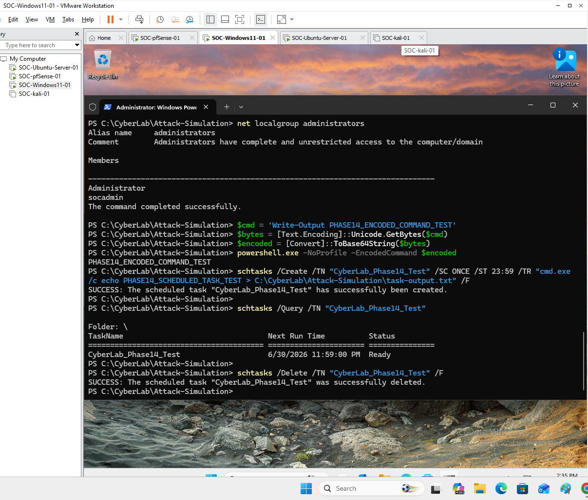
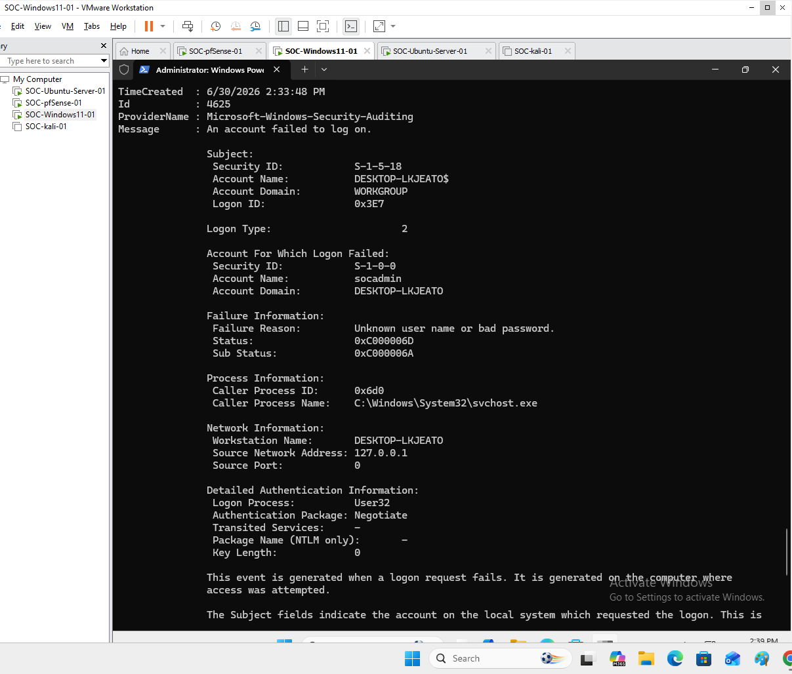
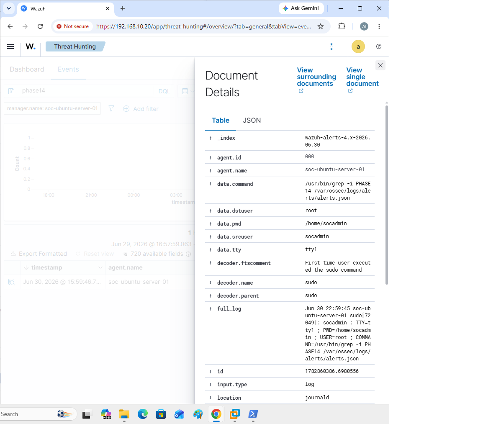
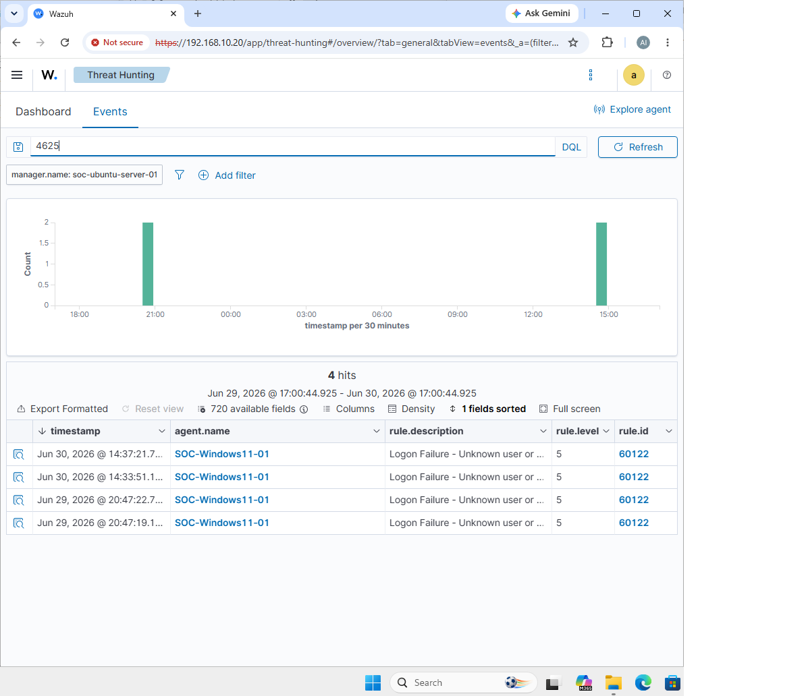

# Phase 14 - Attack Simulation and Detection Validation

## Objective

Perform safe attack simulation activities on the Windows 11 endpoint and validate that Wazuh can detect the activity.

This phase confirms that the SOC lab can collect endpoint telemetry, generate detections, and display alerts in the Wazuh Dashboard.

The simulations in this phase are benign and controlled. No malware, exploit code, or destructive commands were used.

---

# Environment Overview

| Item | Configuration |
| ---- | ------------- |
| Wazuh Server | SOC-Ubuntu-Server-01 |
| Wazuh Dashboard | Installed and verified |
| Windows Endpoint | SOC-Windows11-01 |
| Endpoint Agent | Wazuh Agent |
| Endpoint Telemetry | Sysmon |
| Sysmon Log Channel | Microsoft-Windows-Sysmon/Operational |
| Detection Platform | Wazuh |
| Simulation Type | Safe command execution and failed logon validation |

---

# Phase Prerequisites

Before starting this phase, the following phases were completed:

| Phase | Status |
| ----- | ------ |
| Phase 11 - Wazuh Server Installation | Completed |
| Phase 12 - Wazuh Agent Installation | Completed |
| Phase 13 - Sysmon Deployment | Completed |

Required conditions before attack simulation:

```text
Wazuh Manager is running.
Wazuh Dashboard is accessible.
SOC-Windows11-01 appears as an active Wazuh agent.
Sysmon is installed and running on SOC-Windows11-01.
Wazuh Agent is configured to collect Sysmon EventChannel logs.
```

---

# Step 1 - Verify Wazuh Agent and Sysmon Readiness

On `SOC-Windows11-01`, PowerShell was opened as Administrator.

The Wazuh Agent service was checked:

```powershell
Get-Service wazuhsvc
```

The Sysmon service was checked:

```powershell
Get-Service | Where-Object {$_.Name -like "Sysmon*"}
```

The Sysmon event log channel was also verified:

```powershell
wevtutil el | findstr /i sysmon
```

Expected Sysmon event channel:

```text
Microsoft-Windows-Sysmon/Operational
```

Screenshot evidence:



**Figure 23 - Wazuh Agent and Sysmon ready**

---

# Step 2 - Add a Custom Wazuh Detection Rule

On `SOC-Ubuntu-Server-01`, the existing local rules file was backed up.

```bash
sudo cp /var/ossec/etc/rules/local_rules.xml /var/ossec/etc/rules/local_rules.xml.bak.phase14
```

The local rules file was opened for editing:

```bash
sudo nano /var/ossec/etc/rules/local_rules.xml
```

A custom rule was added to detect the Phase 14 simulation marker:

```xml
<group name="windows,sysmon,phase14,attack_simulation,">
  <rule id="100100" level="10">
    <decoded_as>windows_eventchannel</decoded_as>
    <field name="win.system.channel">Microsoft-Windows-Sysmon/Operational</field>
    <field name="win.eventdata.commandLine">PHASE14_</field>
    <description>Phase 14 attack simulation command detected on Windows endpoint</description>
    <mitre>
      <id>T1059</id>
    </mitre>
  </rule>
</group>
```

Rule purpose:

```text
Detect Sysmon process creation events that contain the PHASE14_ marker in the command line.
```

MITRE ATT&CK mapping:

| Technique | Description |
| --------- | ----------- |
| T1059 | Command and Scripting Interpreter |

Screenshot evidence:



**Figure 24 - Custom Wazuh rule added**

---

# Step 3 - Restart Wazuh Manager

After adding the custom rule, the Wazuh Manager service was restarted.

```bash
sudo systemctl restart wazuh-manager
```

The service status was checked:

```bash
sudo systemctl status wazuh-manager --no-pager
```

Expected result:

```text
active (running)
```

If the service fails to restart, restore the backup rule file:

```bash
sudo cp /var/ossec/etc/rules/local_rules.xml.bak.phase14 /var/ossec/etc/rules/local_rules.xml
sudo systemctl restart wazuh-manager
```

Screenshot evidence:



**Figure 25 - Wazuh Manager restarted**

---

# Step 4 - Execute Safe Attack Simulation Commands

On `SOC-Windows11-01`, PowerShell was opened as Administrator.

A working directory was created for the simulation:

```powershell
New-Item -ItemType Directory -Path "C:\CyberLab\Attack-Simulation" -Force
Set-Location "C:\CyberLab\Attack-Simulation"
```

A Phase 14 marker was generated:

```powershell
$Marker = "PHASE14_ATTACK_SIM_$(Get-Date -Format yyyyMMdd_HHmmss)"
$Marker | Tee-Object -FilePath .\phase14-marker.txt
```

Basic discovery-style commands were executed:

```powershell
whoami /all | Out-File .\whoami.txt
hostname | Out-File .\hostname.txt
ipconfig /all | Out-File .\ipconfig.txt
```

Command execution simulation was performed:

```powershell
powershell.exe -NoProfile -ExecutionPolicy Bypass -Command "Write-Output PHASE14_POWERSHELL_EXECUTION_TEST"
cmd.exe /c "echo PHASE14_CMD_EXECUTION_TEST"
```

Local account and administrator group enumeration commands were executed:

```powershell
net user
net localgroup administrators
```

A benign encoded PowerShell command was executed:

```powershell
$cmd = 'Write-Output PHASE14_ENCODED_COMMAND_TEST'
$bytes = [Text.Encoding]::Unicode.GetBytes($cmd)
$encoded = [Convert]::ToBase64String($bytes)
powershell.exe -NoProfile -EncodedCommand $encoded
```

A benign scheduled task simulation was created, queried, and deleted:

```powershell
schtasks /Create /TN "CyberLab_Phase14_Test" /SC ONCE /ST 23:59 /TR "cmd.exe /c echo PHASE14_SCHEDULED_TASK_TEST > C:\CyberLab\Attack-Simulation\task-output.txt" /F

schtasks /Query /TN "CyberLab_Phase14_Test"

schtasks /Delete /TN "CyberLab_Phase14_Test" /F
```

Screenshot evidence:



**Figure 26 - Attack simulation commands executed**

---

# Step 5 - Generate a Failed Logon Event

A failed logon test was generated from the Windows endpoint.

```powershell
cmd.exe /c "runas /user:%COMPUTERNAME%\fakeuser cmd"
```

When prompted for a password, an incorrect password was entered.

This generated a Windows Security failed logon event.

Expected Windows Event ID:

```text
4625 - An account failed to log on
```

This test is safe and only validates failed authentication detection.

---

# Step 6 - Verify Sysmon Events Locally on Windows

Before checking Wazuh, the endpoint logs were verified locally.

Sysmon process creation events containing the Phase 14 marker were searched:

```powershell
Get-WinEvent -FilterHashtable @{
  LogName='Microsoft-Windows-Sysmon/Operational'
  Id=1
  StartTime=(Get-Date).AddMinutes(-20)
} | Where-Object {$_.Message -match "PHASE14"} |
Select-Object -First 10 TimeCreated,Id,ProviderName,Message |
Format-List
```

Expected result:

```text
Sysmon Event ID 1 process creation events are visible locally.
The event message contains PHASE14 markers.
```

The failed logon event was also checked locally:

```powershell
Get-WinEvent -FilterHashtable @{
  LogName='Security'
  Id=4625
  StartTime=(Get-Date).AddMinutes(-20)
} -MaxEvents 5 |
Format-List TimeCreated,Id,ProviderName,Message
```

Expected result:

```text
Windows Security Event ID 4625 is visible locally.
```

Screenshot evidence:



**Figure 27 - Local Sysmon events verified**

---

# Step 7 - Validate Phase 14 Detection in Wazuh Dashboard

After waiting a few minutes for log ingestion, the Wazuh Dashboard was opened.

The time range was set to:

```text
Last 1 hour
```

The Phase 14 marker was searched in the Wazuh Dashboard:

```text
PHASE14
```

Additional useful searches:

```text
agent.name:"SOC-Windows11-01" AND PHASE14
```

```text
rule.id:100100
```

```text
data.win.eventdata.commandLine:*PHASE14*
```

```text
data.win.system.channel:"Microsoft-Windows-Sysmon/Operational" AND PHASE14
```

If field names differ in the dashboard, this alternate query can also be used:

```text
win.eventdata.commandLine:*PHASE14*
```

Successful search results confirm that Wazuh received and detected the simulated command activity.

Screenshot evidence:



**Figure 28 - Wazuh Phase 14 alert detected**

---

# Step 8 - Validate Failed Logon Detection in Wazuh

The failed logon event was searched in the Wazuh Dashboard.

Primary query:

```text
agent.name:"SOC-Windows11-01" AND data.win.system.eventID:4625
```

Alternate query:

```text
agent.name:"SOC-Windows11-01" AND win.system.eventID:4625
```

General fallback search:

```text
4625
```

Successful results confirmed that the failed logon activity from `SOC-Windows11-01` was collected and displayed in Wazuh.

Screenshot evidence:



**Figure 29 - Failed logon alert detected**

---

# Detection Summary

| Detection Test | Local Windows Log | Wazuh Dashboard | Result |
| -------------- | ----------------- | --------------- | ------ |
| Sysmon process creation | Verified | Verified | Passed |
| PowerShell execution marker | Verified | Verified | Passed |
| CMD execution marker | Verified | Verified | Passed |
| Encoded PowerShell command marker | Verified | Verified | Passed |
| Scheduled task simulation | Verified | Verified | Passed |
| Failed logon event 4625 | Verified | Verified | Passed |

---

# Security and Safety Notes

The simulation commands used in this phase were benign.

No malware was downloaded.

No exploit code was executed.

No persistence was left behind.

The scheduled task test was removed immediately after validation.

The purpose of this phase was to generate realistic security telemetry for detection validation inside the lab.

---

# Troubleshooting Notes

## Issue 1 - PHASE14 Search Does Not Return Results

If Wazuh does not show `PHASE14` events immediately, wait a few minutes and refresh the dashboard.

Then verify:

```text
The Wazuh Agent service is running.
The Sysmon service is running.
The Wazuh Agent ossec.conf includes the Sysmon EventChannel block.
The Wazuh Agent was restarted after modifying ossec.conf.
The local Windows Sysmon log contains PHASE14 events.
The dashboard time range is set to Last 1 hour.
```

Useful Windows checks:

```powershell
Get-Service wazuhsvc
Get-Service | Where-Object {$_.Name -like "Sysmon*"}
```

---

## Issue 2 - Custom Rule Does Not Trigger

If `rule.id:100100` does not return results, but `PHASE14` appears in raw events, the custom rule may need adjustment.

Check the field names shown in the Wazuh event details.

Common possible fields:

```text
win.eventdata.commandLine
data.win.eventdata.commandLine
win.system.channel
data.win.system.channel
```

After modifying the rule, restart Wazuh Manager:

```bash
sudo systemctl restart wazuh-manager
```

---

## Issue 3 - Failed Logon Event Does Not Appear

If failed logon event ID `4625` does not appear in Wazuh, confirm it exists locally on Windows:

```powershell
Get-WinEvent -FilterHashtable @{
  LogName='Security'
  Id=4625
  StartTime=(Get-Date).AddMinutes(-20)
} -MaxEvents 5 |
Format-List TimeCreated,Id,ProviderName,Message
```

If it exists locally but not in Wazuh, verify that the Wazuh Agent is collecting the Windows Security channel.

---

# Validation Summary

| Validation Item | Status |
| --------------- | ------ |
| Wazuh Agent verified | Completed |
| Sysmon service verified | Completed |
| Sysmon EventChannel verified | Completed |
| Custom Wazuh rule added | Completed |
| Wazuh Manager restarted successfully | Completed |
| Safe attack simulation commands executed | Completed |
| Local Sysmon events verified | Completed |
| Failed logon event generated | Completed |
| Phase 14 marker detected in Wazuh | Completed |
| Failed logon alert detected in Wazuh | Completed |

---

# Phase 14 Result

Phase 14 was completed successfully.

The SOC lab successfully generated safe attack simulation telemetry on `SOC-Windows11-01` and validated detection inside the Wazuh Dashboard.

Final validation screenshot:

```text
29-phase14-failed-logon-alert-detected.png
```

The project can now document that Wazuh is collecting endpoint telemetry and detecting simulated suspicious activity.

Recommended README update:

```markdown
| Attack Simulation and Detection Validation | ✅ Completed |
```

Next recommended phase:

```text
Phase 15 - Dashboard Review, Alert Analysis, and Detection Tuning
```
